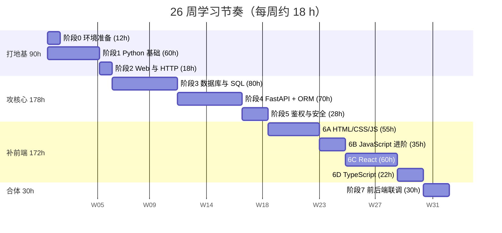
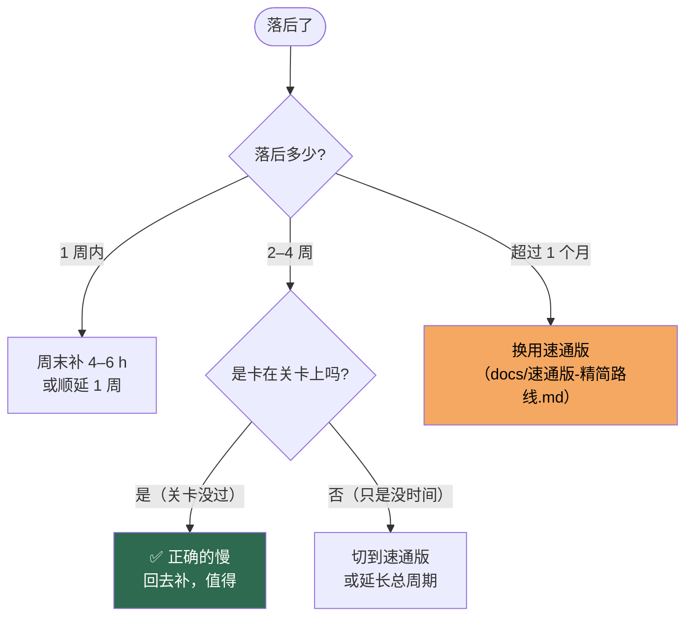

# 26 周日历 · 每周该做什么

> 把 470 小时的核心路线拆成 26 周，**每周约 18 小时**（≈ 每天 2.5–3 小时）。
> 每周表里的工时加总**恰好等于 470 h**，阶段划分与 [`resources.md`](resources.md) 完全对齐。

---

## 怎么用这份日历

1. **每周日晚上**花 5 分钟，去 [`progress.md`](progress.md) 填一行。
2. 每周末对照「周末验收」自测，**过不了就在这一周多留 2–3 天，别往下赶**。
3. 落后了不要慌，看文末的[「延期了怎么办」](#-延期了怎么办)。
4. **周次是相对周**（W01 = 你开始的那一周），不绑定具体日期。

### 每周 18 小时怎么分配

| 用途 | 时长 | 说明 |
|---|:---:|---|
| 看文档 / 视频 | 5 h | 只学当周需要的部分，别提前翻 |
| 跟着敲 + 做练习 | 10 h | **看 1 小时必须配 1 小时动手** |
| 复习上周 + 整理笔记 | 2 h | 上周的东西这周不用，两周后必忘 |
| 写进度日志 | 1 h | 记录卡点，这是三个月后最值钱的东西 |

> ⚠️ **不要把 18 小时堆到周末。** 编程靠肌肉记忆，每天 2–3 小时远好过周末突击 10 小时。

---

## 全景甘特图



---

## 📅 第一阶段 · 打地基（W01–W05，共 90 h）

| 周次 | 阶段 | 本周具体任务 | 工时 | 周末验收 |
|:---:|---|---|:---:|---|
| **W01** | 阶段 0 + 阶段 1 开头 | 装 Python/Node/MySQL/VS Code/Git；学 Git 基本操作；配 SSH key；Python 语法起步 | 12 + 6 | 6 个软件都能报版本号；能 `git push` 到自己的仓库 |
| **W02** | 阶段 1 | 数据类型、list/tuple/dict/set、条件与循环、函数 | 18 | 能写出 50 行左右的脚本，会用字典和列表 |
| **W03** | 阶段 1 | 高级特性（切片/迭代/列表生成式）、模块、文件读写、异常处理 | 18 | `practice/01-python/` 前 3 个练习自测通过 |
| **W04** | 阶段 1 收尾 | 面向对象（类/继承/`@property`）、`datetime`、虚拟环境 venv | 18 | 5 个 Python 练习全过；**里程碑 ① 跑起来** |
| **W05** | 阶段 2 | HTTP 方法/状态码/JSON/CORS；写出第一个 FastAPI 接口 | 18 | **里程碑 ② Hello API**、**③ 内存版 CRUD** |

> 🎯 **本阶段终点：** 你能在命令行里自由活动，写出并运行 Python 脚本，用 FastAPI 提供 4 个内存版接口。

**W05 是第一个关键节点。** 如果这里 `uvicorn` 起不来、`/docs` 打不开，**停下来解决**，不要带着问题上路。

---

## 📅 第二阶段 · 攻核心（W06–W15，共 178 h）★最重要

| 周次 | 阶段 | 本周具体任务 | 工时 | 周末验收 |
|:---:|---|---|:---:|---|
| **W06** | 阶段 3 | SQLBolt 互动教程；`CREATE TABLE`、主键、外键、索引 | 18 | 能独立设计并建出一张表 |
| **W07** | 阶段 3 | `WHERE`/`ORDER BY`/`LIMIT`/`JOIN`/`GROUP BY`/聚合函数 | 18 | 能查出「每个分类有多少本书」这类统计 |
| **W08** | 阶段 3 | **事务 ACID**、四种隔离级别、脏读/不可重复读/幻读 | 18 | 能说清 4 种隔离级别各自防住了什么 |
| **W09** | 阶段 3 | **MVCC 快照**、行锁 `SELECT ... FOR UPDATE`、间隙锁、死锁 | 18 | 能解释「为什么默认隔离级别下行锁会失效」 |
| **W10** | 阶段 3 收尾 → 阶段 4 | 软删除与库存守恒校验；开始 FastAPI 路由分层 + APIRouter | 8 + 10 | **里程碑 ④ 真数据库 CRUD**（重启数据不丢） |
| **W11** | 阶段 4 | Pydantic 模型、请求/响应分离、`Depends` 依赖注入 | 18 | 参数非法自动返回 422 |
| **W12** | 阶段 4 | SQLAlchemy 2.0：`Mapped`、`relationship`、`select()` 新写法、`selectinload` | 18 | 能写出带关联查询的接口，无 N+1 |
| **W13** | 阶段 4 | **`sync_book()` 库存统一重算**、借出/归还业务逻辑 | 18 | **里程碑 ⑤ 借还闭环**，库存守恒校验查询返回 0 |
| **W14** | 阶段 4 收尾 → 阶段 5 | **里程碑 ⑦ 并发修复** ★；开始 bcrypt 密码哈希 | 6 + 14 | **里程碑 ⑦：5 并发只有 1 个成功** |
| **W15** | 阶段 5 | JWT 签发与校验、`get_current_user`、401 vs 403、角色权限 | 14 | **里程碑 ⑥ 登录鉴权**；库里看不到明文密码 |

> 🎯 **本阶段终点：** 后端完整可用 —— 能借书还书、库存永远正确、并发不超借、没 Token 进不来。

**W14 是全流程含金量最高的一周。** 里程碑 ⑦ 要求你能**复现**超借、**修复**它、并**口述**原理。这三件事都做到，你就有了一段能讲 10 分钟的项目经历。

> 📌 里程碑 ⑦ 的 12 小时计入阶段 4 的练习工时 —— 因为它需要一个能跑的借书接口（阶段 4 的产出物），而原理是阶段 3 学的。

---

## 📅 第三阶段 · 补前端（W16–W25，共 172 h）

| 周次 | 阶段 | 本周具体任务 | 工时 | 周末验收 |
|:---:|---|---|:---:|---|
| **W16** | 6A | HTML 常用标签、语义化、表单元素、CSS 选择器与盒模型 | 18 | 能手写一个带表单的静态页面 |
| **W17** | 6A | CSS Flexbox / Grid / 响应式；DOM 操作与事件 | 18 | 能用原生 JS 动态生成表格并绑定点击事件 |
| **W18** | 6A | DOM 事件委托、`localStorage`、综合练习 | 18 | 用纯 HTML/CSS/JS 做出图书列表页 |
| **W19** | 6A 收尾 → 6B | **Promise、`async/await`、`map/filter/reduce`、解构、模块** | 1 + 17 | 能封装出一个带错误处理的 `api()` 函数 |
| **W20** | 6B | `fetch` 调后端、Token 注入、401 处理、`localStorage` 存登录态 | 18 | **里程碑 ⑧ 纯 JS 前端**：不用框架做出能登录能借书的页面 |
| **W21** | 6C | React 心智模型（先搞清「解决了什么问题」）、JSX、组件与 props | 18 | 能把静态页面拆成 3 个以上组件 |
| **W22** | 6C | `useState`、`useEffect`、列表渲染与 `key`、受控表单 | 18 | React 版图书列表页，数据变了自动更新 |
| **W23** | 6C | `useContext`、`react-router-dom`、`ProtectedRoute` 路由守卫 | 18 | 未登录访问 `/books` 自动跳登录页 |
| **W24** | 6C 收尾 → 6D | Tailwind 样式收尾；TypeScript 基础类型、`interface` | 6 + 12 | **里程碑 ⑨ React 前端**：功能与纯 JS 版对等 |
| **W25** | 6D 收尾 → 阶段 7 | 泛型、`Partial/Pick/Omit`、给 API 响应补类型；开始联调 | 10 + 8 | `npm run typecheck` 零报错 |

> 🎯 **本阶段终点：** 你能用 React + TypeScript 独立做出完整前端，并知道它比纯 JS 好在哪。

**W19 是前端的分水岭。** `Promise` / `async-await` / 数组方法不过关，W21 开始的 React 会退化成抄代码。这一周宁可慢一点。

---

## 📅 第四阶段 · 合体（W26，共 30 h）

| 周次 | 阶段 | 本周具体任务 | 工时 | 周末验收 |
|:---:|---|---|:---:|---|
| **W26** | 阶段 7 | CORS 配置、统一 `client.ts`、字段命名对齐、错误处理；完整流程联调排错 | 22 + 8 | **完整借书流程从页面跑通**；能独立排查 4 类常见报错 |

> 🎯 **终点：** 打开浏览器 → 登录 → 搜书 → 借书 → 归还，全流程跑通。

---

## ✅ 打卡表

复制到你的笔记里，或者直接改 [`progress.md`](progress.md)。

- [ ] W01 · 阶段 0 + Python 起步（18h）
- [ ] W02 · Python 基础语法（18h）
- [ ] W03 · Python 高级特性与文件（18h）
- [ ] W04 · Python 面向对象（18h）　→ 🏁 里程碑 ①
- [ ] W05 · Web 与 HTTP + FastAPI 入门（18h）　→ 🏁 里程碑 ②③
- [ ] W06 · SQL 建表与索引（18h）
- [ ] W07 · SQL 查询与 JOIN（18h）
- [ ] W08 · 事务与隔离级别（18h）
- [ ] W09 · MVCC 与行锁（18h）
- [ ] W10 · 软删除 + FastAPI 路由（18h）　→ 🏁 里程碑 ④
- [ ] W11 · Pydantic 与依赖注入（18h）
- [ ] W12 · SQLAlchemy 2.0 ORM（18h）
- [ ] W13 · 库存重算与借还逻辑（18h）　→ 🏁 里程碑 ⑤
- [ ] W14 · **并发修复**（20h）　→ 🏁 **里程碑 ⑦** ★
- [ ] W15 · JWT 与权限（14h）　→ 🏁 里程碑 ⑥
- [ ] W16 · HTML 与 CSS 基础（18h）
- [ ] W17 · Flexbox/Grid 与 DOM（18h）
- [ ] W18 · DOM 事件与 `localStorage`（18h）
- [ ] W19 · **JS 进阶：Promise / async-await**（18h）
- [ ] W20 · fetch 联调与纯 JS 前端（18h）　→ 🏁 里程碑 ⑧
- [ ] W21 · React 心智模型与组件（18h）
- [ ] W22 · useState / useEffect（18h）
- [ ] W23 · Context 与路由守卫（18h）
- [ ] W24 · Tailwind + TypeScript 基础（18h）　→ 🏁 里程碑 ⑨
- [ ] W25 · TypeScript 收尾 + 联调起步（18h）
- [ ] W26 · 前后端完整联调（22h）　→ 🏁 全部完成

---

## 📊 工时核对

| 阶段 | 日历分配 | 与 resources.md 是否一致 |
|---|:---:|:---:|
| 阶段 0 环境准备 | 12 h | ✅ |
| 阶段 1 Python 基础 | 60 h | ✅ |
| 阶段 2 Web 与 HTTP | 18 h | ✅ |
| 阶段 3 数据库与 SQL | 80 h | ✅ |
| 阶段 4 FastAPI + ORM | 70 h | ✅ |
| 阶段 5 鉴权与安全 | 28 h | ✅ |
| 6A HTML/CSS/JS | 55 h | ✅ |
| 6B JavaScript 进阶 | 35 h | ✅ |
| 6C React | 60 h | ✅ |
| 6D TypeScript | 22 h | ✅ |
| 阶段 7 前后端联调 | 30 h | ✅ |
| **合计** | **470 h** | ✅ |

> 26 周中：23 周各 18 h，W14 为 20 h，W15 为 14 h，W26 为 22 h —— 加总正好 470 h。

---

## ⏳ 延期了怎么办

**落后是常态，不是失败。** 按下面顺序处理：



### 三种应对策略（按优先级）

| 策略 | 做法 | 代价 |
|---|---|---|
| ① **延长时间** | 26 周变 30–35 周 | 无 —— 最推荐 |
| ② **砍选修** | 跳过 6D TypeScript、阶段 8 | 小 |
| ③ **换速通版** | 切到 [260 h 版本](docs/速通版-精简路线.md) | 项目深度下降，面试经不起深挖 |

### ⛔ 绝对不能做的事

| 别做 | 为什么 |
|---|---|
| 跳过 W08/W09（事务与锁） | 这是整个项目**唯一的技术亮点**，跳过等于白做 |
| 跳过 W19（JS 进阶） | 后面 React 会变成抄代码，越学越痛苦 |
| 只看不敲 | 视频看完觉得会了，一周后全忘 |
| 关卡没过多硬往下走 | 后面每一步都建立在前面的基础上，会越欠越多 |

---

## 🧭 每周固定动作清单

打印出来贴在桌上：

```
□ 周日晚上：更新 progress.md（本周工时 + 卡点）
□ 周一：复习上周内容 30 分钟，再开新内容
□ 每次学新东西：看完立刻关掉资料，自己敲一遍
□ 每天结束：git commit 一次（哪怕只写了一行）
□ 卡住超过 2 小时：记录下来，去问人或搜索，别死磕
□ 每完成一个关卡：回来把打卡表那一行勾掉 🎉
```

---

## 🔗 相关文档

- 总路线图 → [`README.md`](README.md)
- 阶段依赖与并行策略 → [`ROADMAP.md`](ROADMAP.md)
- 资源总表（含工时） → [`resources.md`](resources.md)
- 里程碑与验收标准 → [`milestones.md`](milestones.md)
- 进度打卡表 → [`progress.md`](progress.md)
- 练习脚手架 → [`practice/`](practice/)

---

[← 返回首页](README.md) · [里程碑](milestones.md) · [进度打卡](progress.md)
