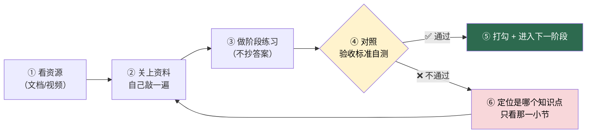
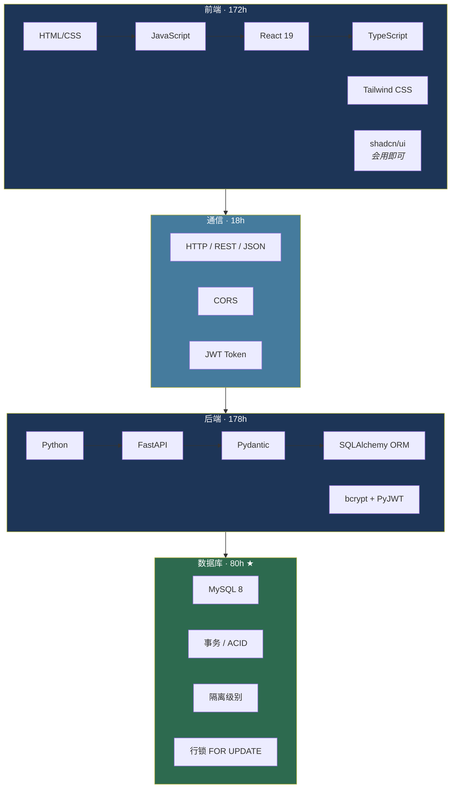

# 图书管理系统 · 学习路线图

> 从**零基础**到能独立复刻一套「FastAPI + MySQL + React」前后端分离图书管理系统的完整学习计划。
>
> 每个阶段都写明：**学什么资源、花多少小时、必须掌握什么、怎么验收**。照着流程图走，卡住了就回炉。

---

## 📖 这个仓库怎么用

1. **先看下面的「总路线图」**，搞清自己要走的顺序（阶段 3 和阶段 6 是两座大山）。
2. **打开 [`progress.md`](progress.md)**，按周填进度。这是你唯一需要每天更新的文件。
3. **进入某个阶段时，打开 `docs/` 下对应的那份文档**，照「资源清单」学，照「验收标准」自测。
4. **验收不过就回炉**，不要硬着头皮往下走 —— 后面所有内容都建立在前面的基础上。
5. 每完成一个阶段，在 [`milestones.md`](milestones.md) 里把对应里程碑勾掉。

> 💡 **本仓库所有流程图都是 Mermaid 语法**，GitHub 会直接渲染成图。手机端如果显示成代码块，用电脑浏览器打开即可。

---

## 🗺️ 总路线图

```mermaid
flowchart TD
    START(["零基础开始"]) --> S0

    S0["<b>阶段 0 · 环境准备</b><br/>12 小时<br/>命令行 / Python / Node / MySQL / Git"]
    S0 --> S1

    S1["<b>阶段 1 · Python 基础</b><br/>60 小时"]
    S1 --> G1{"验收：能独立写出<br/>100 行以上的脚本?"}
    G1 -- "❌ 不能" --> S1
    G1 -- "✅ 能" --> S2

    S2["<b>阶段 2 · Web 与 HTTP 基础</b><br/>18 小时<br/>REST / JSON / 状态码 / CORS"]
    S2 --> S3

    S3["<b>阶段 3 · 数据库与 SQL</b> ★核心<br/>80 小时<br/>事务 / 隔离级别 / 行锁"]
    S3 --> G3{"验收：能手动复现超借<br/>并用行锁修好?"}
    G3 -- "❌ 不能" --> S3
    G3 -- "✅ 能" --> S4

    S4["<b>阶段 4 · FastAPI + SQLAlchemy</b><br/>70 小时<br/>路由 / ORM / Pydantic"]
    S4 --> S5

    S5["<b>阶段 5 · 鉴权与安全</b><br/>28 小时<br/>bcrypt / JWT / 权限"]
    S5 --> S6

    S6["<b>阶段 6 · 前端</b> ★核心<br/>172 小时<br/>HTML/CSS/JS → React → TypeScript"]
    S6 --> G6{"验收：能独立做出<br/>带登录的增删改查页面?"}
    G6 -- "❌ 不能" --> S6
    G6 -- "✅ 能" --> S7

    S7["<b>阶段 7 · 前后端联调</b><br/>30 小时"]
    S7 --> G7{"验收：完整借书流程<br/>能从页面跑通?"}
    G7 -- "❌ 不能" --> S7
    G7 -- "✅ 能" --> DONE

    DONE(["🎉 能独立复刻<br/>图书管理系统"])
    DONE -.-> S8["阶段 8 · 进阶与部署（选修）<br/>45 小时"]

    style S3 fill:#2d6a4f,color:#fff
    style S6 fill:#2d6a4f,color:#fff
    style DONE fill:#f4a261,color:#000
    style G1 fill:#fff3cd,color:#000
    style G3 fill:#fff3cd,color:#000
    style G6 fill:#fff3cd,color:#000
    style G7 fill:#fff3cd,color:#000
```

> 黄色菱形 = **验收关卡**。过不了就别往下走，回去把当前阶段再练一遍。

---

## ⏱️ 工时预算

### 核心路线（必学）

| 阶段 | 内容 | 工时 | 占比 |
|:---:|---|:---:|:---:|
| 0 | 环境准备 | 12 h | 2.6% |
| 1 | Python 基础 | 60 h | 12.8% |
| 2 | Web 与 HTTP 基础 | 18 h | 3.8% |
| 3 | **数据库与 SQL** ★ | 80 h | 17.0% |
| 4 | FastAPI + SQLAlchemy + Pydantic | 70 h | 14.9% |
| 5 | 鉴权与安全 | 28 h | 6.0% |
| 6A | HTML / CSS / JavaScript | 55 h | 11.7% |
| 6B | JavaScript 进阶 | 35 h | 7.4% |
| 6C | React | 60 h | 12.8% |
| 6D | TypeScript | 22 h | 4.7% |
| 7 | 前后端联调 | 30 h | 6.4% |
| | **核心合计** | **470 h** | 100% |
| 8 | 进阶与部署（选修） | 45 h | — |
| | **全部合计** | **515 h** | — |

### 换算成日历时间

| 每天投入 | 核心 470h 需要 | 适合谁 |
|:---:|:---:|---|
| 1 小时 | 约 16 个月 | 在职、纯业余 |
| 2 小时 | 约 8 个月 | 在校学生（课余） |
| 3 小时 | 约 5 个月 | 在校学生（当主业） |
| 6 小时 | 约 3 个月 | 脱产集中冲刺 |

### 三条可选路径

需求不同，可以裁剪。**别一上来就选最全的**。

| 路径 | 工时 | 裁剪内容 | 适用场景 |
|---|:---:|---|---|
| 🏃 **速通版** | ~260 h | 跳过 Python 面向对象进阶、SQL 索引原理、TypeScript、React 进阶 | 只为交课程设计 / 作业，能跑就行 |
| 🚶 **标准版**（推荐） | ~470 h | 不裁剪，按顺序走完 0–7 | 想真正学会全栈开发 |
| 🧗 **完整版** | ~515 h | 标准版 + 阶段 8 进阶 | 准备找开发工作 |

> 速通版进度表见 [`docs/速通版-精简路线.md`](docs/速通版-精简路线.md)。

---

## 🔁 每个阶段怎么学（学习循环）

**这是全仓库最重要的一张图。** 不要只学不练 —— 看视频产生的「我懂了」是假的。

**三条铁律：**

1. **不许只看不敲。** 视频看 1 小时，必须配 1 小时自己写代码。
2. **不许抄答案。** 练习卡住先查文档，超过 30 分钟再看参考实现。
3. **不许跳关。** 阶段 3（数据库）和阶段 6（前端）跳过去，后面必崩。

---

## 🧭 技术栈地图

---

## 📂 文件导航

| 文件 | 作用 |
|---|---|
| **[`ROADMAP.md`](ROADMAP.md)** | 完整路线图：阶段依赖、决策点、每阶段一句话说明 |
| **[`resources.md`](resources.md)** | ⭐ **全部学习资源汇总表**（含链接、语言、时长、优先级） |
| **[`milestones.md`](milestones.md)** | ⭐ **9 个里程碑 + 验收标准**（照着自测，过了才往下走） |
| **[`progress.md`](progress.md)** | ⭐ **进度打卡表**（每周更新这一个文件） |
| [`docs/`](docs/) | 每个阶段的详细计划（目标 / 资源 / 知识点 / 练习 / 验收） |
| [`diagrams/`](diagrams/) | 所有 Mermaid 流程图单独存放 |

### `docs/` 目录

| 文档 | 阶段 | 工时 |
|---|---|:---:|
| [`00-环境准备.md`](docs/00-环境准备.md) | 0 | 12 h |
| [`01-Python基础.md`](docs/01-Python基础.md) | 1 | 60 h |
| [`02-Web与HTTP基础.md`](docs/02-Web与HTTP基础.md) | 2 | 18 h |
| [`03-数据库与SQL.md`](docs/03-数据库与SQL.md) | 3 ★ | 80 h |
| [`04-FastAPI与SQLAlchemy.md`](docs/04-FastAPI与SQLAlchemy.md) | 4 | 70 h |
| [`05-鉴权与安全.md`](docs/05-鉴权与安全.md) | 5 | 28 h |
| [`06A-HTML-CSS-JavaScript.md`](docs/06A-HTML-CSS-JavaScript.md) | 6A | 55 h |
| [`06B-JavaScript进阶.md`](docs/06B-JavaScript进阶.md) | 6B | 35 h |
| [`06C-React.md`](docs/06C-React.md) | 6C | 60 h |
| [`06D-TypeScript.md`](docs/06D-TypeScript.md) | 6D | 22 h |
| [`07-前后端联调.md`](docs/07-前后端联调.md) | 7 | 30 h |
| [`08-进阶与部署.md`](docs/08-进阶与部署.md) | 8 | 45 h（选修） |
| [`速通版-精简路线.md`](docs/速通版-精简路线.md) | — | 260 h |

---

## ✅ 进度总表

复制到你的笔记里，或者直接编辑 [`progress.md`](progress.md)。

- [ ] **阶段 0** · 环境准备（12h）
- [ ] **阶段 1** · Python 基础（60h）
- [ ] **阶段 2** · Web 与 HTTP 基础（18h）
- [ ] **阶段 3** · 数据库与 SQL ★（80h）
- [ ] **阶段 4** · FastAPI + SQLAlchemy（70h）
- [ ] **阶段 5** · 鉴权与安全（28h）
- [ ] **阶段 6A** · HTML / CSS / JavaScript（55h）
- [ ] **阶段 6B** · JavaScript 进阶（35h）
- [ ] **阶段 6C** · React（60h）
- [ ] **阶段 6D** · TypeScript（22h）
- [ ] **阶段 7** · 前后端联调（30h）
- [ ] **阶段 8** · 进阶与部署（45h，选修）

---

## 🎯 九个里程碑

每个里程碑都是一个**可以给别人演示的东西**，不是「我学完了」这种自我感觉。

| # | 里程碑 | 产出物 | 对应阶段 |
|:---:|---|---|:---:|
| 1 | 跑起来 | 本地能启动一套现成的图书管理系统 | 0 |
| 2 | Hello API | FastAPI 的 `/health` 返回 JSON | 2 |
| 3 | 内存版 CRUD | 不连数据库，用列表存图书，4 个接口可用 | 2 |
| 4 | 真数据库 CRUD | 换成 MySQL，数据重启不丢 | 3 |
| 5 | 借还闭环 | 借出 / 归还，`available` 永远正确 | 4 |
| 6 | 登录鉴权 | 登录拿 Token，无 Token 访问被拒 | 5 |
| 7 | **并发修复** ★ | 复现超借，再用行锁 + READ COMMITTED 修好 | 4 之后 |
| 8 | 纯 JS 前端 | 不用框架，做出能登录能借书的页面 | 6A+6B |
| 9 | React 前端 | 用 React 重写第 8 步 | 6C+6D |

详见 **[`milestones.md`](milestones.md)**。

---

## ⚠️ 新手最容易踩的 8 个坑

来自真实项目（`book_borrow_api`）里踩过的坑，提前告诉你，能省你几十小时。

| 坑 | 说明 |
|---|---|
| 1. 只加行锁，不改隔离级别 | MySQL 默认 REPEATABLE READ，锁了也没用，**并发借书照样超借**（实测 5 并发能过 4 个） |
| 2. 让前端算库存 / 状态 | 前端后端各算一套，必然对不上。**库存和状态只能由后端算** |
| 3. `available` 到处手工 `+1/-1` | 散落在各处的加减法一定会错，要收敛到一个函数里**重算** |
| 4. 密码 / 密钥提交进 Git | `.env`、`.jwt_secret` 必须写进 `.gitignore` |
| 5. 改动 JWT 密钥 | 所有已签发的 Token 立即失效，用户全被登出 |
| 6. 硬删除数据 | 有借阅历史的书删不掉（外键冲突），要用**软删除** `is_deleted = 1` |
| 7. 一上来就学 React | 先写纯 JS 版，你才知道 React 到底帮你解决了什么 |
| 8. 头像直接传 base64 原图 | 几 MB 的字符串会撑爆接口，必须先在浏览器压到 256px |

---

## 📌 三句话总结

1. **难点不在「用了多少库」，而在数据库的事务与并发控制。** —— 阶段 3 是分水岭。
2. **第二难点是前后端职责边界的划分。** —— 阶段 7 才真正理解为什么要分离。
3. **状态要由数据推导，不要存两份真相。** —— 借阅状态由 `return_date` / `due_date` 推导，不落库。

把这三条吃透，剩下的都是查文档的体力活。

---

## 🔗 相关资源

- 本路线图对应的真实项目：`book_borrow_api`（FastAPI + MySQL）+ `library_ui`（React）
- 所有推荐资源见 **[`resources.md`](resources.md)**
- 遇到问题优先查**官方文档**，其次是 Stack Overflow，最后才问 AI

---

**觉得有用就点个 ⭐ Star，让更多在学全栈的人看到**

