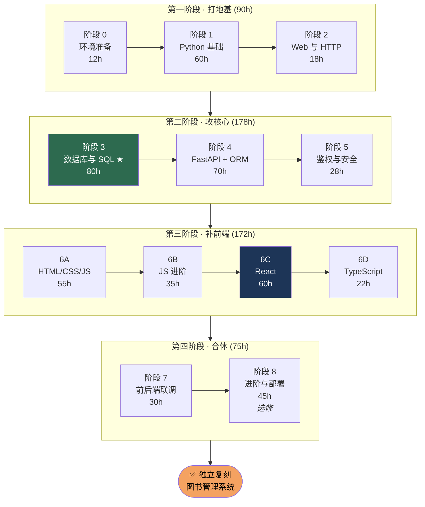
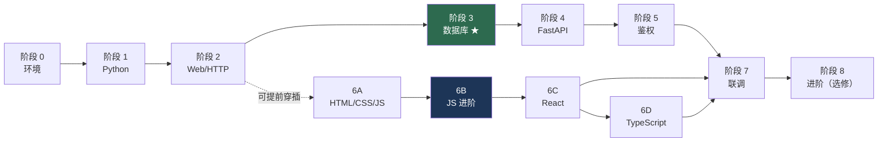
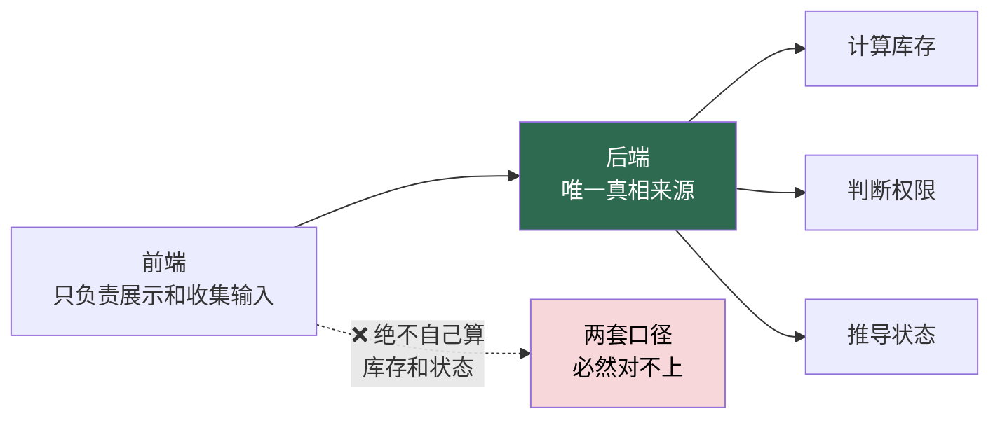
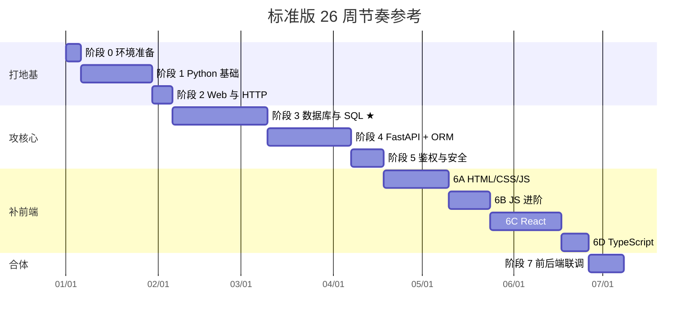
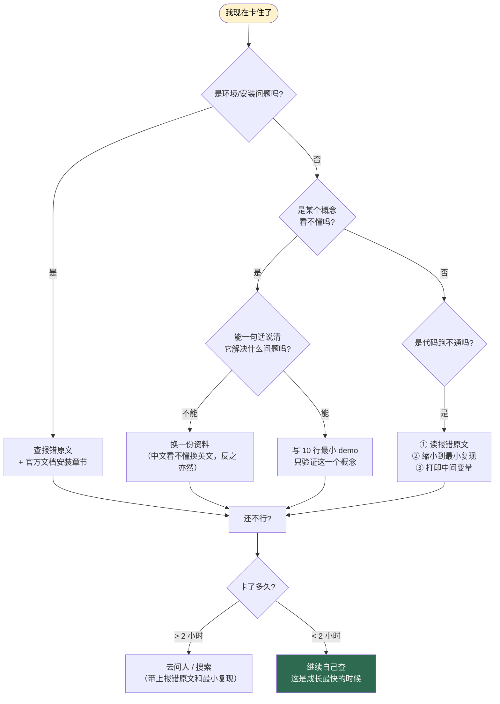

# 完整学习路线图

> 这是 [`README.md`](README.md) 的展开版：把每个阶段讲清楚「为什么在这个位置、学完能做什么、和前后阶段什么关系」。
> 具体的资源清单和验收标准，看各阶段的详细文档。

---

## 一张图看懂全局



---

## 阶段依赖关系（重要）

**不是所有阶段都必须严格串行。** 下面标出了哪些可以灵活安排。



### 可以灵活安排的地方

| 组合方式 | 说明 | 适合谁 |
|---|---|---|
| 严格串行 0→1→2→3→4→5→6A→6B→6C→6D→7 | 最稳，但后端学完后前端全忘了 | 时间充裕、怕乱的人 |
| **后端为主，前端穿插**（推荐） | 学完阶段 2 后，每天 30% 时间推进 6A/6B，主线仍是后端 | 大多数在校学生 |
| 前后端并行 | 阶段 3/4 与 6A/6B 同时推进，阶段 7 汇合 | 时间紧、能承受双线压力 |

> ⚠️ **唯一不能打乱的两处**：
> 1. **阶段 3 必须在阶段 4 之前** —— 不懂事务和锁，用 ORM 只会写出超借的 bug。
> 2. **阶段 6B 必须在 6C 之前** —— 不懂 `async/await` 和数组方法，React 会变成抄代码。

---

## 逐个阶段说明

### 阶段 0 · 环境准备（12 h）

**为什么放第一个：** 没有环境什么都干不了，而且这一步的坑（Python 装哪、MySQL 起不来、SSH key 配不对）会反复消耗你的耐心。

**学完能做什么：** 在命令行里自由活动，装好并启动所有需要的软件，会用 Git 提交代码到 GitHub。

**产出物：** 一个能跑起来的开源项目 + 自己的 GitHub 仓库。

📄 [详细计划](docs/00-环境准备.md)

---

### 阶段 1 · Python 基础（60 h）

**为什么在这里：** 后端语言是 Python。你有 C++ 基础的话，语法一周就能过，重点放在「动态类型 + 缩进 + 迭代器」的思维差异上。

**学完能做什么：** 独立写出 100 行以上的脚本，会定义函数和类，会处理异常和读写文件。

**可以跳过：** turtle 图形界面、电子邮件、区块链、异步 IO。

📄 [详细计划](docs/01-Python基础.md)

---

### 阶段 2 · Web 与 HTTP 基础（18 h）★最容易被低估

**为什么在这里：** **这是新手最容易跳过、但跳过之后最痛苦的一步。** 不理解 HTTP 的状态码和请求结构，后面调接口时会完全不知道错误出在哪一层。

**学完能做什么：**
- 说清 `GET/POST/PUT/DELETE` 的区别
- 看到 `401` 知道是没登录，看到 `403` 知道是没权限，看到 `422` 知道是参数格式错
- 写出第一个 FastAPI 接口并在 `/docs` 里调试

**产出物：** 里程碑 ② Hello API、里程碑 ③ 内存版 CRUD。

📄 [详细计划](docs/02-Web与HTTP基础.md)

---

### 阶段 3 · 数据库与 SQL（80 h）★★★★★ 全程最重要的阶段

**为什么最重要：**

> 这套系统**表面上是 CRUD，实际上是并发控制**。
> 「1 本库存的书被 5 个人同时借走」这个 bug，才是这个项目真正的技术含量所在。

**学完能做什么：**
- 手写 `CREATE TABLE`，设计主键、外键、索引
- 说清 4 种隔离级别的区别，以及 MVCC 快照在什么时刻建立
- 解释「为什么只加行锁不加 READ COMMITTED 没用」
- 亲手复现并修复超借 bug

**核心结论（务必记住）：**

```sql
-- 库存必须永远守恒，任何时刻跑这句都应该返回 0
SELECT (SELECT SUM(stock - available) FROM books WHERE is_deleted = 0)
     - (SELECT COUNT(*) FROM borrow_records WHERE return_date IS NULL);
```

**产出物：** 里程碑 ④ 真数据库 CRUD。（里程碑 ⑦ **并发修复** 的原理在本阶段学完，但要等阶段 4 有了借书接口才能真正跑起来 —— 见下方说明。）

> 📖 原理读 [小林coding · 图解 MySQL](https://xiaolincoding.com/mysql/) 的**事务篇**和**锁篇**，这两章要反复读三遍。

📄 [详细计划](docs/03-数据库与SQL.md)

---

### 阶段 4 · FastAPI + SQLAlchemy（70 h）

**为什么在这里：** 有了 SQL 基础，才知道 ORM 底层帮你做了什么。反过来先学 ORM 会变成「黑盒调 API」。

**学完能做什么：** 独立设计一套 RESTful API，用依赖注入管数据库会话，用 Pydantic 做校验，用 `selectinload` 避免 N+1。

**本阶段的核心设计原则：**

| 原则 | 反例 | 正确做法 |
|---|---|---|
| 库存统一重算 | 各处手工 `available -= 1` | 统一走 `sync_book()` |
| 状态不落库 | 表里存 `status = 'borrowing'` | 由日期动态推导 |
| 分页在数据库层 | 全查出来再切片 | `LIMIT/OFFSET` |

**产出物：** 里程碑 ⑤ 借还闭环。

📄 [详细计划](docs/04-FastAPI与SQLAlchemy.md)

---

### 阶段 5 · 鉴权与安全（28 h）

**为什么在这里：** 业务逻辑跑通后再加鉴权，能清楚看到「加了一层保护」前后的区别。

**学完能做什么：** 实现注册/登录/鉴权/角色权限，懂 bcrypt 和 JWT 的原理，知道 401 和 403 什么时候用哪个。

**必须记住：**

```
密码：永远 bcrypt 哈希，永不存明文，永不自己写加密算法
权限：必须后端强制校验，前端只做路由引导（前端能绕过，后端不能）
密钥：.env / .jwt_secret 必须进 .gitignore
```

**产出物：** 里程碑 ⑥ 登录鉴权。

📄 [详细计划](docs/05-鉴权与安全.md)

---

### 阶段 6A · HTML / CSS / JavaScript（55 h）

**为什么在这里：** 任何框架都建立在这三样之上。跳过它们直接学 React，等于在沙子上盖楼。

**学完能做什么：** 手写静态页面，用原生 JS 操作 DOM、绑定事件、做出一个待办清单。

📄 [详细计划](docs/06A-HTML-CSS-JavaScript.md)

---

### 阶段 6B · JavaScript 进阶（35 h）★★★ 第二重要

**为什么这里特别标注：**

> `Promise`、`async/await`、`map/filter/reduce`、解构、模块化 —— **这五样不过关，React 会学得非常痛苦。**
> 大多数人学 React 失败，根因不是 React 难，而是 JS 没学扎实。

**学完能做什么：** 用 `async/await` 调后端接口，写出带 Token 注入、401 处理、统一错误提取的 `api()` 封装。

**产出物：** 里程碑 ⑧ 纯 JS 前端的前置条件。

📄 [详细计划](docs/06B-JavaScript进阶.md)

---

### 阶段 6C · React（60 h）

**为什么必须在纯 JS 之后：** 只有先体会过「改一个数据要手动操作 5 处 DOM」的痛苦，你才真正理解 React 的 state 驱动渲染解决了什么。**这是本阶段效率的分水岭。**

**学完能做什么：** 用组件化思维拆分页面，用 `useState`/`useEffect`/`Context` 管理状态，用路由守卫拦截未登录访问。

**记住：** `components/ui/` 下的 shadcn/ui 组件用 CLI 生成，**不要手写，也不要通读**。

**产出物：** 里程碑 ⑨ React 前端。

📄 [详细计划](docs/06C-React.md)

---

### 阶段 6D · TypeScript（22 h）

**为什么放在 React 之后：** 先有能跑的 JS 代码，再把类型加上去，你能直观感受到类型带来的好处。反过来先学 TS 会觉得全是负担。

**学完能做什么：** 给所有 API 响应和数据模型定义 `interface`，跑 `npm run typecheck` 零报错。

**警告：** 不要陷进类型体操。够用就行。

📄 [详细计划](docs/06D-TypeScript.md)

---

### 阶段 7 · 前后端联调（30 h）

**为什么单独成一个阶段：** 前后端各自能跑 ≠ 能连起来跑。CORS、Token 传递、字段命名（camelCase vs snake_case）、错误处理，每一个都能卡你半天。

**学完能做什么：** 独立排查 `blocked by CORS policy`、`401 登录后被登出`、`422 参数错误`、`Failed to fetch` 这类问题。

**核心原则：**



**产出物：** 完整的借书流程能从页面跑通。

📄 [详细计划](docs/07-前后端联调.md)

---

### 阶段 8 · 进阶与部署（45 h，选修）

**什么时候学：** 阶段 7 完成后，且你的目标不只是「交作业」。

**学完能做什么：** 写 pytest 自动化测试、用 Docker 打包部署、做并发压测、把项目写进简历。

📄 [详细计划](docs/08-进阶与部署.md)

---

## 📅 参考学习节奏（标准版 470 h，每天 2.5 h）



> 这是**参考**，不是 KPI。学得慢不要紧，**卡住不回炉才是真问题**。

---

## 🧭 迷路时看这张图



---

[← 返回首页](README.md) · [资源总表](resources.md) · [里程碑](milestones.md) · [进度打卡](progress.md)
