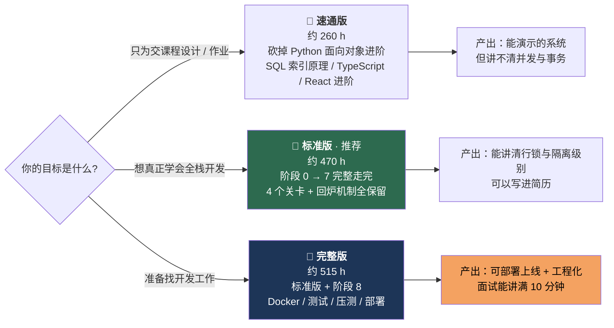
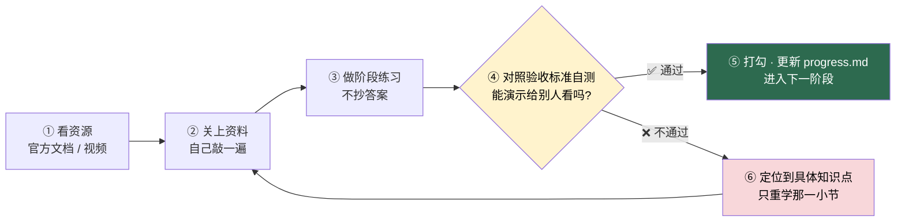

# 01 · 总路线图

> 这张图回答一个问题：**从零基础到做出「图书管理系统」，一共要走几步、每步花多少小时、什么时候才可以往下走。**

先在第一张图里找到自己的位置，再用第二张图决定「要学多深」，最后照第三张图的循环去执行每一天。

---

## 一、主流程图 · 9 个阶段 + 4 个验收关卡

```mermaid
flowchart TD
    START(["🎬 零基础开始<br/>先看到成品，再决定怎么学"]) --> S0

    S0["<b>阶段 0 · 环境准备</b><br/>12 h · 里程碑 ① 跑起来<br/>命令行 / Python 3.12 / Node LTS / MySQL 8.4 / Git"]
    S0 --> S1
    S1["<b>阶段 1 · Python 基础</b><br/>60 h<br/>语法 / 函数 / 文件 / 异常 / 面向对象 / 虚拟环境"]
    S1 --> G1{"关卡 ① 验收<br/>能独立写出<br/>100 行以上的脚本?"}
    G1 -- "❌ 不能 · 回炉重练" --> S1
    G1 -- "✅ 能 · 继续" --> S2

    S2["<b>阶段 2 · Web 与 HTTP 基础</b><br/>18 h · 里程碑 ② Hello API ③ 内存版 CRUD<br/>REST / JSON / 状态码 / CORS / FastAPI 入门"]
    S2 --> S3
    S3["<b>阶段 3 · 数据库与 SQL</b> ★核心<br/>80 h · 里程碑 ④ 真数据库 CRUD<br/>建表 / 索引 / 事务 ACID / 隔离级别 / 行锁 FOR UPDATE"]
    S3 --> G3{"关卡 ② 验收<br/>能手动复现超借<br/>并用行锁修好?"}
    G3 -- "❌ 不能 · 回炉重练" --> S3
    G3 -- "✅ 能 · 继续" --> S4

    S4["<b>阶段 4 · FastAPI + SQLAlchemy 2.0</b><br/>70 h · 里程碑 ⑤ 借还闭环<br/>路由分层 / ORM 模型 / Pydantic 校验 / 统一重算库存"]
    S4 --> S5
    S5["<b>阶段 5 · 鉴权与安全</b><br/>28 h · 里程碑 ⑥ 登录鉴权<br/>bcrypt 哈希 / JWT 签发校验 / admin 与 reader 角色"]
    S5 --> M7
    M7["<b>里程碑 ⑦ · 并发修复</b> ★★ 含金量最高<br/>阶段 4 之后 · 12 h<br/>5 并发复现超借 → 行锁 + READ COMMITTED 修好"]

    subgraph S6["<b>阶段 6 · 前端</b> ★核心 · 合计 172 h · 里程碑 ⑧ ⑨"]
        direction LR
        S6A["<b>6A HTML / CSS / 原生 JS</b><br/>55 h"]
        S6B["<b>6B JavaScript 进阶</b><br/>35 h · 闭包 / Promise / async-await"]
        S6C["<b>6C React 19 + Vite</b><br/>60 h · 组件 / useState / 路由"]
        S6D["<b>6D TypeScript + Tailwind v4</b><br/>22 h · 接口类型 / 泛型"]
        S6A --> S6B --> S6C --> S6D
    end

    M7 --> S6A
    S6D --> G6{"关卡 ③ 验收<br/>能独立做出带登录的<br/>增删改查页面?"}
    G6 -- "❌ 不能 · 回炉重练" --> S6A
    G6 -- "✅ 能 · 继续" --> S7

    S7["<b>阶段 7 · 前后端联调</b><br/>30 h<br/>CORS / Token 贯通 / 错误处理 / 职责边界划分"]
    S7 --> G7{"关卡 ④ 验收<br/>完整借书流程<br/>能从页面跑通?"}
    G7 -- "❌ 不能 · 回炉重练" --> S7
    G7 -- "✅ 能 · 通关" --> DONE

    DONE(["🎉 能独立复刻<br/>图书管理系统"])
    DONE -.-> S8["<b>阶段 8 · 进阶与部署</b>（选修）<br/>45 h<br/>Docker / pytest / 压测 / Nginx 部署"]

    style S3 fill:#2d6a4f,color:#fff
    style S6 fill:#1d3557,color:#fff
    style M7 fill:#f4a261,color:#000
    style DONE fill:#2d6a4f,color:#fff
    style G1 fill:#fff3cd,color:#000
    style G3 fill:#fff3cd,color:#000
    style G6 fill:#fff3cd,color:#000
    style G7 fill:#fff3cd,color:#000
```

| 图形 | 含义 | 你该做什么 |
|---|---|---|
| 深绿矩形（阶段 3、6） | **分水岭阶段** | 学不动很正常，这里投入占比最高 |
| 橙色矩形（里程碑 ⑦） | 简历上最值钱的一段 | 必须能口述原理，不能只抄代码 |
| 黄色菱形 | **验收关卡** | 过不了就回炉，绝不硬着头皮往下走 |
| 虚线箭头 | 选修（阶段 8） | 不做也能交差，做了才好找工作 |

> ⚠️ 全流程只有 4 次「允许往下走」的判定，集中在阶段 1、3、6、7 结束时。**关卡不是形式，是防止你带着漏洞往前跑。**

---

## 二、三条路径对比 · 先选路径再开始

| 路径 | 工时 | 砍掉了什么 | 适合谁 | 风险 |
|---|:---:|---|---|---|
| 🏃 速通版 | ~260 h | Python 面向对象进阶、SQL 索引原理、TypeScript、React 进阶 | 只为交课程设计，能跑就行 | 被问「并发怎么办」会答不上来 |
| 🚶 标准版（推荐） | ~470 h | 什么都不砍，按顺序走完 0–7 | 想真正学会全栈开发 | 周期长，中途容易放弃 |
| 🧗 完整版 | ~515 h | 标准版 + 阶段 8 | 准备找开发工作 | 前面没吃透就上 Docker，收益很低 |

**换算成日历时间（按核心 470 h 算）：** 每天 1 h ≈ 16 个月 · 每天 2 h ≈ 8 个月 · 每天 3 h ≈ 5 个月 · 每天 6 h ≈ 3 个月。

> 💡 **新手最大的误区是一上来就选完整版。** 先用速通版跑到「能演示」，再回来补 TypeScript 和并发，动力会强得多。

---

## 三、学习循环 · 每个阶段都照这个跑

**三条铁律：**

1. **不许只看不敲。** 视频看 1 小时，必须配 1 小时自己写代码。看视频产生的「我懂了」是假的。
2. **不许抄答案。** 卡住先查官方文档，超过 30 分钟再看参考实现。
3. **不许跳关。** 阶段 3（数据库）和阶段 6B（JavaScript 进阶）跳过去，后面必崩。

**一周的节奏：** 周一/周二看资源并跟着敲 → 周三/周四脱离资料重写 → 周五/周六做练习 → 周日跑验收，过了打勾，不过就定点回炉。回炉不是失败，是标准动作。

---

[← 返回首页](../README.md) · [里程碑](../milestones.md)
