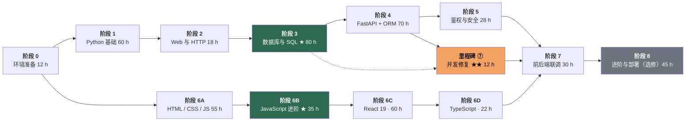
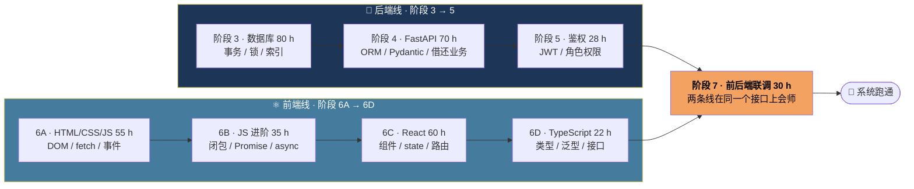
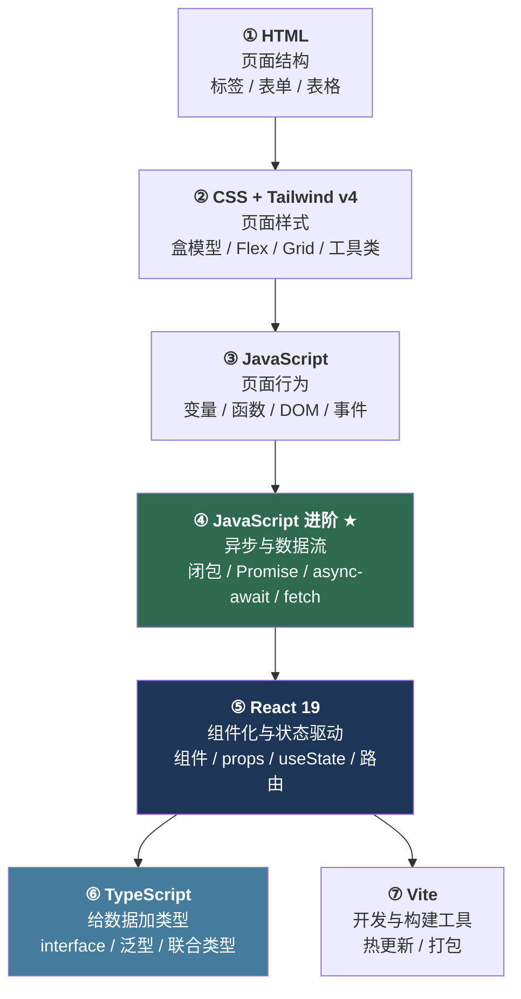

# 02 · 阶段依赖图

> 这张图回答一个问题：**哪个阶段必须先学、哪个阶段可以穿插着学、跳过了会怎么死。**

路线图不是一条死板的直线。看懂依赖关系，你就能把前端和后端**穿插着学**，用「换脑子」代替「学累了刷手机」。

---

## 一、阶段前置依赖（谁必须在谁之前）

**除虚线外全是硬依赖** —— 前面的没学，后面的根本看不懂。`P3 -.-> M7` 表示里程碑 ⑦ 要回头复习阶段 3。

---

## 二、可以并行的区间（重点看这里）

阶段 6A / 6B 的前端基础和阶段 3 / 4 的后端内容**没有互相依赖**，可以穿插。同一天里换着学，效率比死磕一条线高。

| 并行安排 | 怎么排 | 为什么可行 |
|---|---|---|
| 阶段 6A ↔ 阶段 2 | 前端三件套和 HTTP 基础同时进行 | 都只需要「浏览器 + 编辑器」，不碰数据库 |
| 阶段 6B ↔ 阶段 3 | 上午啃 SQL，下午写 JS | 两种思维模式，互相不打架，更不容易疲劳 |
| 阶段 6C ↔ 阶段 4 | React 组件 vs FastAPI 路由 | 都建立在「把大东西拆成小块」的思路上 |
| 阶段 7 | **不能并行，必须两边都完成** | 联调要求前后端同时在场 |

> ⚠️ 并行不等于同时开五条线。**同时推进最多两条**，超过两条必崩。

---

## 三、哪些绝对不能跳

| 阶段 | 能否跳 | 理由 |
|---|:---:|---|
| 3 · 数据库与 SQL ★ | ❌ **绝对不能** | 事务、隔离级别、行锁是本项目唯一的真难点，超借 bug 就出在这里 |
| 6B · JavaScript 进阶 ★ | ❌ **绝对不能** | Promise / async-await 是 fetch 调接口的地基，跳过后接口数据永远拿不到 |
| 6A · 前端三件套 | ❌ 不能 | 跳过后你永远不知道 React 到底帮你解决了什么 |
| 1 · Python 基础 | ❌ 不能 | 可精简，但函数、类、异常、虚拟环境必须会 |
| 2 · Web 与 HTTP | ❌ 不能 | 分不清 401 / 403 / CORS，联调时只能瞎猜 |
| 6D · TypeScript | 🟡 速通版可暂缓 | 不影响功能，但面试前要补上 |
| 0 · 环境准备 | ⚠️ 可压到 4 h | 但必须真的把一套系统跑起来一次 |
| 8 · 进阶与部署 | ✅ 可以跳 | 选修，不影响主线 |

---

## 四、每个阶段「没有它会怎样」

| 阶段 | 工时 | 没学好的后果 | 你自己的症状 |
|:---:|:---:|---|---|
| 0 环境准备 | 12 h | 后面每一步都在和命令行、版本、路径打架 | `python` 找不到、MySQL 连不上、Git 冲突不会解 |
| 1 Python 基础 | 60 h | 看不懂 ORM 模型定义，写不出一个函数 | `class`、`self`、推导式全靠抄 |
| 2 Web 与 HTTP | 18 h | 不知道前后端在传什么，调试全靠猜 | 分不清 401 和 403，不知道 CORS 是谁拦的 |
| 3 数据库 ★ | 80 h | **并发超借修不好，面试讲不出原理** | 5 人同借 1 本书，借出去 4 本 |
| 4 FastAPI + ORM | 70 h | 写不出接口，业务逻辑全堆一个文件 | 一个 `main.py` 写到 2000 行 |
| 5 鉴权与安全 | 28 h | 密码明文入库，谁都能调管理员接口 | 数据库里直接看到 `123456` |
| 6A 前端三件套 | 55 h | 只会复制粘贴页面，样式错一点就崩 | 改一个颜色找了半小时 |
| 6B JS 进阶 ★ | 35 h | `await` 用错地方，拿到的永远是 `undefined` | 接口有数据，页面渲染不出来 |
| 6C React | 60 h | 改数据页面不更新，或者无限刷新 | `useEffect` 死循环，控制台刷屏 |
| 6D TypeScript | 22 h | 类型全是 `any`，等于没写 TS | 编译过不去，一路 `as any` 蒙 |
| 7 前后端联调 | 30 h | 两边各自能跑，合起来就 404 / 401 / CORS | 请求发出去，浏览器红字一片 |
| 8 进阶与部署 | 45 h | 只是少一项加分项，不影响主线 | 简历上写不出「部署上线」 |

---

## 五、技术栈依赖图 · 前端那条线的递进关系

前端不是四个并列的技术，而是**一层套一层**，每一层都在解决上一层留下的痛点。

**为什么必须先写纯 JS 版（里程碑 ⑧）再学 React：**

| 对比维度 | 纯 JS 版 | React 版 |
|---|---|---|
| 更新界面 | 手动 `querySelector` 改 DOM | 改 `state`，界面自动渲染 |
| 状态管理 | 全局变量满天飞 | `useState` / `Context` |
| 代码复用 | 复制粘贴 | 组件 |
| 类型安全 | 无 | TypeScript |

**答不出这三题，说明 ⑥B 没学扎实：** ① 每改一个数据，你手动调了几次渲染函数？② 状态散落在几个变量里，同步它们累不累？③ 如果页面有 20 个地方要更新，你还写得动吗？

---

[← 返回首页](../README.md) · [里程碑](../milestones.md)
