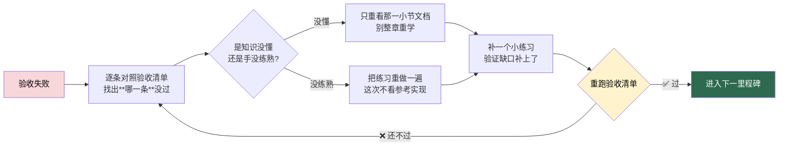

# 03 · 里程碑流程图

> 这张图回答一个问题：**每个阶段学完，我手上应该多出一个什么能演示的东西？验收不过该怎么办？**

「我学完了」是自我感觉，「打开浏览器能演示」才是事实。9 个里程碑就是 9 个事实。

---

## 一、9 个里程碑推进流程（含回炉分支）

```mermaid
flowchart TD
    START(["🎬 零基础开始"]) --> M1

    M1["<b>① 跑起来</b> · 阶段 0 · 约 8 h<br/>产出：本地启动一套现成的图书管理系统<br/>能登录、能打开 /docs 调一个 GET"]
    M1 --> C1{"能登录 + /docs 能调通?"}
    C1 -- "❌ 不能" --> M1
    C1 -- "✅ 能" --> M2

    M2["<b>② Hello API</b> · 阶段 2 · 约 4 h<br/>产出：FastAPI 的 /health 返回 JSON<br/>改代码后 --reload 自动生效"]
    M2 --> C2{"/health 返回 200<br/>且 /docs 可用?"}
    C2 -- "❌ 不能" --> M2
    C2 -- "✅ 能" --> M3

    M3["<b>③ 内存版 CRUD</b> · 阶段 2 · 约 6 h<br/>产出：不连数据库，用列表存图书<br/>GET / POST / PUT / DELETE 四个接口可用"]
    M3 --> C3{"非法入参返回 422<br/>而不是 500?"}
    C3 -- "❌ 不能" --> M3
    C3 -- "✅ 能" --> M4

    M4["<b>④ 真数据库 CRUD</b> · 阶段 3 · 约 12 h<br/>产出：换成 MySQL，重启数据不丢<br/>表里有 created_at / is_deleted"]
    M4 --> C4{"重启后端<br/>数据还在吗?"}
    C4 -- "❌ 不在" --> M4
    C4 -- "✅ 在" --> M5

    M5["<b>⑤ 借还闭环</b> · 阶段 4 · 约 20 h<br/>产出：借出 / 归还，available 永远正确<br/>sync_book 统一重算，不散落加减法"]
    M5 --> C5{"stock - available<br/>恒等于在借 + 预约占位?"}
    C5 -- "❌ 不等" --> M5
    C5 -- "✅ 相等" --> M6

    M6["<b>⑥ 登录鉴权</b> · 阶段 5 · 约 16 h<br/>产出：登录拿 JWT，无 Token 一律 401<br/>读者调管理员接口 403"]
    M6 --> C6{"数据库里<br/>看不到密码明文?"}
    C6 -- "❌ 看得到" --> M6
    C6 -- "✅ 看不到" --> M7

    M7["<b>⑦ 并发修复</b> ★★ 最重要 · 阶段 4 之后 · 约 12 h<br/>产出：5 并发复现超借 → 行锁 + READ COMMITTED 修好<br/>修复后只有 1 个 201，其余 4 个 400"]
    M7 --> C7{"能复现、能修复、<br/>还能口述原理?"}
    C7 -- "❌ 讲不出来" --> M7
    C7 -- "✅ 能讲清" --> M8

    M8["<b>⑧ 纯 JS 前端</b> · 阶段 6A + 6B · 约 30 h<br/>产出：不用框架，做出能登录能借书的页面<br/>fetch + localStorage + showToast"]
    M8 --> C8{"刷新页面<br/>登录态还在吗?"}
    C8 -- "❌ 丢了" --> M8
    C8 -- "✅ 还在" --> M9

    M9["<b>⑨ React 前端</b> · 阶段 6C + 6D · 约 40 h<br/>产出：用 React 19 + TS 重写第 ⑧ 步<br/>组件拆分 + ProtectedRoute + 无 any"]
    M9 --> C9{"功能与纯 JS 版<br/>完全对等?"}
    C9 -- "❌ 缺功能" --> M9
    C9 -- "✅ 对等" --> DONE

    DONE(["✅ 可以写进简历<br/>能独立复刻图书管理系统"])

    style M7 fill:#f4a261,color:#000
    style DONE fill:#2d6a4f,color:#fff
    style C1 fill:#fff3cd,color:#000
    style C3 fill:#fff3cd,color:#000
    style C5 fill:#fff3cd,color:#000
    style C7 fill:#fff3cd,color:#000
    style C9 fill:#fff3cd,color:#000
```

> ⏱️ 9 个里程碑加起来约 **148 h**，是 470 h 核心工时里**真正产出成品的那部分**。剩下的时间是看文档、调 bug、回炉。

---

## 二、「验收不通过就回炉」到底怎么回

回炉不是从头再学一遍，而是**定点修补**。图里 `❌ 不能 --> M1` 这种自环箭头，实际执行时是这样走的：

**回炉的三条纪律：**

1. **一次只补一个缺口。** 同时补三处，等于三处都没补。
2. **必须写下来。** 把「我卡在哪一条」写进 `progress.md`，一周后你会感谢自己。
3. **不许降低标准。** 验收清单是底线，不是参考线。过不了就说明后面一定会崩。

---

## 三、每个里程碑对应简历上的什么能力

| # | 里程碑 | 对应阶段 | 工时 | 简历 / 面试能写什么 |
|:---:|---|:---:|:---:|---|
| ① | 跑起来 | 0 | 8 h | 「能独立搭建 Python / Node / MySQL 本地开发环境」 |
| ② | Hello API | 2 | 4 h | 「熟悉 RESTful 设计，能用 FastAPI 编写接口并阅读 Swagger 文档」 |
| ③ | 内存版 CRUD | 2 | 6 h | 「掌握 Pydantic 数据校验，能处理 422 参数错误与统一响应结构」 |
| ④ | 真数据库 CRUD | 3 | 12 h | 「熟悉 MySQL 建表与索引，能用 SQLAlchemy 2.0 ORM 完成持久化」 |
| ⑤ | 借还闭环 | 4 | 20 h | 「独立设计借还业务模型，库存由后端统一重算，保证数据一致性」 |
| ⑥ | 登录鉴权 | 5 | 16 h | 「实现 bcrypt 密码哈希 + JWT 鉴权，基于角色的接口级权限控制」 |
| ⑦ | **并发修复** ★ | 4 之后 | 12 h | 「定位并修复高并发下的**超借**问题：`SELECT ... FOR UPDATE` 行锁 + READ COMMITTED 隔离级别」**← 面试最值钱的一条** |
| ⑧ | 纯 JS 前端 | 6A + 6B | 30 h | 「不依赖框架手写原生 JS 前端，掌握 fetch 异步请求与 Token 持久化」 |
| ⑨ | React 前端 | 6C + 6D | 40 h | 「使用 React 19 + TypeScript + Vite + Tailwind v4 开发前端，组件化拆分与路由守卫」 |

**怎么把这张表变成一段项目描述（示例）：**

> 独立开发前后端分离的图书管理系统。后端 FastAPI + SQLAlchemy 2.0 + MySQL 8 + Pydantic，实现图书 CRUD、借还闭环、预约队列与 JWT 鉴权；前端 React 19 + TypeScript + Vite + Tailwind CSS v4。
> 针对并发借书场景，通过 **`SELECT ... FOR UPDATE` 行锁配合 READ COMMITTED 隔离级别**解决 MySQL 默认 REPEATABLE READ 下 MVCC 快照导致的**超借**问题：压测 5 并发从「4 个成功」修复为「1 个成功、4 个正确返回库存不足」，并通过校验 SQL 保证 `stock - available` 恒等于在借与预约占位之和。

---

## 四、里程碑自测速查

| 自测问题 | 答不上来 → 回炉到 |
|---|---|
| 主键和外键分别解决什么问题？ | ④ · 阶段 3 |
| 为什么删书用 `is_deleted = 1` 而不是 `DELETE`？ | ④ · 阶段 3 |
| 只加行锁不改隔离级别，为什么并发还是超借？ | ⑦ · 阶段 3 事务篇 |
| MVCC 快照是在事务的哪个时刻建立的？ | ⑦ · 阶段 3 |
| 为什么库存和状态只能由后端算？ | ⑤ · 阶段 4 |
| `401` 和 `403` 的区别是什么？ | ⑥ · 阶段 5 |
| `async` 函数忘了 `await` 会怎样？ | ⑧ · 阶段 6B |
| 为什么不先学 React，要先写纯 JS 版？ | ⑧ · 阶段 6A |

---

[← 返回首页](../README.md) · [里程碑](../milestones.md)
