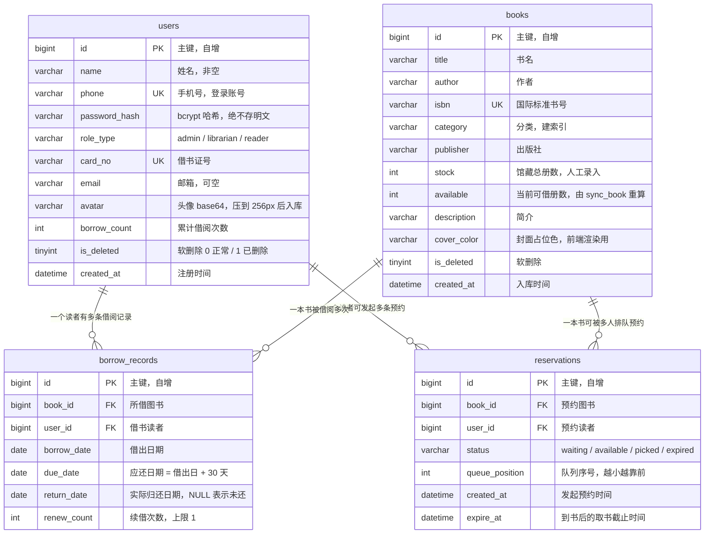
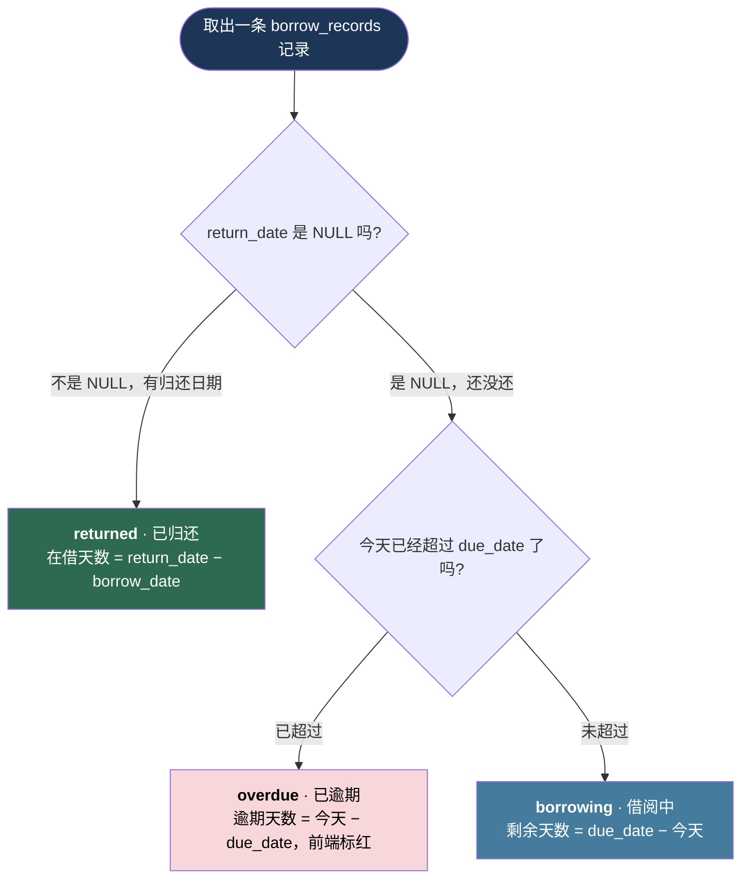

# 04 · 数据模型图

> 这张图回答一个问题：**数据库里到底有哪几张表、字段长什么样、借阅状态和库存到底存在哪里。**

---

## 一、ER 图 · 四张表及其关系

> ⚠️ 图中**没有 `borrow_status` 字段，也没有「是否逾期」字段** —— 这是故意的，见第三节。

---

## 二、字段说明表

| users · 字段 | 类型 | 说明与约束 |
|---|---|---|
| `id` | bigint | 主键，自增 |
| `name` | varchar(50) | 姓名，非空 |
| `phone` | varchar(20) | 登录账号，唯一索引 |
| `password_hash` | varchar(255) | bcrypt 哈希，形如 `$2b$12$...`，绝不存明文 |
| `role_type` | varchar(20) | `admin` 管理员 / `librarian` 馆员 / `reader` 读者，默认 reader |
| `card_no` | varchar(20) | 借书证号，唯一 |
| `email` | varchar(100) | 可空 |
| `avatar` | text | 头像 base64，**上传前必须压到 256px** |
| `borrow_count` | int | 累计借阅次数，默认 0 |
| `is_deleted` | tinyint(1) | 软删除，0 正常 / 1 已删除 |
| `created_at` | datetime | 默认 `CURRENT_TIMESTAMP` |

| books · 字段 | 类型 | 说明与约束 |
|---|---|---|
| `id` | bigint | 主键，自增 |
| `title` | varchar(200) | 书名，非空 |
| `author` | varchar(100) | 作者，非空 |
| `isbn` | varchar(20) | 国际标准书号，唯一索引 |
| `category` | varchar(50) | 分类，建索引 |
| `publisher` | varchar(100) | 可空 |
| `stock` | int | 馆藏总册数，**人工录入，业务不改** |
| `available` | int | 当前可借册数，**由 `sync_book()` 重算** |
| `description` | text | 简介 |
| `cover_color` | varchar(20) | 封面占位色值 |
| `is_deleted` | tinyint(1) | 软删除，**有借阅历史的书不允许物理删除** |
| `created_at` | datetime | 入库时间 |

| borrow_records · 字段 | 类型 | 说明与约束 |
|---|---|---|
| `id` | bigint | 主键，自增 |
| `book_id` | bigint | FK → `books.id`，索引 |
| `user_id` | bigint | FK → `users.id`，索引 |
| `borrow_date` | date | 借出日期，非空 |
| `due_date` | date | 应还日期 = 借出日 + 30 天，索引 |
| `return_date` | date | **NULL = 未归还，这是唯一的「在借」判据** |
| `renew_count` | int | 续借次数，上限 1 |

| reservations · 字段 | 类型 | 说明与约束 |
|---|---|---|
| `id` | bigint | 主键，自增 |
| `book_id` | bigint | FK → `books.id`，索引 |
| `user_id` | bigint | FK → `users.id`，索引 |
| `status` | varchar(20) | `waiting` 排队中 / `available` 已到书待取 / `picked` 已取书 / `expired` 已过期 |
| `queue_position` | int | 队列序号，越小越靠前，索引 |
| `created_at` | datetime | 发起预约时间 |
| `expire_at` | datetime | 到书后的取书截止时间，默认 +3 天 |

---

## 三、三条关键设计说明

- **① 借阅状态不落库**：状态由日期动态推导 —— `return_date` 有值 → `returned`；为空且已过 `due_date` → `overdue`；其余 → `borrowing`。状态若落库，就得靠定时任务每天去刷，任务一挂、服务器一停，数据立刻变错。**日期是事实，状态是结论。**
- **② `available` 由真实数据重算，不做手工加减**：`available = stock − 未归还借阅数 − 已到书待取的预约占位数`。`±1` 散落在借书、还书、续借、取消预约、超期处理五六个地方，漏一处就永久错位，所以全部收敛进 `sync_book(book_id)`。自检 SQL：`SUM(stock - available)` 必须恒等于「未归还借阅数 + 已到书待取占位数」，不等就说明有代码绕过了重算。
- **③ 一律软删除**：删除 = `UPDATE books SET is_deleted = 1`。有借阅历史的书会被外键挡住删不掉，硬删还会销毁历史报表；所有查询默认带 `WHERE is_deleted = 0`，借阅与预约记录永不删除。

---

## 四、借阅状态推导流程图

---

[← 返回首页](../README.md) · [里程碑](../milestones.md)
