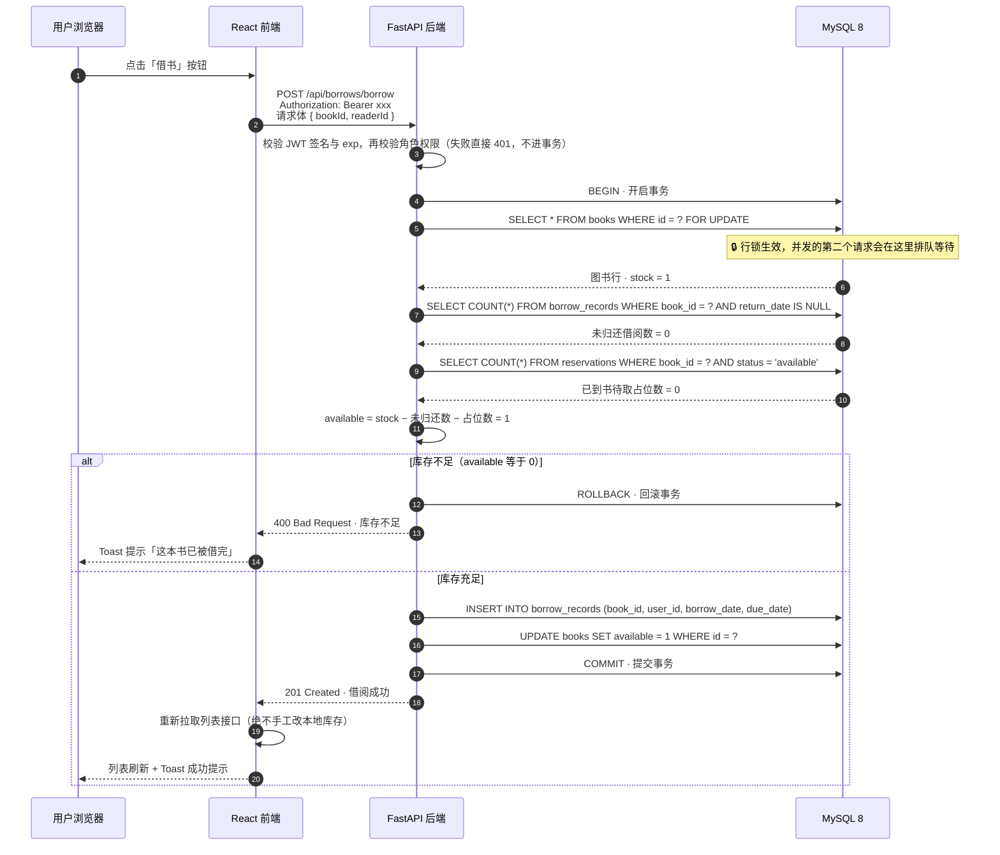
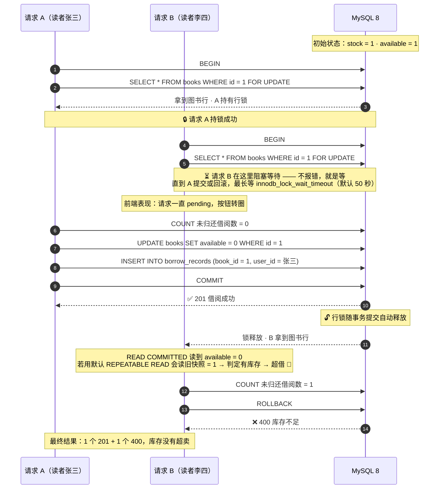
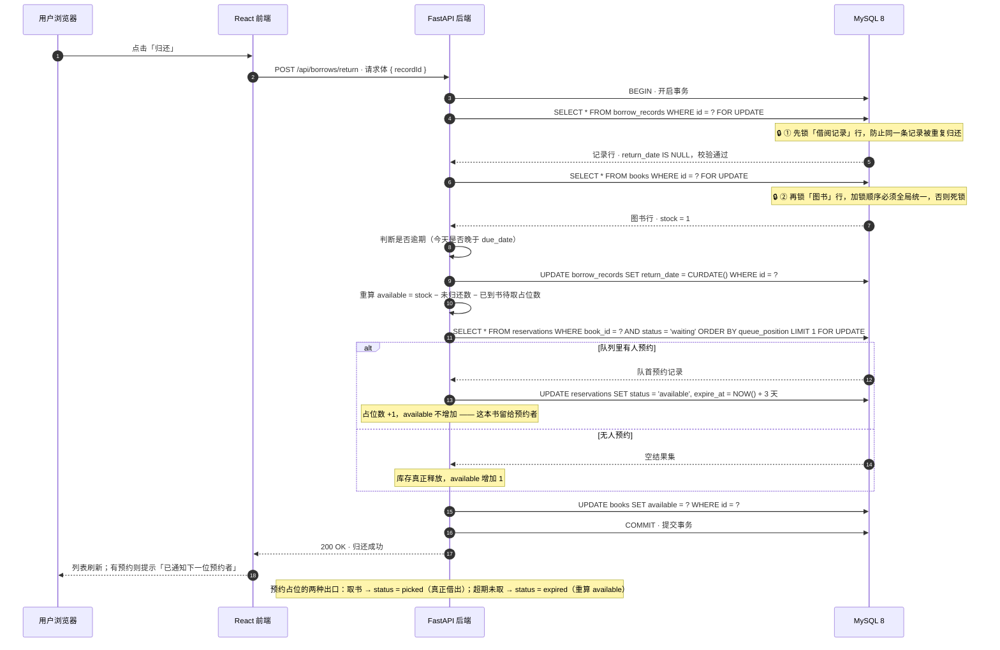

# 05 · 借书 / 还书时序图

> 这张图回答一个问题：**点一下「借书」，浏览器到数据库之间到底发生了什么？为什么并发时会超借？**

---

## 一、借书时序图（正常路径）



**三个必须记住的点：** ① `SELECT ... FOR UPDATE` —— 没有行锁，5 个并发请求会同时读到 `available = 1`；② `available` 必须重算而不是 `- 1` —— 加减法散落多处必然错位；③ 前端刷新列表而不是本地减 1 —— 库存和状态只能由后端算。

---

## 二、并发场景 · 两个人同时借同一本书（stock = 1 · available = 1）



| 修复措施 | 5 并发借 1 本书的结果 |
|---|---|
| 什么都不做 | 5 个 `201` —— 一本书借出去 5 次 |
| **只加 `FOR UPDATE`** | **4 个 `201`** —— 锁了个寂寞 🐛 |
| 加锁 + `READ COMMITTED` | 1 个 `201` + 4 个 `400` ✅ |

---

## 三、还书时序图（含预约队列晋升）



**加锁顺序：** 借书是「图书行 → 借阅记录」，还书是「借阅记录 → 图书行」。**全局顺序必须统一**，一个事务先锁书记录、另一个先锁记录再锁书，就会交叉等待形成 💀 **死锁**（MySQL 报 `Deadlock found`，随机杀掉其中一个事务）。

---

## 四、为什么必须用 READ COMMITTED

| 对比维度 | REPEATABLE READ（MySQL 默认） | READ COMMITTED（本项目采用） |
|---|---|---|
| MVCC 快照建立时机 | 事务中**第一次读**时建立，之后不再变 | **每条语句**开始时都重建 |
| 行锁内读到的数据 | 旧快照里的 `available = 1` | 最新已提交的 `available = 0` |
| 5 并发借 1 本书 | 4 个 `201`（超借 🐛） | 1 个 `201` + 4 个 `400` ✅ |
| `SELECT ... FOR UPDATE` | 锁生效了，但**读到的是过期数据** | 锁 + 最新数据，判断才正确 |
| 同一事务内两次读 | 结果始终一致（可重复读） | 可能不一致 |
| 代价 | —— | 失去可重复读能力，业务上必须能接受 |

**只加锁不改隔离级别是无效的，两件事必须同时做：**

```python
@event.listens_for(engine, "connect")
def _use_read_committed(conn, _):
    conn.cursor().execute("SET SESSION TRANSACTION ISOLATION LEVEL READ COMMITTED")
```

关键查询还必须带 `with_for_update()`：`select(Book).where(Book.id == bid).with_for_update()`。

**三条铁律：** ① 库存和状态只能由后端算；② `available` 只能重算，不能手工 ±1；③ 行锁和隔离级别必须同时改，少任何一个并发借书照样超借。

[← 返回首页](../README.md) · [里程碑](../milestones.md)
