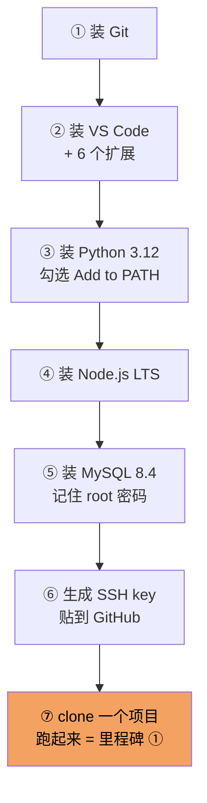

# 阶段 0 · 环境准备

> **一句话定位：** 把「能写代码、能跑起来、能存上 GitHub」这套家伙什装齐，后面 11 个阶段全指望它。

**工时：12 h** ｜ 前置要求：一台能上网的 Windows 电脑 ｜ 对应里程碑：[① 跑起来](../milestones.md)

---

## 🎯 学完能做什么

- 在 PowerShell 里自由进出目录、创建文件、运行脚本，不再怕黑窗口
- 装好 Python 3.12 / Node.js LTS / MySQL 8.4 / VS Code / Git，每个都能报出版本号
- 建一个虚拟环境 `venv`，在里面装包，不污染全局
- 用 Git 管住自己的代码：`add / commit / push / pull / branch / merge`
- 配好 SSH key，以后 `git push` 不用输密码
- 把代码推到 GitHub，别人能看见

**做完这些你会得到：** 一个能在本地跑起来的开源项目（里程碑 ①），和一套以后每天都用的工具链。

---

## ⏱️ 工时拆解表

| # | 模块 | 具体内容 | 工时 | 产出物 |
|:---:|---|---|:---:|---|
| 1 | 环境安装实操 | Python / Node / MySQL / VS Code / Git 全套装好 | 2 h | 6 个版本号截图 |
| 2 | Git 入门 | [廖雪峰 Git 教程](https://liaoxuefeng.com/books/git/index.html) | 3 h | 本地仓库能 `commit` |
| 3 | Git 深入 | [Pro Git 中文版](https://git-scm.com/book/zh/v2) 第 1–3 章 | 4 h | 看懂 `status / log / diff` |
| 4 | GitHub 协作 | [GitHub Skills](https://skills.github.com/) 互动课 | 3 h | 能 `push`、能提 PR |
| | | **合计** | **12 h** | |

> 💡 时间分配建议：**第 1 天只装环境**（2 h，装不上别硬扛，重启电脑再试），**第 2–4 天学 Git**。

---

## 📚 资源清单

| 资源 | 类型 | 语言 | 工时 | 优先级 | 链接 |
|---|---|:---:|:---:|:---:|---|
| 廖雪峰 Git 教程 | 图文 | 中 | 3 h | 🔴必学 | <https://liaoxuefeng.com/books/git/index.html> |
| Pro Git 官方书（第 1–3 章） | 电子书 | 中 | 4 h | 🔴必学 | <https://git-scm.com/book/zh/v2> |
| GitHub Skills 互动课程 | 互动 | 英 | 3 h | 🟡推荐 | <https://skills.github.com/> |
| 环境安装实操（Python/Node/MySQL/VS Code） | 动手 | — | 2 h | 🔴必学 | — |

### 工具下载（全部实测可访问）

| 工具 | 用途 | 版本要求 | 下载地址 |
|---|---|:---:|---|
| VS Code | 写代码的编辑器 | 最新稳定版 | <https://code.visualstudio.com/> |
| Git | 版本控制 | 最新版 | <https://git-scm.com/downloads> |
| Node.js | 跑前端（阶段 6 才用，但先装） | LTS | <https://nodejs.org/zh-cn> |
| Python | 跑后端 | **3.12** | <https://www.python.org/downloads/> |
| MySQL | 数据库 | **8.4** | <https://dev.mysql.com/downloads/> |
| Hoppscotch | 在线测接口（免安装） | — | <https://hoppscotch.io/> |

> ⚠️ **版本别乱选。** Python 用 3.12（3.13 有些库还没轮子），MySQL 用 8.4（8.0 的语法教程也能用，但 8.4 是当前 LTS）。

---

## 🗺️ 安装顺序



> 💡 **顺序别调。** 先装 VS Code 再装 Python，VS Code 才能自动认出 Python 解释器。

---

## ✅ 必须掌握的知识点

### 1. 命令行基础（Windows PowerShell）

- [ ] 打开 PowerShell 的三种方式：`Win + X` → 终端、`Win + R` 输 `powershell`、VS Code 里 `` Ctrl + ` ``
- [ ] `pwd` 我在哪；`cd 路径` 去哪；`cd ..` 回上一层
- [ ] `ls` / `Get-ChildItem` 列出目录；`ls -Force` 连隐藏文件一起列
- [ ] `mkdir 名字` 建目录；`New-Item 文件名` 建空文件
- [ ] `Remove-Item 文件` 删文件；`Remove-Item -Recurse -Force 目录` 删目录
- [ ] `cat 文件` / `Get-Content 文件` 看文件内容
- [ ] `python --version`、`node -v`、`git --version`、`mysql --version` 都能出结果
- [ ] 明白 PATH 是什么：为什么输 `python` 能找到程序
- [ ] 知道报错 `不是内部或外部命令` = PATH 没配好

### 2. Python 3.12 + venv

- [ ] 安装时**必须勾** `Add python.exe to PATH`
- [ ] `py -3.12 --version` 能输出 `Python 3.12.x`
- [ ] 建虚拟环境：`python -m venv .venv`
- [ ] 激活：`.\.venv\Scripts\Activate.ps1`（前面出现 `(.venv)` 才算成功）
- [ ] 装包：`pip install fastapi "uvicorn[standard]"`；导出依赖：`pip freeze > requirements.txt`
- [ ] **说清楚为什么要 venv**：每个项目一套独立依赖，互不打架

> ⚠️ PowerShell 激活 venv 报「禁止运行脚本」时，执行一次（只需一次）：
>
> ```powershell
> Set-ExecutionPolicy -Scope CurrentUser RemoteSigned
> ```

### 3. Node.js LTS

- [ ] `node -v` 输出 `v22.x` 或更新，`npm -v` 有输出
- [ ] 知道 `npm install` 会生成 `node_modules`（**永远不要打开它**）

### 4. MySQL 8.4

- [ ] 用 MySQL Installer 装 **Server only**，配置类型选 `Development Computer`
- [ ] **设置 root 密码并记住它**（忘了只能重装）
- [ ] 确认服务在跑：`Get-Service -Name MySQL*` 状态是 `Running`
- [ ] 能登录：`mysql -u root -p`
- [ ] 会三条命令：`SHOW DATABASES;`、`CREATE DATABASE library;`、`exit`

### 5. VS Code 及必装扩展

- [ ] `Python`（微软官方，Python 支持）
- [ ] `Pylance`（类型提示、跳转定义）
- [ ] `ESLint`（JS/TS 代码检查）
- [ ] `Prettier`（代码格式化，保存自动排版）
- [ ] `SQLTools`（连 MySQL、写 SQL）
- [ ] `Chinese (Simplified)`（中文界面）
- [ ] 会开 VS Code 内置终端，会 `code .` 用当前目录打开 VS Code

### 6. Git 基本操作

- [ ] 配置身份：`git config --global user.name` / `user.email`
- [ ] `git init` 把目录变成仓库
- [ ] `git status` 看当前状态（**最常用的命令，一天敲 50 次**）
- [ ] `git add 文件` / `git add .` 把改动放进暂存区
- [ ] `git commit -m "说明"` 提交
- [ ] `git log --oneline` 看历史
- [ ] `git diff` 看改了什么
- [ ] `git branch 名字` 建分支；`git switch 名字` 切分支
- [ ] `git merge 分支名` 合并
- [ ] `git pull` / `git push` 拉取和推送
- [ ] 看懂 `.gitignore`，知道 `.venv/`、`node_modules/`、`.env` 必须写进去

### 7. SSH key 配到 GitHub

- [ ] `ssh-keygen -t ed25519 -C "你的邮箱"` 一路回车
- [ ] 公钥在 `C:\Users\你的用户名\.ssh\id_ed25519.pub`
- [ ] 复制内容 → GitHub → Settings → SSH and GPG keys → New SSH key
- [ ] `ssh -T git@github.com` 看到 `Hi 用户名!` 就算成功
- [ ] 知道 **私钥 `id_ed25519` 绝不能给任何人**

---

## 🛠️ 动手练习

### 练习 1：把命令全敲一遍（30 min）

打开 PowerShell，按顺序执行，每步都要看到预期输出：

```powershell
# 1. 看当前在哪
pwd

# 2. 建一个练习目录并进去
mkdir E:\code\hello-env
cd E:\code\hello-env

# 3. 检查 6 个工具（每个都要出版本号，出不来就回去重装）
git --version
python --version
node -v
npm -v
code --version
mysql --version

# 4. 建虚拟环境并激活（注意前面出现 (.venv)）
python -m venv .venv
.\.venv\Scripts\Activate.ps1

# 5. 在虚拟环境里装个包验证一下
pip install requests
python -c "import requests; print('venv OK', requests.__version__)"

# 6. 退出虚拟环境
deactivate
```

> 💡 第 3 步 `code --version` 失败很正常：安装 VS Code 时勾上 `Add to PATH` 才有。

### 练习 2：走完 Git 全流程（1 h）

```powershell
# 1. 配置身份（只做一次，全局生效）
git config --global user.name "你的名字"
git config --global user.email "你的邮箱@example.com"
git config --global init.defaultBranch main

# 2. 初始化仓库
mkdir E:\code\git-practice
cd E:\code\git-practice
git init

# 3. 写第一个文件
"# 我的第一个仓库" | Out-File -Encoding utf8 README.md
git status          # 应该看到 README.md 是红色的 untracked

# 4. 提交
git add .
git commit -m "第一次提交：添加 README"

# 5. 改点东西，再提交一次
"`n这一行是第二次改的" | Out-File -Append -Encoding utf8 README.md
git diff            # 看看改了什么
git add .
git commit -m "第二次提交：补充内容"
git log --oneline   # 应该看到两条记录

# 6. 开分支、改、合并（模拟真实协作）
git switch -c feature/add-title
"`n## 小标题" | Out-File -Append -Encoding utf8 README.md
git add .
git commit -m "分支上：加小标题"
git switch main
git merge feature/add-title
git log --oneline --graph   # 看到合并历史
```

**要求：** 全部敲完，并且能口头解释 `add` 和 `commit` 的区别。

### 练习 3：推到 GitHub（1 h）

- [ ] 在 GitHub 网页上新建一个**空仓库**（不要勾 README）
- [ ] 按页面提示把本地仓库推上去：

```powershell
# 换成你自己的仓库地址
git remote add origin git@github.com:你的用户名/git-practice.git
git branch -M main
git push -u origin main
```

- [ ] 刷新 GitHub 页面，能看到 `README.md`
- [ ] 在网页上改一句话，然后本地 `git pull`，看到改动被拉下来
- [ ] 跑 `ssh -T git@github.com`，确认 SSH 生效

### 练习 4：clone 并跑起来一个现成项目（1.5 h，里程碑 ①）

- [ ] `git clone` 一个开源的 FastAPI 或管理系统 Demo 到你电脑
- [ ] 按它 README 装依赖，把服务启动起来
- [ ] 浏览器打开 `http://127.0.0.1:8000/docs`，随便调一个 GET 接口
- [ ] **目的不是看懂代码**，是确认「我的环境能跑别人的项目」

---

## 🏁 验收标准

- [ ] `git --version`、`python --version`、`node -v`、`mysql --version` 四条命令全都有输出
- [ ] 能新建并激活 venv，`(.venv)` 出现在命令行前面
- [ ] 能在 venv 里装包，并用 `python -c "import 包名"` 验证
- [ ] 能用 `mysql -u root -p` 登录，并成功执行 `CREATE DATABASE library;`
- [ ] VS Code 里 6 个扩展全部安装完成，界面是中文
- [ ] 能在 VS Code 内置终端里跑 Python 文件
- [ ] 有一个本地 Git 仓库，至少 3 次 commit、1 个分支、1 次 merge
- [ ] 这个仓库已经推到 GitHub，网页上能打开
- [ ] `ssh -T git@github.com` 返回 `Hi xxx!`
- [ ] 成功 clone 别人的项目并启动起来
- [ ] 能说清：**工作区 → 暂存区 → 本地仓库 → 远程仓库** 四者的关系

### 自测题（答不出就回去补）

1. `git add` 之后文件存在哪里？`commit` 又做了什么？
2. 为什么 `.venv/` 和 `node_modules/` 不能提交进 Git？
3. `git pull` 和 `git fetch` 有什么区别？
4. PowerShell 里 `Activate.ps1` 报「禁止运行脚本」，原因是什么？怎么一次性解决？

---

## ⚠️ 常见坑

| 坑 | 现象 | 怎么解决 |
|---|---|---|
| Python 安装没勾 PATH | 输 `python` 提示「不是内部或外部命令」 | 重跑安装包 → Modify → 勾上 Add to PATH；或手动把安装目录加进环境变量 |
| PowerShell 不让激活 venv | `Activate.ps1 因为在此系统上禁止运行脚本` | `Set-ExecutionPolicy -Scope CurrentUser RemoteSigned` |
| MySQL root 密码忘了 | 死活登不进去 | 别硬修，直接卸载重装最省时间 |
| MySQL 服务没启动 | `Can't connect to MySQL server on 'localhost'` | `net start MySQL84`（服务名以 `Get-Service -Name MySQL*` 为准） |
| 用记事本存 Python 文件 | 运行报 `SyntaxError: invalid character` | 文件编码必须是 **UTF-8 无 BOM**，用 VS Code 存 |
| SSH 一直要密码 | 每次 push 都弹用户名密码 | 说明用的是 HTTPS 地址，换成 `git@github.com:...` |
| 把 `.env` / 密码提交了 | 仓库里能看到明文密钥 | 加进 `.gitignore`，并 `git rm --cached .env` 从版本控制里摘掉 |
| 在错误的目录里 `git init` | 整个用户目录变成仓库 | `Remove-Item -Recurse -Force .git` 删掉重来 |

---

## 🧭 下一步

环境好了，正式开写代码。**阶段 1 是 60 h 的 Python，是全流程最不能糊弄的基础章节。** 阶段 0 的价值要到第 4 周才体现：当你能一条命令切分支、一条命令回滚到 bug 之前的版本时，你会庆幸现在花了这 12 小时。

---

[← 返回首页](../README.md) · [资源总表](../resources.md) · [里程碑](../milestones.md)
