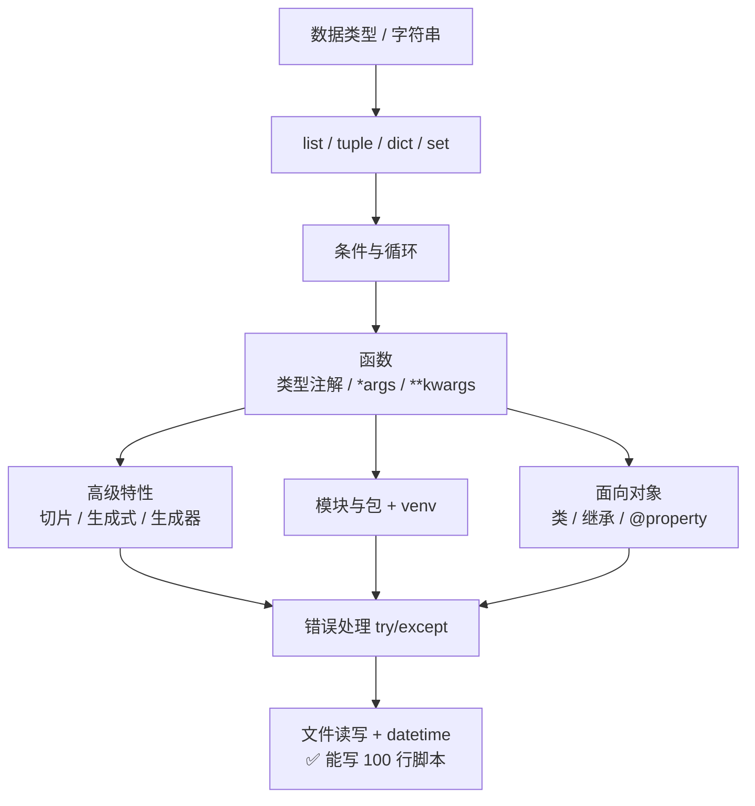

# 阶段 1 · Python 基础

> **一句话定位：** Python 是后端的唯一语言，这 60 小时决定你后面 400 小时是顺畅还是寸步难行。

**工时：60 h（资源 40 h + 练习 20 h）** ｜ 前置要求：[阶段 0](00-环境准备.md) ｜ 对应里程碑：[② Hello API](../milestones.md)

---

## 🎯 学完能做什么

- 熟练用 `list / dict / set` 处理数据，不再为「怎么存一批书」发愁
- 写出带类型注解的函数，一眼看懂参数和返回值是什么
- 用列表生成式、切片、生成器把 10 行循环压成 1 行
- 用类描述现实世界的东西（`Book`、`Reader`、`BorrowRecord`），并用 `@property` 保护数据
- 文件读进来 → 处理 → 写出去，一个脚本搞定，遇到错误也不会整崩
- 独立写出 5 个 100 行以上的可用脚本

**关键认知：** 这一阶段**不需要任何 Web 知识**，就是纯练基本功。功夫不到位，阶段 4 的 FastAPI 会变成抄代码。

---

## ⏱️ 工时拆解表

| # | 模块 | 具体内容 | 工时 | 产出物 |
|:---:|---|---|:---:|---|
| 1 | 基础语法 | 廖雪峰第 1–6 章：数据类型、字符串、list/dict、条件循环、函数 | 12 h | 能手写各种小算法 |
| 2 | 高级特性 | 廖雪峰第 7–9 章：切片、迭代、列表生成式、生成器 | 7 h | 能用一行写完过滤逻辑 |
| 3 | 模块与面向对象 | 廖雪峰第 10–12 章：模块、类、继承、`@property` | 6 h | 会拆多文件项目 |
| 4 | 官方文档 + 速查补漏 | 官方教程定向查、菜鸟教程当字典 | 15 h | 遇到问题会自己查 |
| 5 | **写 5 个小脚本** | 下面「动手练习」里的 5 道题 | 20 h | 5 个 `.py` 文件 |
| | | **合计** | **60 h** | |

---

## 📚 资源清单

| 资源 | 类型 | 语言 | 工时 | 优先级 | 链接 |
|---|---|:---:|:---:|:---:|---|
| 廖雪峰 Python 教程（第 1–12 章） | 图文 | 中 | 25 h | 🔴必学 | <https://liaoxuefeng.com/books/python/introduction/index.html> |
| Python 官方教程（中文） | 文档 | 中 | 10 h | 🟡推荐 | <https://docs.python.org/zh-cn/3/tutorial/> |
| 菜鸟教程 Python3（当字典查） | 速查 | 中 | 5 h | 🟡推荐 | <https://www.runoob.com/python3/python3-tutorial.html> |
| CS50P 哈佛 Python 课 | 视频 | 英 | 20 h | ⚪选学 | <https://cs50.harvard.edu/python/> |
| 自己写 5 个小脚本 | 动手 | — | 20 h | 🔴必学 | 见下方练习 |

**学习配方：** 廖雪峰照顺序读（主线）→ 官方教程补细节（支线）→ 菜鸟教程只用来查语法 → 每读完一章**立刻**写代码。

---

## 🗺️ 知识依赖顺序



> 💡 **函数是分水岭。** 函数没学明白，后面的类、装饰器、FastAPI 依赖注入全是玄学。

---

## ✅ 必须掌握的知识点

### 1. 数据类型、字符串与容器

- [ ] `int / float / str / bool / None` 五兄弟；`type(x)` 和 `isinstance(x, int)`
- [ ] f-string：`f"书名：{title}，库存：{stock}"`
- [ ] 字符串方法：`strip()` `split()` `join()` `replace()` `startswith()`，以及 `int("123")` 转型
- [ ] `list` 有序可变（`append/pop/sort`）；`tuple` 有序不可变，用来表示一条记录
- [ ] `dict` 键值对：**`d["k"]` 键不存在会抛 `KeyError`，`d.get("k", 默认值)` 不会**
- [ ] `set` 去重 + 集合运算；`for i, x in enumerate(lst)` 和 `for k, v in d.items()`

### 2. 条件、循环与函数

- [ ] `if / elif / else`，`while` 与 `for`，`break / continue`，三元表达式
- [ ] `def` 定义、返回值、多返回值（其实是元组）
- [ ] **类型注解**：`def add_book(title: str, stock: int = 1) -> dict:`
- [ ] 默认参数的坑：**别用可变对象当默认值**，`def f(lst=[])` 是经典 bug
- [ ] `*args` 收位置参数、`**kwargs` 收关键字参数；`lambda x: x["stock"] > 0` 配合 `sorted(key=...)`

### 3. 高级特性

- [ ] 切片：`lst[1:3]`、`lst[::-1]` 反转、`s[:5]` 取前五个
- [ ] 迭代：为什么 `for` 能作用于 list / dict / 文件对象
- [ ] 列表生成式：`[b["title"] for b in books if b["stock"] > 0]`
- [ ] 生成器 `yield`：一次产一个，不占内存（理解即可，会用更好）

### 4. 模块、包与 venv

- [ ] `if __name__ == "__main__":` 到底防的是什么
- [ ] 一个目录加 `__init__.py` 就成了包
- [ ] `pip install`、`pip freeze > requirements.txt`、`python -m venv .venv` 天天用

### 5. 面向对象

- [ ] `class` / `__init__` / `self` 的含义；实例属性 vs 类属性
- [ ] `__str__` 和 `__repr__`：让 `print(book)` 输出可读内容
- [ ] 继承 `class EBook(Book):`、`super().__init__(...)`
- [ ] 多态：不同子类实现同名方法，调用方不用管具体类型
- [ ] `@property` 把方法变成属性：写 `book.available` 而不是 `book.get_available()`
- [ ] `@dataclass` 快速定义只有数据的类（写模型时超好用）

### 6. 错误处理、文件读写与 datetime

- [ ] `try / except 具体异常 / else / finally` 完整结构
- [ ] 常见异常：`ValueError` `KeyError` `TypeError` `FileNotFoundError` `ZeroDivisionError`
- [ ] **不要 `except Exception: pass`** —— 那是把 bug 藏起来；`raise ValueError("库存不能为负")` 主动抛错
- [ ] `with open("books.csv", encoding="utf-8") as f:` 自动关文件；写文件用 `"w"`、追加用 `"a"`
- [ ] `csv.DictReader` 把每行变成 dict；`json.load` / `json.dump(ensure_ascii=False, indent=2)`
- [ ] `datetime.now()`、`strftime("%Y-%m-%d")`、`strptime`、`timedelta(days=30)` 算应还日期

### ❌ 可以跳过的章节（省 10+ 小时）

| 章节 | 为什么跳过 |
|---|---|
| turtle 图形界面 | 画图跟 Web 后端毫无关系 |
| 电子邮件 / SMTP | 本项目的通知功能不做 |
| 区块链 / bitcoin | 廖雪峰教程里的示例章节，纯概念 |
| 异步 IO（`async` / `await`） | **阶段 8 再回来看**，现在学只会混淆 |
| 元类 / 描述符 / 装饰器进阶 | 面试再准备，本项目用不到 |

---

## 🛠️ 动手练习

> 5 道题共 20 h。**别抄答案**，卡住超过 30 分钟再看参考实现。

### 练习 1：命令行通讯录（3 h）

功能：增 / 删 / 列全部，数据存 JSON 文件，重启不丢。

```python
# contacts.py —— 练 dict、函数、异常、JSON 文件读写
import json
from pathlib import Path

DATA = Path("contacts.json")

def load() -> dict[str, str]:
    """读文件；文件不存在就返回空字典（不要报错）"""
    if not DATA.exists():
        return {}
    return json.loads(DATA.read_text(encoding="utf-8"))

def save(data: dict[str, str]) -> None:
    DATA.write_text(json.dumps(data, ensure_ascii=False, indent=2), encoding="utf-8")

def add(name: str, phone: str) -> None:
    data = load()
    if name in data:
        raise ValueError(f"{name} 已存在")
    data[name] = phone
    save(data)
    print(f"✅ 已添加 {name}")

def remove(name: str) -> None:
    data = load()
    if data.pop(name, None) is None:   # pop 的第二个参数 = 找不到时的默认值
        raise KeyError(f"{name} 不存在")
    save(data)
    print(f"✅ 已删除 {name}")

def main() -> None:
    while True:
        cmd = input("命令 (add/del/list/quit): ").strip()
        if cmd == "quit":
            break
        try:
            if cmd == "add":
                add(input("姓名: "), input("电话: "))
            elif cmd == "del":
                remove(input("姓名: "))
            elif cmd == "list":
                for name, phone in sorted(load().items()):
                    print(f"  {name:<10} {phone}")
        except (ValueError, KeyError) as e:
            print(f"❌ {e}")

if __name__ == "__main__":
    main()
```

**要求：** 不许用一个全局变量存数据；自己再加上一个 `find 姓名` 命令。

### 练习 2：读 CSV 统计词频（4 h）

准备一个 `books.csv`（列：`title,author,stock`），要求：

- [ ] 统计一共几本书、总库存多少；结果写成 `report.json`（`ensure_ascii=False`）
- [ ] 按作者分组，输出每位作者有几本书（用 `dict` 累积）
- [ ] 找出库存最多的前 3 本（`sorted(key=lambda x: ...)`）

### 练习 3：银行账户类（4 h）

```python
# accounts.py —— 练类、@property、继承、多态
class BankAccount:
    """存钱 / 取钱 / 查流水；余额不足要抛异常"""

    def __init__(self, owner: str, balance: float = 0.0) -> None:
        self.owner = owner
        self._balance = balance
        self.history: list[str] = []

    @property
    def balance(self) -> float:
        """只读属性，防止外部直接把余额改坏"""
        return self._balance

    def deposit(self, amount: float) -> None:
        if amount <= 0:
            raise ValueError("存款金额必须为正数")
        self._balance += amount
        self.history.append(f"+{amount}")

    def withdraw(self, amount: float) -> None:
        if amount > self._balance:
            raise ValueError(f"余额不足：当前 {self._balance}")
        self._balance -= amount
        self.history.append(f"-{amount}")

class SavingsAccount(BankAccount):
    """储蓄账户：取钱收 0.5% 手续费（继承 + 方法重写）"""

    def withdraw(self, amount: float) -> None:
        super().withdraw(amount * 1.005)
```

**要求：** 再写一个 `CreditAccount`（可透支 1000），三个类一起演示。

### 练习 4：日志分析器（5 h）

给自己造 200 行日志（格式 `2024-05-01 10:23:45 ERROR 数据库连接失败`），要求：

- [ ] 用 `collections.Counter` 统计 INFO / WARN / ERROR 次数，并用列表生成式筛出所有 ERROR 行
- [ ] 用 `datetime.strptime` 解析时间，找出错误最集中的那个小时
- [ ] 用生成器 `def iter_lines(path): yield ...` 逐行读，不许 `readlines()`

### 练习 5：把练习 1–4 拆成包（4 h）

```
mylib/
├── __init__.py
├── storage.py      # 只管读写文件
├── models.py       # 用 @dataclass 定义 Book / Reader
└── utils.py        # 日期计算、格式化
main.py             # 只负责调用
```

- [ ] 每个模块职责单一，`main.py` 里写 `from mylib.models import Book`
- [ ] 全程在 venv 里开发，最后 `pip freeze > requirements.txt`

---

## 🏁 验收标准

- [ ] 5 个脚本全部写完，**总计 500 行以上**，都能 `python 文件名.py` 直接跑通
- [ ] 5 个脚本都提交进 Git（至少 20 次 commit）
- [ ] 能默写：`[b["title"] for b in books if b["stock"] > 0]`
- [ ] 能解释 `d["k"]` 和 `d.get("k")` 的区别
- [ ] 能解释为什么默认参数不能写 `def f(lst=[])`
- [ ] 能解释 `@property` 解决了什么问题
- [ ] 遇到 `KeyError` / `FileNotFoundError` 知道什么意思、怎么修
- [ ] 拿到没见过的需求（如「统计每个读者借了几本书」），能独立拆解并写出来

### 自测题

1. `*args` 和 `**kwargs` 分别接收什么？函数签名怎么写？
2. `for i in range(len(lst))` 为什么不推荐？更好的写法是什么？
3. `with open(...)` 里的 `with` 起什么作用？

---

## ⚠️ 常见坑

| 坑 | 说明 |
|---|---|
| `def f(lst=[])` 当默认值 | 这个列表**只创建一次**，多次调用会累积数据；要写 `lst=None` 再判断 |
| 缩进混用 Tab 和空格 | 直接 `IndentationError`，VS Code 设成 4 空格 |
| `except: pass` 吞掉所有错误 | 程序不报错但结果是错的；必须捕获**具体异常** |
| 边遍历边删列表元素 | 会漏元素，正确做法是 `for x in lst[:]` 或生成新列表 |
| 读写文件不写 `encoding="utf-8"` | Windows 默认 GBK，中文会乱码或报 `UnicodeDecodeError` |
| 把「看懂」当成「会写」 | 唯一解法：关掉教程，从空白文件开始敲 |

---

## 🧭 下一步

Python 基本功有了，接下来搞明白**后端到底在跟谁说话** —— 阶段 2 讲清 HTTP 是什么、`GET` 和 `POST` 差在哪，然后用 4 小时写出你人生第一个 API。

---

[← 返回首页](../README.md) · [资源总表](../resources.md) · [里程碑](../milestones.md)
