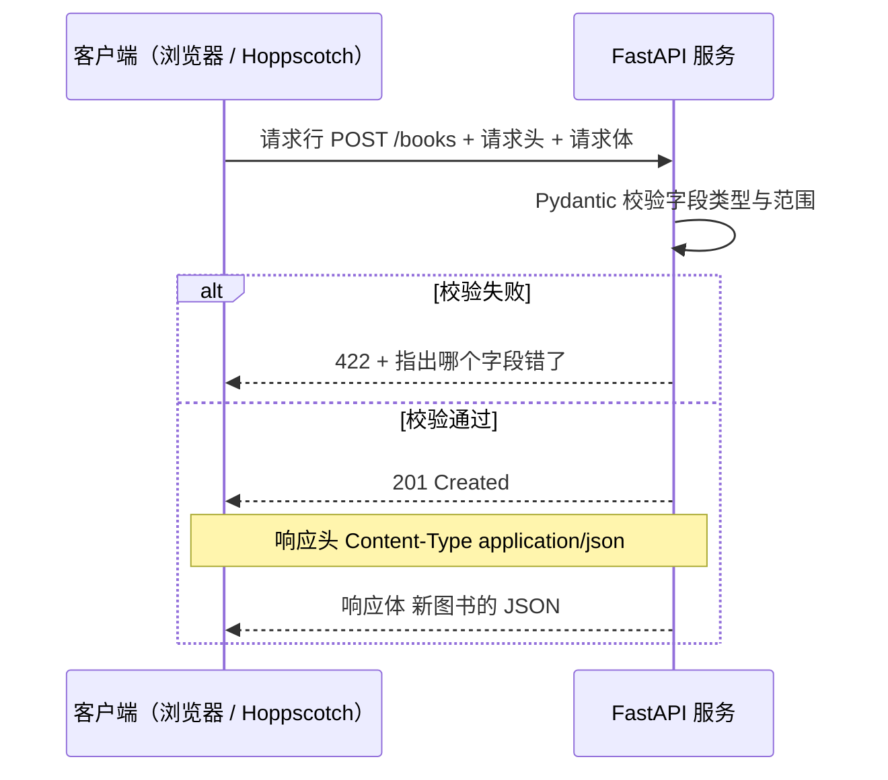

# 阶段 2 · Web 与 HTTP 基础

> **一句话定位：** 搞明白「浏览器敲一个网址到看见数据」中间发生了什么，然后写出你人生第一个 API。

**工时：18 h（资源 14 h + 练习 4 h）** ｜ 前置要求：[阶段 1](01-Python基础.md) ｜ 对应里程碑：[② Hello API](../milestones.md)、[③ 内存版 CRUD](../milestones.md)

---

## 🎯 学完能做什么

- 说清一次 HTTP 请求由**请求行 + 请求头 + 请求体**三部分组成
- 看到 `404` / `422` / `401` 就知道往哪查，不再一脸懵
- 按 REST 风格设计接口：`GET /books`、`POST /books`、`PUT /books/{id}`
- 用 FastAPI 做出 5 个接口，用 Pydantic 校验参数，非法数据返回 `422` 而不是 `500`
- 讲明白**前后端分离**分离了什么、**CORS** 为什么报错、**Bearer Token** 为什么叫无状态

**产出物：** 一个能跑的 `main.py`，`/docs` 里 5 个接口全部可用 —— 这就是里程碑 ② 和 ③。

---

## ⏱️ 工时拆解表

| # | 模块 | 具体内容 | 工时 | 产出物 |
|:---:|---|---|:---:|---|
| 1 | HTTP 协议 | MDN · HTTP 概述：请求 / 响应 / 方法 / 状态码 | 4 h | 自己画的请求响应结构图 |
| 2 | Web 全貌 | MDN · 学习网页开发：前后端各干什么 | 4 h | 能口述一次网页加载流程 |
| 3 | FastAPI 入门 | 官方中文文档「教程 - 用户指南」前 10 节 | 6 h | 跑通 `/health` 和 `/docs` |
| 4 | **动手：两个里程碑** | `/health` + 内存版 CRUD + Pydantic 校验 | 4 h | `main.py` 一个文件 |
| | | **合计** | **18 h** | |

> ⚠️ 第 4 步的 4 h 是**写代码净时间**，不含调试。想加分页、搜索可以额外投入，但**别卡在这** —— 阶段 4 会用真数据库重写一遍。

---

## 📚 资源清单

| 资源 | 类型 | 语言 | 工时 | 优先级 | 链接 |
|---|---|:---:|:---:|:---:|---|
| MDN · HTTP 概述 | 文档 | 中 | 4 h | 🔴必学 | <https://developer.mozilla.org/zh-CN/docs/Web/HTTP/Overview> |
| MDN · 学习网页开发（了解全貌） | 教程 | 中 | 4 h | 🟡推荐 | <https://developer.mozilla.org/zh-CN/docs/Learn> |
| FastAPI 官方中文文档（先读教程-用户指南） | 文档 | 中 | 6 h | 🔴必学 | <https://fastapi.tiangolo.com/zh/> |
| 动手：写 `/health` + 内存版 CRUD | 动手 | — | 4 h | 🔴必学 | 见下方练习 |

---

## 🗺️ 一次请求都经历了什么



---

## ✅ 必须掌握的知识点

### 1. 请求与响应结构

- [ ] **请求行**：`GET /books?page=1 HTTP/1.1` —— 方法 + 路径 + 查询参数
- [ ] **请求头**：`Host`、`Content-Type`、`Authorization`、`Accept`；**请求体**只有 `POST/PUT/PATCH` 才有
- [ ] **响应**：状态行 `HTTP/1.1 200 OK` + 响应头 `Content-Type: application/json` + JSON 响应体
- [ ] 路径参数 `/books/B001` 用于定位资源；查询参数 `/books?keyword=三体` 用于筛选

### 2. 方法与状态码

| 方法 | 语义 | 幂等 | 本项目例子 |
|---|---|:---:|---|
| `GET` | 查询，**不改数据** | ✅ | `GET /books`、`GET /books/B001` |
| `POST` | 新建 | ❌ | `POST /books` |
| `PUT` | 全量更新 | ✅ | `PUT /books/B001` |
| `PATCH` | 局部更新 | ❌ | 我们用 `PUT` + `exclude_unset` 代替 |
| `DELETE` | 删除 | ✅ | `DELETE /books/B001` |

| 码 | 含义 | 什么时候出现 | 谁的问题 |
|:---:|---|---|---|
| **200** | OK | 查询 / 更新成功 | — |
| **201** | Created | 新建成功（`POST` 的标准返回） | — |
| **204** | No Content | 删除成功，响应体为空 | — |
| **400** | Bad Request | 业务规则不通过（如库存不足） | 客户端 |
| **401** | Unauthorized | **没登录 / Token 无效或过期** | 客户端 |
| **403** | Forbidden | 登录了但**没权限** | 客户端 |
| **404** | Not Found | 资源不存在 / 路径写错 | 客户端 |
| **422** | Unprocessable Entity | **参数校验失败**（`stock` 传了字符串） | 客户端 |
| **500** | Internal Server Error | 后端抛了未捕获异常 | **服务端** |

> ⚠️ **幂等** = 同一请求发 1 次和发 100 次，服务器最终状态一样。铁律：`401` 是「不知道你是谁」，`403` 是「知道你是谁，但你不够格」。

### 3. JSON 与 REST 风格

- [ ] JSON 的键必须用**双引号**（和 Python 不一样），不支持注释和尾逗号，也没有 `datetime` 类型
- [ ] 时间统一用 ISO 字符串 `"2024-05-01T10:23:45"`；Python 互转用 `json.dumps` / `json.loads`
- [ ] REST：路径用**名词复数** `/books`，动作交给 HTTP 方法，层级用嵌套 `/readers/R001/borrows`

| ❌ 不 REST | ✅ REST |
|---|---|
| `GET /getAllBooks` | `GET /books` |
| `POST /addBook` | `POST /books` |
| `POST /deleteBook?id=1` | `DELETE /books/1` |

### 4. 前后端分离与 CORS

- [ ] 前端（React）只管**显示和交互**，后端（FastAPI）只管**数据和规则**，唯一的契约是 JSON 接口文档
- [ ] 好处：可同时开发、能换前端、能被 App 复用；代价：必须处理跨域、必须约定字段名
- [ ] **同源** = 协议 + 域名 + 端口完全一致；`localhost:5173` 与 `127.0.0.1:8000` **不同源**，所以会报 CORS
- [ ] CORS 报错时浏览器拦的是**响应**，请求其实发出去了（后端日志有记录）；只能靠**后端加响应头**解决

在练习 2 的 `main.py` 里加上这段（`app` 已存在）：

```python
from fastapi.middleware.cors import CORSMiddleware

app.add_middleware(
    CORSMiddleware,
    allow_origins=["http://localhost:5173"],  # 别写 "*" 又同时开 credentials
    allow_credentials=True,
    allow_methods=["*"],
    allow_headers=["*"],
)
```

### 5. 无状态鉴权（Bearer Token）

- [ ] **有状态**：服务器用 Session 记住「谁登录了」；**无状态**：服务器签发 Token（阶段 5 用 JWT）靠**验签**判断真假
- [ ] 写法：`Authorization: Bearer eyJhbGciOi...`，**`Bearer` 后有一个空格**，少空格直接 401；好处是服务器不存东西好扩容，代价是 Token 无法单独作废

---

## 🛠️ 动手练习

### 练习 1：Hello API（1 h，里程碑 ②）

```powershell
mkdir E:\code\library-api; cd E:\code\library-api
python -m venv .venv
.\.venv\Scripts\Activate.ps1
pip install fastapi "uvicorn[standard]"
uvicorn main:app --reload   # --reload：改完代码自动重启，开发时必开
```

```python
# main.py —— 最小可运行的 FastAPI 应用
from fastapi import FastAPI

app = FastAPI(title="Library API", version="0.1.0")


@app.get("/health", tags=["系统"])
def health() -> dict:
    """健康检查：部署后用来确认服务还活着"""
    return {"ok": True, "service": "library-api"}
```

**验收：** `http://127.0.0.1:8000/health` 返回 `{"ok":true,"service":"library-api"}`；`/docs` 能点着调用。

### 练习 2：内存版 CRUD（3 h，里程碑 ③）

**完整代码，复制即可运行。** 用 `list` 存数据，重启就丢 —— 这是故意的。

```python
# main.py —— 内存版图书 CRUD（FastAPI + Pydantic 校验）
from fastapi import FastAPI, HTTPException, status
from pydantic import BaseModel, Field

app = FastAPI(title="Library API", version="0.2.0")

class BookCreate(BaseModel):
    """新增图书时前端要传的字段"""
    title: str = Field(min_length=1, max_length=100, description="书名")
    author: str = Field(min_length=1, max_length=50, description="作者")
    stock: int = Field(default=1, ge=0, le=999, description="库存，0 表示全借出")

class BookUpdate(BaseModel):
    """更新时字段全部可选，只改传上来的那些"""
    title: str | None = Field(default=None, min_length=1, max_length=100)
    author: str | None = Field(default=None, min_length=1, max_length=50)
    stock: int | None = Field(default=None, ge=0, le=999)

class Book(BookCreate):
    """返回给前端的完整图书：比入参多一个 id"""
    id: str

# ---------- 内存"数据库"：进程重启就没了（故意的） ----------
books: list[Book] = [
    Book(id="B001", title="三体", author="刘慈欣", stock=3),
    Book(id="B002", title="活着", author="余华", stock=1),
    Book(id="B003", title="人类简史", author="尤瓦尔·赫拉利", stock=0),
]
_next_id = 4  # 自增主键，模拟数据库的 AUTO_INCREMENT

def find_book(book_id: str) -> Book:
    """找不到就抛 404，免得每个接口都写一遍循环"""
    for b in books:
        if b.id == book_id:
            return b
    raise HTTPException(status.HTTP_404_NOT_FOUND, f"图书 {book_id} 不存在")

@app.get("/health", tags=["系统"])
def health() -> dict:
    return {"ok": True, "service": "library-api"}

@app.get("/books", response_model=list[Book], tags=["图书"])
def list_books(keyword: str | None = None) -> list[Book]:
    """GET /books，或 GET /books?keyword=三体"""
    if keyword:
        return [b for b in books if keyword.lower() in b.title.lower()]
    return books

@app.post("/books", response_model=Book, status_code=status.HTTP_201_CREATED, tags=["图书"])
def create_book(payload: BookCreate) -> Book:
    """新增图书，成功返回 201（不是 200）"""
    global _next_id
    book = Book(id=f"B{_next_id:03d}", **payload.model_dump())
    _next_id += 1
    books.append(book)
    return book

@app.put("/books/{book_id}", response_model=Book, tags=["图书"])
def update_book(book_id: str, payload: BookUpdate) -> Book:
    """exclude_unset 保证只改前端传了的字段"""
    book = find_book(book_id)
    for key, value in payload.model_dump(exclude_unset=True).items():
        setattr(book, key, value)
    return book

@app.delete("/books/{book_id}", status_code=status.HTTP_204_NO_CONTENT, tags=["图书"])
def delete_book(book_id: str) -> None:
    """删除成功返回 204，响应体为空"""
    books.remove(find_book(book_id))
    return None
```

启动方式同练习 1。用 `/docs` 或 Hoppscotch 逐个测，**必须亲眼看到**这些状态码：

| 操作 | 请求 | 期望状态码 |
|---|---|:---:|
| 列表 / 搜索 | `GET /books`、`GET /books?keyword=三体` | 200 |
| 新增合法 | `POST /books` body `{"title":"呐喊","author":"鲁迅","stock":2}` | **201** |
| 新增缺字段 | body `{"title":"呐喊"}` | **422** |
| 新增类型错 | body `{"title":"x","author":"y","stock":"abc"}` | **422** |
| 更新 | `PUT /books/B001` body `{"stock":9}` | 200，且 `author` 没被清空 |
| 更新不存在的 id | `PUT /books/B999` body `{"stock":1}` | **404** |
| 删除 / 再删一次 | `DELETE /books/B002` 连做两次 | **204** / **404** |

> 💡 `stock: "abc"` 返回 **422 而不是 500**，就是 Pydantic 在干活 —— 这是阶段 4 面试题的标准答案。

---

## 🏁 验收标准

- [ ] `/health` 返回 `{"ok": true, "service": "library-api"}`
- [ ] `/docs` 能看到自动生成的 Swagger 文档，并能点击 `Try it out` 调用
- [ ] 改代码后服务自动重载（`--reload` 生效）
- [ ] `GET /books` 返回图书数组；`POST /books` 新增返回 **201**
- [ ] `PUT /books/{id}` 能改，**只传 `stock` 时 `author` 不丢**；`DELETE` 返回 **204**
- [ ] 传非法数据（`stock: "abc"`）返回 **422**，不是 500；id 不存在返回 **404**
- [ ] 能说清 `200 / 201 / 204 / 400 / 401 / 403 / 404 / 422 / 500` 各自含义
- [ ] 能说清 CORS 报错是谁的问题（后端）、怎么修（加中间件）
- [ ] 能说清**为什么访问 `/docs` 不用自己写前端** —— FastAPI 读类型注解自动生成的

### 自测题

1. `GET` 和 `POST` 最本质的区别是什么？为什么 `GET` 不该改数据？
2. `401` 和 `403` 分别是什么场景？分别怎么处理？
3. `PUT` 和 `PATCH` 有什么区别？我们用哪种方式模拟了 `PATCH`？
4. 浏览器报 CORS 错误时，请求到底有没有发到后端？怎么验证？
5. `Authorization: Bearer xxx` 里，服务器凭什么知道 Token 是真的？

---

## ⚠️ 常见坑

| 坑 | 现象 | 怎么解决 |
|---|---|---|
| 忘了 `response_model` | 响应漏字段 / 多出内部字段 | 每个接口都指定 `response_model` |
| 新增返回 200 | 前端判断逻辑开始混乱 | 显式写 `status_code=201` |
| `PUT` 用 `model_dump()` | 没传的字段被覆盖成 `None` | 用 `model_dump(exclude_unset=True)` |
| CORS 同时开 `"*"` 和 credentials | 浏览器报 `Invalid CORS header` | `allow_origins` 写具体前端地址 |
| 端口 8000 被占 | `[Errno 10048] address already in use` | `uvicorn main:app --port 8001` |
| 以为 `422` 是后端 bug | 去后端代码里瞎找 | `422` 永远是**参数问题**，看 `detail` 指哪个字段 |

---

## 🧭 下一步

你的接口**能用了，但数据一关就没**。阶段 3 回答那个关键问题：**数据该存在哪、两个请求同时改一条数据会发生什么** —— 那是全流程含金量最高的一章。

---

[← 返回首页](../README.md) · [资源总表](../resources.md) · [里程碑](../milestones.md)
