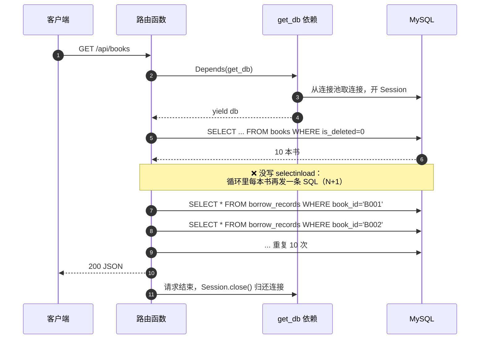
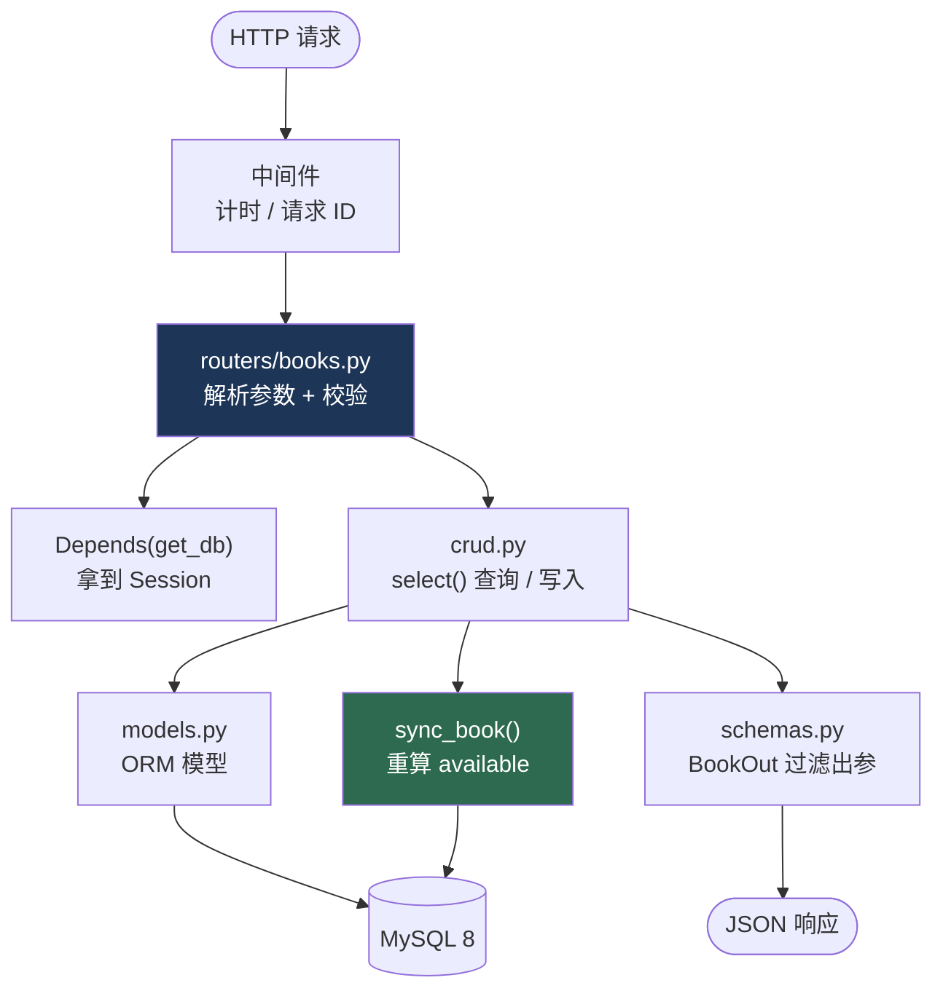

# 阶段 4 · FastAPI + SQLAlchemy + Pydantic

> **一句话定位：** 阶段 3 你学会了「数据库怎么想」，这一阶段学会「怎么把它包成一个能用的后端」—— 这是你第一次交付**能给别人演示**的产品。

---

## ✅ 学完能做什么

| 能力 | 具体表现 | 对应里程碑 |
|---|---|---|
| 搭出规范的项目骨架 | 7 个文件各司其职，不写「一个 `main.py` 两千行」 | ④ |
| 写标准 CRUD 接口 | 增删改查 + `response_model` + 正确的状态码 | ④ |
| 用 Pydantic 把住入口 | 脏数据在进数据库之前就被挡掉，返回 `422` 而不是 `500` | ④ |
| 用 SQLAlchemy 2.0 风格查询 | `select()` + `Mapped[]`，不用过时的 `Query` API | ④ |
| 解决 N+1 查询 | 用 `selectinload` 把 1+N 条 SQL 压成 2 条 | ⑤ |
| 做出借还闭环 | 借书 / 还书 / 预约，`available` 永远正确 | ⑤ |
| 写分页 + 排序 + 模糊搜索 | 一个列表接口带全套参数，且**排序字段走白名单** | ⑤ |
| 做惰性维护 | 把过期预约、逾期催还塞进读接口，不引入定时任务 | ⑤ |

---

## ⏱️ 工时拆解（合计 70 h = 资源 48 h + 练习 22 h）

| # | 模块 | 主资源 | 资源 h | 练习 h | 小计 |
|:--:|---|---|:--:|:--:|:--:|
| A | FastAPI 路由 / 参数 / 响应模型 | FastAPI 中文文档 | 10 | 4 | 14 |
| B | Pydantic 数据校验 | FastAPI 中文 + Pydantic 官方 | 9 | 3 | 12 |
| C | 依赖注入与项目结构 | FastAPI 中文文档 | 6 | 3 | 9 |
| D | SQLAlchemy 2.0 ORM ★ | ORM 快速入门 + 官方文档 | 15 | 5 | 20 |
| E | 分页 / 排序 / 模糊搜索 + 惰性维护 | FastAPI 中文文档 | 4 | 3 | 7 |
| F | 中间件 / CORS / 生命周期 | FastAPI 中文文档 | 4 | 0 | 4 |
| G | 里程碑 ④⑤：CRUD + 借还闭环 | 动手 | 0 | 4 | 4 |
| | **合计** | | **48** | **22** | **70** |

---

## 📚 资源清单

| 资源 | 类型 | 语言 | 工时 | 优先级 | 链接 |
|---|---|:---:|:---:|:---:|---|
| FastAPI 官方中文文档 · 用户指南（全） | 文档 | 中 | 25 h | 🔴必学 | <https://fastapi.tiangolo.com/zh/tutorial/> |
| SQLAlchemy 2.0 ORM 快速入门 | 文档 | 英 | 8 h | 🔴必学 | <https://docs.sqlalchemy.org/en/20/orm/quickstart.html> |
| SQLAlchemy 2.0 官方文档（全） | 文档 | 英 | 7 h | 🟡推荐 | <https://docs.sqlalchemy.org/en/20/> |
| Pydantic 官方文档 | 文档 | 英 | 8 h | 🟡推荐 | <https://docs.pydantic.dev/latest/> |
| 动手：完整图书 CRUD API | 动手 | — | 22 h | 🔴必学 | 本文「动手练习」 |

**用户指南里可以跳过的章节：** 安全（阶段 5 学）、测试、部署、WebSocket、GraphQL、模板（`Jinja2`，本项目前后端分离用不到）、`StaticFiles`。

**必须逐字读的章节：** 路径参数 → 查询参数 → 请求体 → 响应模型 → 依赖项 → 安全性之前的「更大的应用」→ 中间件 → CORS → Lifespan 事件。

---

## 🧠 必须掌握的知识点

### A. FastAPI 核心

- [ ] 路由：`@app.get / post / put / patch / delete`，路径参数 `{book_id}` 与类型注解自动校验
- [ ] 查询参数：默认值 = 可选，`Query(1, ge=1, le=100)` 加约束；`?keyword=x&page=2`
- [ ] 请求体：`BaseModel` 子类做参数 → 自动生成 JSON Schema 和 `/docs` 表单
- [ ] **`response_model`**：出参过滤（防止把 `password_hash` 漏出去）+ 类型转换 + 文档
- [ ] **状态码**：`201` 创建成功、`204` 删除成功、`400` 业务规则不满足、`404` 资源不存在、`409` 冲突、`422` 参数校验失败
- [ ] `HTTPException(status_code=400, detail="库存不足")` —— `detail` 会出现在响应体的 `{"detail": ...}`
- [ ] **`Depends` 依赖注入**：函数即依赖，可嵌套、可缓存（同一请求内默认复用一次结果）
- [ ] **`APIRouter` 拆分**：`APIRouter(prefix="/api/books", tags=["图书"])`，最后 `app.include_router(...)`
- [ ] 中间件 `@app.middleware("http")`：请求计时、请求 ID、统一异常日志
- [ ] **CORS**：`allow_origins` 不能同时写 `["*"]` 和 `allow_credentials=True`（浏览器会拒绝）
- [ ] **生命周期 `lifespan`**：启动时建连接池 / 预热，关闭时 `engine.dispose()`，别用已废弃的 `@app.on_event`
- [ ] 能说清「为什么 `/docs` 不用自己写前端」：FastAPI 从类型注解 + Pydantic 模型生成 OpenAPI JSON

### B. Pydantic v2

- [ ] `BaseModel` + 类型注解，自动校验与类型转换（`"12"` → `12`）
- [ ] 字段约束：`Field(min_length=, max_length=, ge=, le=, pattern=)`；`Decimal` 用于金额
- [ ] `model_config = ConfigDict(from_attributes=True)` —— 直接从 ORM 对象构造（旧版叫 `orm_mode`）
- [ ] **请求模型与响应模型分离**：`BookCreate` / `BookUpdate` / `BookOut` 三个类，字段各不相同
- [ ] **关键：`available` 只能出现在 `BookOut`，绝不能出现在 `BookCreate`** —— 前端不许决定库存
- [ ] **camelCase 别名**：前端习惯 `bookId`，后端写 `book_id`，用生成器自动转换
- [ ] 嵌套模型、`list[BookOut]`、可选字段 `str | None = None` 与「未提供 vs 显式 null」的区别（`model_fields_set`）
- [ ] 自定义校验 `@field_validator`（如 ISBN 校验位、手机号格式）

```python
from decimal import Decimal
from datetime import date, datetime

from pydantic import BaseModel, ConfigDict, Field
from pydantic.alias_generators import to_camel


class ApiModel(BaseModel):
    """全项目 Schema 基类：统一 camelCase 出参 + 支持从 ORM 对象构造。"""
    model_config = ConfigDict(
        alias_generator=to_camel,      # book_id -> bookId
        populate_by_name=True,         # 两种写法都接受
        from_attributes=True,          # 可以直接 BookOut.model_validate(book_orm)
    )


class BookBase(ApiModel):
    isbn: str | None = Field(default=None, max_length=20)
    title: str = Field(min_length=1, max_length=200)
    author: str = Field(default="", max_length=100)
    publisher: str = Field(default="", max_length=100)
    category: str = Field(default="", max_length=50)
    price: Decimal = Field(default=Decimal("0.00"), ge=0, le=99999)
    cover_url: str = Field(default="", max_length=255)


class BookCreate(BookBase):
    """新增图书：库存由管理员给，available 由后端算。"""
    id: str = Field(pattern=r"^B\d{3,}$")
    stock: int = Field(ge=0, le=100000)


class BookUpdate(ApiModel):
    """修改图书：全部可选，只改传上来的字段（PATCH 语义）。"""
    title: str | None = Field(default=None, min_length=1, max_length=200)
    author: str | None = Field(default=None, max_length=100)
    category: str | None = Field(default=None, max_length=50)
    price: Decimal | None = Field(default=None, ge=0, le=99999)
    stock: int | None = Field(default=None, ge=0, le=100000)


class BookOut(BookBase):
    """出参：包含只有后端能算出来的字段。"""
    id: str
    stock: int
    available: int
    created_at: datetime
    updated_at: datetime


class BookListOut(ApiModel):
    total: int
    page: int
    page_size: int
    items: list[BookOut]


class BorrowCreate(ApiModel):
    book_id: str = Field(min_length=1, max_length=16)     # JSON 里是 bookId
    reader_id: str = Field(min_length=1, max_length=16)   # JSON 里是 readerId


class ReturnCreate(ApiModel):
    record_id: int = Field(gt=0)
    reader_id: str = Field(min_length=1, max_length=16)


class BorrowOut(ApiModel):
    id: int
    book_id: str
    user_id: str
    borrow_date: date
    due_date: date
    return_date: date | None
    status: str          # 来自 BorrowRecord.status 这个 @property，不落库
```

> ⚠️ Pydantic 2.11 起 `populate_by_name` 被标记为弃用，新写法是 `validate_by_name=True, validate_by_alias=True`。
> 两个都能跑，看到弃用警告不用慌。

### C. SQLAlchemy 2.0 ORM（★ 别用旧 API）

- [ ] `class Base(DeclarativeBase): pass` —— 2.0 的声明式基类
- [ ] **`Mapped[str]` + `mapped_column(...)`** 类型注解写法（旧写法 `Column` 仍能用但不推荐）
- [ ] 常用列类型：`String(200)` / `Integer` / `Numeric(10, 2)` / `Date` / `DateTime` / `Boolean` / `Enum`
- [ ] `primary_key=True` / `nullable=` / `default=` / `server_default=text("CURRENT_TIMESTAMP")` / `index=True`
- [ ] **`relationship()`**：`lazy="select"`（默认）/ `"joined"` / `"selectin"` / `"raise"`；`back_populates` 双向绑定
- [ ] **新的 `select()` 2.0 风格**（不是旧 `Query` API）：

| 目的 | ✅ 2.0 写法 | ❌ 旧写法 |
|---|---|---|
| 查全部 | `db.execute(select(Book)).scalars().all()` | `db.query(Book).all()` |
| 查一条 | `db.execute(select(Book).where(Book.id == x)).scalar_one_or_none()` | `db.query(Book).get(x)` |
| 取会话 | `db.get(Book, x)` | `db.query(Book).get(x)` |
| 计数 | `db.execute(select(func.count()).select_from(Book)).scalar_one()` | `db.query(Book).count()` |
| 条件 | `.where(Book.is_deleted == 0)` | `.filter(...)` |
| 关联预加载 | `.options(selectinload(Book.borrow_records))` | `.options(joinedload(...))` |

- [ ] **`selectinload` 解决 N+1**（下图的场景必须亲手复现一次）
- [ ] `Session` 与依赖注入结合：一个请求一个 Session，`yield` 之后自动关闭
- [ ] 事务：`with db.begin():` 或手动 `db.commit()` / `db.rollback()`；`db.flush()` 与 `commit()` 的区别
- [ ] 用 `echo=True` 看真实 SQL；用 `text()` 执行原生 SQL



```python
# ❌ N+1：1 条查书 + N 条查关联 = 11 条 SQL
books = db.execute(select(Book).where(Book.is_deleted == 0)).scalars().all()
for b in books:
    print(b.title, len(b.borrow_records))      # 每循环一次发一条 SQL

# ✅ 1 + 1 = 2 条 SQL
books = db.execute(
    select(Book)
    .where(Book.is_deleted == 0)
    .options(selectinload(Book.borrow_records))   # 用 IN (...) 一次捞完
).scalars().all()
```

### D. 项目结构（每个文件只干一件事）

| 文件 | 职责 | 不该出现的东西 |
|---|---|---|
| `app/config.py` | 读 `.env`，导出 `Settings`（数据库 URL、JWT 密钥、过期时间） | 业务逻辑 |
| `app/database.py` | `engine`、`SessionLocal`、`Base`、`get_db()` 依赖、隔离级别 event 监听器 | 模型定义 |
| `app/models.py` | ORM 模型：`Book` / `User` / `BorrowRecord` / `Reservation` ＋ `relationship` | 校验规则 |
| `app/schemas.py` | Pydantic 模型：`BookCreate` / `BookOut` / `BookListOut` … | 数据库操作 |
| `app/crud.py` | 纯数据操作函数：`create_book` / `list_books` / `sync_book` | 抛 `HTTPException` |
| `app/services.py` | 跨表的后台逻辑：`run_maintenance()` 惰性维护 | 路由参数解析 |
| `app/routers/books.py` 等 | 路由：解析参数 → 调 crud → 返回 schema；**只在这里抛 `HTTPException`** | 直接写 SQL |
| `app/main.py` | 建 `FastAPI` 实例、`lifespan`、CORS、中间件、`include_router` | 具体业务 |



### E. 分页 / 排序 / 模糊搜索

- [ ] 分页用 `OFFSET / LIMIT`；`total` 用 `COUNT(*)` **单独查一次**（不要 `len(items)`）
- [ ] 页码从 1 开始，`offset = (page - 1) * page_size`；`page_size` 必须设上限（如 `le=100`），否则有人 `?page_size=999999` 就把库拖垮
- [ ] 模糊搜索：`Book.title.like(f"%{kw}%")`，多字段用 `or_()`
- [ ] **排序字段必须走白名单**，绝不能把用户输入拼进 `order_by`（SQL 注入 + 报错）
- [ ] 能说清 `OFFSET 100000` 为什么慢（要扫过前 10 万行），以及游标分页（`WHERE id > 上一页最后一个`）为什么快

### F. `_run_maintenance()` 惰性维护

- [ ] 思路：没有常驻调度器，就把「过期预约失效」「逾期催还统计」挂在**读接口最前面**
- [ ] 必须**幂等**、**能提前返回**：绝大多数请求应该在第一句 `if not stale: return` 就结束
- [ ] 用一条批量 `UPDATE` 处理，不要 `for` 循环逐行 `UPDATE`
- [ ] 释放预约占位后，**必须对受影响的 `book_id` 重新跑 `sync_book()`**
- [ ] 只挂在读接口（`GET`）上，写接口不要再调一次

---

## 🛠️ 动手练习

### 练习 1：搭项目骨架 + 完整图书 CRUD（12 h，里程碑 ④）

```python
# app/database.py
from collections.abc import Generator

from sqlalchemy import create_engine, event
from sqlalchemy.orm import DeclarativeBase, Session, sessionmaker

from app.config import settings

engine = create_engine(
    settings.database_url,
    pool_size=10,
    max_overflow=20,
    pool_pre_ping=True,
    pool_recycle=3600,
    echo=settings.sql_echo,     # 开发时 True，方便看真实 SQL
)


@event.listens_for(engine, "connect")
def _set_read_committed(dbapi_connection, _connection_record):
    """阶段 3 的超借修复：每条连接都设成 READ COMMITTED。"""
    cursor = dbapi_connection.cursor()
    cursor.execute("SET SESSION TRANSACTION ISOLATION LEVEL READ COMMITTED")
    cursor.close()


SessionLocal = sessionmaker(bind=engine, autoflush=False, expire_on_commit=False)


class Base(DeclarativeBase):
    pass


def get_db() -> Generator[Session, None, None]:
    """一个请求一个 Session；请求结束一定关闭，连接归还池子。"""
    db = SessionLocal()
    try:
        yield db
    finally:
        db.close()
```

```python
# app/models.py
from datetime import date, datetime
from decimal import Decimal

from sqlalchemy import Date, DateTime, ForeignKey, Integer, Numeric, String, func
from sqlalchemy.orm import Mapped, mapped_column, relationship

from app.database import Base


class Book(Base):
    __tablename__ = "books"

    id: Mapped[str] = mapped_column(String(16), primary_key=True, comment="图书编号")
    isbn: Mapped[str | None] = mapped_column(String(20), unique=True)
    title: Mapped[str] = mapped_column(String(200), index=True)
    author: Mapped[str] = mapped_column(String(100), default="")
    publisher: Mapped[str] = mapped_column(String(100), default="")
    category: Mapped[str] = mapped_column(String(50), default="", index=True)
    price: Mapped[Decimal] = mapped_column(Numeric(10, 2), default=0)
    stock: Mapped[int] = mapped_column(Integer, default=0)
    available: Mapped[int] = mapped_column(Integer, default=0)
    cover_url: Mapped[str] = mapped_column(String(255), default="")
    is_deleted: Mapped[bool] = mapped_column(default=False)
    created_at: Mapped[datetime] = mapped_column(
        DateTime, server_default=func.current_timestamp()
    )
    updated_at: Mapped[datetime] = mapped_column(
        DateTime, server_default=func.current_timestamp(), onupdate=func.current_timestamp()
    )

    borrow_records: Mapped[list["BorrowRecord"]] = relationship(
        back_populates="book", cascade="all, delete-orphan"
    )
    reservations: Mapped[list["Reservation"]] = relationship(back_populates="book")


class User(Base):
    __tablename__ = "users"
    id: Mapped[str] = mapped_column(String(16), primary_key=True)
    name: Mapped[str] = mapped_column(String(50))
    phone: Mapped[str | None] = mapped_column(String(20), unique=True)
    role: Mapped[str] = mapped_column(String(10), default="reader")
    password_hash: Mapped[str] = mapped_column(String(100), default="")   # 阶段 5 用
    is_deleted: Mapped[bool] = mapped_column(default=False)
    # User / Reservation 与上面同构，完整字段见阶段 3 的 schema.sql
    borrow_records: Mapped[list["BorrowRecord"]] = relationship(back_populates="user")


class BorrowRecord(Base):
    __tablename__ = "borrow_records"

    id: Mapped[int] = mapped_column(primary_key=True, autoincrement=True)
    user_id: Mapped[str] = mapped_column(ForeignKey("users.id"))
    book_id: Mapped[str] = mapped_column(ForeignKey("books.id"))
    borrow_date: Mapped[date] = mapped_column(Date)
    due_date: Mapped[date] = mapped_column(Date)
    return_date: Mapped[date | None] = mapped_column(Date, default=None)
    renew_count: Mapped[int] = mapped_column(Integer, default=0)

    user: Mapped["User"] = relationship(back_populates="borrow_records")
    book: Mapped["Book"] = relationship(back_populates="borrow_records")

    @property
    def status(self) -> str:
        """借阅状态不落库，由日期推导 —— 全项目唯一的推导入口。"""
        if self.return_date is not None:
            return "returned"
        if self.due_date < date.today():
            return "overdue"
        return "borrowing"
```

```python
# app/routers/books.py
from typing import Literal

from fastapi import APIRouter, Depends, HTTPException, Query, status
from sqlalchemy import func, or_, select
from sqlalchemy.orm import Session

from app import crud
from app.database import get_db
from app.models import Book
from app.schemas import BookCreate, BookListOut, BookOut, BookUpdate
from app.services import run_maintenance

router = APIRouter(prefix="/api/books", tags=["图书"])

# ✅ 排序白名单：用户只能传 key，拼 SQL 的永远是这里的表达式
SORT_MAP = {
    "title": Book.title.asc(),
    "-title": Book.title.desc(),
    "created_at": Book.created_at.asc(),
    "-created_at": Book.created_at.desc(),
    "available": Book.available.asc(),
    "-available": Book.available.desc(),
}


@router.get("", response_model=BookListOut, summary="图书列表（分页 + 搜索 + 排序）")
def list_books(
    db: Session = Depends(get_db),
    page: int = Query(1, ge=1),
    page_size: int = Query(10, ge=1, le=100),
    keyword: str | None = Query(None, max_length=50, description="书名/作者/ISBN 模糊搜索"),
    category: str | None = Query(None, max_length=50),
    sort: Literal["title", "-title", "created_at", "-created_at",
                  "available", "-available"] = "-created_at",
):
    run_maintenance(db)          # 惰性维护：顺手把过期预约失效掉

    stmt = select(Book).where(Book.is_deleted == 0)
    if keyword:
        like = f"%{keyword}%"
        stmt = stmt.where(
            or_(Book.title.like(like), Book.author.like(like), Book.isbn.like(like))
        )
    if category:
        stmt = stmt.where(Book.category == category)

    total = db.execute(select(func.count()).select_from(stmt.subquery())).scalar_one()
    rows = db.execute(
        stmt.order_by(SORT_MAP[sort])
        .offset((page - 1) * page_size)
        .limit(page_size)
    ).scalars().all()

    return BookListOut(total=total, page=page, page_size=page_size, items=rows)


@router.get("/{book_id}", response_model=BookOut, summary="图书详情")
def get_book(book_id: str, db: Session = Depends(get_db)):
    book = db.get(Book, book_id)
    if book is None or book.is_deleted:
        raise HTTPException(status.HTTP_404_NOT_FOUND, detail="图书不存在")
    return book


@router.post("", response_model=BookOut, status_code=status.HTTP_201_CREATED)
def create_book(payload: BookCreate, db: Session = Depends(get_db)):
    if db.get(Book, payload.id) is not None:
        raise HTTPException(status.HTTP_409_CONFLICT, detail="图书编号已存在")
    book = Book(**payload.model_dump(), available=payload.stock)   # 新书全部可借
    db.add(book)
    db.commit()
    db.refresh(book)
    return book


@router.patch("/{book_id}", response_model=BookOut)
def update_book(book_id: str, payload: BookUpdate, db: Session = Depends(get_db)):
    book = db.get(Book, book_id)
    if book is None or book.is_deleted:
        raise HTTPException(status.HTTP_404_NOT_FOUND, detail="图书不存在")

    # exclude_unset：只改前端真正传上来的字段
    for field, value in payload.model_dump(exclude_unset=True).items():
        setattr(book, field, value)

    if "stock" in payload.model_fields_set:
        if payload.stock < crud.count_borrowed(db, book_id):
            raise HTTPException(
                status.HTTP_400_BAD_REQUEST, detail="新库存小于当前在借数，改不了"
            )
        crud.sync_book(db, book_id)      # 改了 stock 必须重算 available

    db.commit()
    db.refresh(book)
    return book


@router.delete("/{book_id}", status_code=status.HTTP_204_NO_CONTENT)
def delete_book(book_id: str, db: Session = Depends(get_db)):
    book = db.get(Book, book_id)
    if book is None or book.is_deleted:
        raise HTTPException(status.HTTP_404_NOT_FOUND, detail="图书不存在")
    if crud.count_borrowed(db, book_id) > 0:
        raise HTTPException(status.HTTP_400_BAD_REQUEST, detail="还有未归还的借阅，不能删除")

    book.is_deleted = True          # ✅ 软删除，绝不 DELETE
    book.available = 0              # 下架的书不可再借
    db.commit()
```

```python
# app/main.py
import logging
from contextlib import asynccontextmanager
from time import perf_counter

from fastapi import FastAPI, Request
from fastapi.middleware.cors import CORSMiddleware

from app.database import Base, engine
from app.routers import books, borrows, reservations, users

logging.basicConfig(level=logging.INFO, format="%(asctime)s %(levelname)s %(message)s")
logger = logging.getLogger("library")


@asynccontextmanager
async def lifespan(app: FastAPI):
    Base.metadata.create_all(bind=engine)     # 演示用；正式项目用 Alembic 迁移
    logger.info("API 启动完成")
    yield
    engine.dispose()                          # 关闭连接池
    logger.info("API 已关闭，连接池释放")


app = FastAPI(title="图书管理系统 API", version="1.0.0", lifespan=lifespan)

app.add_middleware(
    CORSMiddleware,
    allow_origins=["http://localhost:5173", "http://127.0.0.1:5173"],  # Vite 默认端口
    allow_credentials=True,
    allow_methods=["*"],
    allow_headers=["*"],
    # ❌ 不要写 allow_origins=["*"] + allow_credentials=True，浏览器会直接拒绝
)


@app.middleware("http")
async def add_process_time_header(request: Request, call_next):
    start = perf_counter()
    response = await call_next(request)
    response.headers["X-Process-Time"] = f"{perf_counter() - start:.4f}"
    return response


@app.get("/health", tags=["系统"])
def health():
    return {"ok": True, "service": "library-api"}


for r in (books.router, borrows.router, reservations.router, users.router):
    app.include_router(r)
```

验收：

- [ ] `uvicorn app.main:app --reload` 启动无报错，`/docs` 能看到 5 个分组
- [ ] `POST /api/books` 传 `{"id":"B003","title":"测试","stock":"abc"}` → **422**，不是 500
- [ ] `GET /api/books?page_size=99999` → **422**（被 `le=100` 挡住）
- [ ] `GET /api/books/{不存在的id}` → **404**
- [ ] `DELETE /api/books/B001` → **204**，且 MySQL 里 `is_deleted = 1`，数据还在
- [ ] 重启后端，数据还在（里程碑 ④ 达成）

### 练习 2：借还闭环 + `sync_book()` 完整实现（8 h，里程碑 ⑤）

```python
# app/crud.py
from datetime import date, timedelta

from sqlalchemy import func, select
from sqlalchemy.orm import Session

from app.models import Book, BorrowRecord, Reservation

DEFAULT_LOAN_DAYS = 30


def count_borrowed(db: Session, book_id: str) -> int:
    """这本书当前有多少条未归还记录。"""
    return db.execute(
        select(func.count()).select_from(BorrowRecord).where(
            BorrowRecord.book_id == book_id,
            BorrowRecord.return_date.is_(None),
        )
    ).scalar_one()


def count_reserved(db: Session, book_id: str) -> int:
    """已到书待取的预约占位数（只有 ready 才占位）。"""
    return db.execute(
        select(func.count()).select_from(Reservation).where(
            Reservation.book_id == book_id,
            Reservation.status == "ready",
        )
    ).scalar_one()


def sync_book(db: Session, book_id: str) -> int:
    """★ 全项目唯一的库存计算入口：重算 available，返回新值。

    available = stock - 未归还借阅数 - ready 状态的预约占位数

    为什么是「重算」而不是「+1 / -1」：
    加减法散落在借书 / 还书 / 预约 / 取消预约 / 管理员改库存 五个地方，
    任何一处漏掉或重复执行，库存就永久错位且查不出原因。
    重算的输入是「事实表」，无论调用多少次、在哪个流程调用，结果都一致。
    """
    book = db.get(Book, book_id)
    if book is None:
        return 0

    available = book.stock - count_borrowed(db, book_id) - count_reserved(db, book_id)
    book.available = max(available, 0)      # 兜底：绝不允许出现负数
    return book.available


def borrow_book(db: Session, user_id: str, book_id: str, days: int = DEFAULT_LOAN_DAYS):
    """借书：先加行锁 → 锁内重算 → 写记录 → sync_book。

    完整的 bug 复现与原理见阶段 3；这里只看「ORM 层长什么样」。
    """
    # ① 锁定读放在事务第一句，让并发请求排队（配合 READ COMMITTED，见阶段 3）
    book = db.execute(
        select(Book)
        .where(Book.id == book_id, Book.is_deleted == 0)
        .with_for_update()
    ).scalar_one_or_none()
    if book is None:
        return None, "图书不存在"

    # ② 同一读者不能对同一本书有两条未归还记录
    dup = db.execute(
        select(func.count()).select_from(BorrowRecord).where(
            BorrowRecord.user_id == user_id,
            BorrowRecord.book_id == book_id,
            BorrowRecord.return_date.is_(None),
        )
    ).scalar_one()
    if dup:
        return None, "你已借阅此书且未归还"

    # ③ 锁内判断库存（READ COMMITTED 保证读的是最新数据）
    if book.stock - count_borrowed(db, book_id) - count_reserved(db, book_id) <= 0:
        return None, "库存不足"

    today = date.today()
    record = BorrowRecord(
        user_id=user_id, book_id=book_id, borrow_date=today,
        due_date=today + timedelta(days=days), return_date=None, renew_count=0,
    )
    db.add(record)
    db.flush()                    # ★ 先落 INSERT，sync_book 才数得到这一条
    sync_book(db, book_id)
    db.commit()
    db.refresh(record)
    return record, None


def return_book(db: Session, user_id: str, record_id: int):
    """还书：填 return_date → sync_book 重算。同样要加锁，否则并发还书会算错。"""
    record = db.execute(
        select(BorrowRecord)
        .where(BorrowRecord.id == record_id, BorrowRecord.return_date.is_(None))
        .with_for_update()
    ).scalar_one_or_none()
    if record is None:
        return None, "借阅记录不存在或已归还"
    if record.user_id != user_id:
        return None, "这不是你的借阅记录"

    record.return_date = date.today()
    db.flush()
    sync_book(db, record.book_id)
    db.commit()
    db.refresh(record)
    return record, None
```

```python
# app/routers/borrows.py —— 和 books 路由同构，只贴关键的两个
from fastapi import APIRouter, Depends, HTTPException, status
from sqlalchemy.orm import Session

from app import crud
from app.database import get_db
from app.schemas import BorrowCreate, BorrowOut, ReturnCreate

router = APIRouter(prefix="/api/borrows", tags=["借阅"])


@router.post("/borrow", response_model=BorrowOut, status_code=status.HTTP_201_CREATED)
def borrow(payload: BorrowCreate, db: Session = Depends(get_db)):
    record, err = crud.borrow_book(db, payload.reader_id, payload.book_id)
    if err:
        # 业务规则不满足 → 400。crud 层不关心 HTTP，错误信息由路由翻译成状态码
        raise HTTPException(status.HTTP_400_BAD_REQUEST, detail=err)
    return record


@router.post("/return", response_model=BorrowOut)
def return_book(payload: ReturnCreate, db: Session = Depends(get_db)):
    record, err = crud.return_book(db, payload.reader_id, payload.record_id)
    if err:
        raise HTTPException(status.HTTP_400_BAD_REQUEST, detail=err)
    return record


@router.get("", summary="借阅记录列表（惰性维护挂这里）")
def list_borrows(db: Session = Depends(get_db), page: int = 1, page_size: int = 20):
    run_maintenance(db)          # 读接口最频繁，性价比最高
    ...
```

- [ ] 借出一本，`available` 减 1；归还一本，`available` 加 1
- [ ] 同一读者对同一本书借两次 → **400**
- [ ] `available = 0` 时借书 → **400**
- [ ] **`stock - available` 恒等于「在借 + 预约占位」**，用下面这句 SQL 验证，结果恒为 `0`

```sql
SELECT (SELECT IFNULL(SUM(stock - available), 0) FROM books WHERE is_deleted = 0)
     - (SELECT COUNT(*) FROM borrow_records WHERE return_date IS NULL)
     - (SELECT COUNT(*) FROM reservations  WHERE status = 'ready') AS diff;   -- 必须为 0
```

- [ ] 用 `echo=True` 数一次「借一本书」发了几条 SQL，能指出哪条是 `FOR UPDATE`

### 练习 3：惰性维护 `run_maintenance()`（2 h）

```python
# app/services.py
import logging
from datetime import date

from sqlalchemy import select, update
from sqlalchemy.orm import Session

from app.crud import sync_book
from app.models import Book, BorrowRecord, Reservation

logger = logging.getLogger("library.maintenance")


def run_maintenance(db: Session) -> None:
    """惰性维护：把「定时任务」拆进读接口里顺带做完。

    为什么不做定时任务：这个项目没有常驻调度器（Celery / APScheduler），
    加了就多一套要运维的东西。而「预约过期」这类数据只在**有人来看**的
    时候才需要正确。挂在读接口前，等于保证「任何人看到的数据都是刚维护过的」。

    三条要求：幂等（重复跑结果一样）、能提前返回（没事就立刻结束）、批量（别逐行）。
    """
    today = date.today()

    # ① 找出所有「有预约过期」的书。没事发生就在这里 return，开销只有一条索引查询
    stale_book_ids = [
        row[0]
        for row in db.execute(
            select(Reservation.book_id)
            .where(
                Reservation.status.in_(("pending", "ready")),
                Reservation.expire_date < today,
            )
            .distinct()
        ).all()
    ]
    if not stale_book_ids:
        return

    # ② 一条 UPDATE 批量失效，不要 for 循环逐行改
    db.execute(
        update(Reservation)
        .where(
            Reservation.status.in_(("pending", "ready")),
            Reservation.expire_date < today,
        )
        .values(status="expired")
    )

    # ③ 占位释放了 → 必须重算受影响图书的 available（否则库存少算）
    for book_id in stale_book_ids:
        sync_book(db, book_id)

    # ④ 逾期催还：借阅状态不落库，所以这里只统计 + 记日志
    overdue = db.execute(
        select(BorrowRecord.id, BorrowRecord.user_id, BorrowRecord.book_id)
        .where(
            BorrowRecord.return_date.is_(None),
            BorrowRecord.due_date < today,
        )
    ).all()
    if overdue:
        logger.info("逾期未还 %d 条：%s", len(overdue), [r.id for r in overdue])

    db.commit()      # 维护结果要落库
```

```python
# 挂在读接口最前面（示例：图书列表、借阅列表）
@router.get("", response_model=BookListOut)
def list_books(db: Session = Depends(get_db), ...):
    run_maintenance(db)
    ...
```

> 💡 更干净的做法：把 `run_maintenance` 包成一个依赖，用 `Depends` 挂在需要的路由上：
> `def maintenance(db: Session = Depends(get_db)): run_maintenance(db)`
> 这样路由函数体里就看不到维护代码了。

- [ ] 手动把一条 `ready` 预约的 `expire_date` 改成昨天，然后请求 `GET /api/books`
- [ ] 刷新数据库：该预约 `status` 变成 `expired`，对应图书的 `available` **加回了 1**
- [ ] 反复请求 10 次，`available` 不会一直涨（**幂等**验证）
- [ ] 开启 `echo=True`，确认「没事发生」时维护只发**一条** SQL

---

## ✅ 验收标准

- [ ] 项目按 `config / database / models / schemas / crud / routers / main` 分文件，没有超过 300 行的文件
- [ ] 所有出参都走 `response_model`；任何接口都不会返回 `password_hash`
- [ ] Pydantic 把住入口：非法数据返回 **422**，业务错误返回 **400/404/409**，绝不 500
- [ ] 全部查询用 `select()` 2.0 风格，全项目搜不到 `db.query(`
- [ ] 能亲手复现 N+1（数 SQL 条数），并用 `selectinload` 压成 2 条
- [ ] 列表接口支持分页 + 排序 + 模糊搜索，排序走白名单
- [ ] `sync_book()` 是全项目**唯一**改 `available` 的地方，全项目搜不到 `available +=` 或 `available -=`
- [ ] `stock - available` 恒等于在借数 + 预约占位，校验 SQL 返回 `0`
- [ ] 借还闭环可用：借 → `available` 减 1；还 → 加 1；重复借 → 400
- [ ] 里程碑 ④ 达成：重启后端数据还在
- [ ] 里程碑 ⑤ 达成：`available` 永远正确
- [ ] CORS 配好，Vite 前端（`localhost:5173`）能直接调通接口
- [ ] 没有用 `@app.on_event`（已废弃），启动/关闭逻辑都在 `lifespan` 里

---

## ⚠️ 常见坑

| # | 坑 | 后果 | 正确做法 |
|:--:|---|---|---|
| 1 | `Depends(get_db)` 里不用 `yield` + `finally` | 连接泄漏，请求一多就 `Too many connections` | `try: yield db finally: db.close()` |
| 2 | 在 `crud.py` 里 `raise HTTPException` | 数据层和 HTTP 层耦合，没法复用 | 返回 `(结果, 错误信息)` 或抛自定义异常，由路由翻译成状态码 |
| 3 | 把 ORM 模型直接当响应模型返回 | 敏感字段泄露（`password_hash`）、懒加载在序列化时爆 SQL | 一律用 `response_model` + `from_attributes=True` |
| 4 | 用旧 `db.query(Book).all()` | 与 2.0 风格混用，类型提示失效 | 全项目统一 `db.execute(select(...))` |
| 5 | 循环里访问 `book.borrow_records` | N+1，列表页从 2 条 SQL 变 101 条 | `.options(selectinload(Book.borrow_records))` |
| 6 | `relationship` 没配 `back_populates` | 双向不同步，改了 A 那边看不到 | 两边都写清楚 |
| 7 | 把用户传的字段名直接当 `order_by` | SQL 注入 / 500 | **排序白名单字典** |
| 8 | `page_size` 不设上限 | `?page_size=999999` 直接把库拖垮 | `Query(10, ge=1, le=100)` |
| 9 | 用 `len(items)` 当 `total` | 分页总数永远等于当前页条数 | 单独 `SELECT COUNT(*)` |
| 10 | 全项目到处 `available += 1 / -= 1` | 库存永久错位，查不出原因 | 收敛到 `sync_book()` **重算** |
| 11 | 忘了 `db.flush()` 就调 `sync_book()` | 新借的记录还没进事务，`COUNT` 数不到，重算结果偏大 | 先 `flush()` 再 `sync_book()` |
| 12 | `allow_origins=["*"]` + `allow_credentials=True` | 浏览器直接拒绝，登录接口永远跨域失败 | 明确列出前端源 |
| 13 | 用 `@app.on_event("startup")` | 已废弃，未来版本移除 | 用 `lifespan` |
| 14 | `Base.metadata.create_all()` 当迁移工具 | 改字段不会生效（表已存在就不动） | 开发期凑合，正经项目用 Alembic |
| 15 | 惰性维护放在写接口里 | 一次借书跑两遍维护，白白加锁 | 只挂读接口，或抽成 `Depends` |
| 16 | `run_maintenance` 逐行 `for` 循环 `UPDATE` | 1000 条过期预约 = 1000 条 SQL | 一条批量 `UPDATE ... WHERE` |
| 17 | 所有接口都开 `echo=True` | 日志刷屏，性能下降 | 只在需要调试时开，或走配置项 |
| 18 | Pydantic 模型一个类从入参用到出参 | 前端能传 `available`，库存被前端控制 | 请求模型和响应模型**分开写** |

---

## 📌 这一阶段的三句话

1. **校验在入口，计算在后端。** 前端传什么都要怀疑，`available` 这类字段永远由后端算。
2. **`sync_book()` 是全项目唯一的库存入口。** 看到第二个改 `available` 的地方，就是 bug。
3. **写完一个接口先数一下它发了几条 SQL。** 数不清 SQL 的人，调不动性能。

---

[← 返回首页](../README.md) · [资源总表](../resources.md) · [里程碑](../milestones.md)
