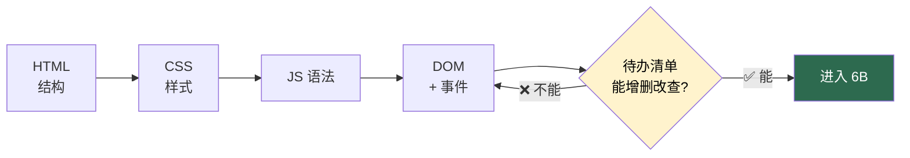

# 阶段 6A · HTML / CSS / JavaScript

## 📌 一句话定位

> **用最原始的三件套，把一个网页从「白板」写到「能点能用」。**
> 核心只有一句话：**这一阶段坚决不把 React 搬进来。** 先把原生写熟，后面学 React 才知道它在替你干什么。

| 项目 | 内容 |
|---|---|
| **总工时** | **55 h**（资源 45 h + 练习 10 h） |
| **前置** | [阶段 0](00-环境准备.md)：会用 VS Code，会按 F12 打开控制台 |
| **后置** | [阶段 6B · JavaScript 进阶](06B-JavaScript进阶.md)，产出物计入 [里程碑 ⑧](../milestones.md) |

> 🚫 **不要碰：** React / Vue、Webpack、Sass、jQuery、任何 `npm install`。这一阶段连 `package.json` 都不需要。

---

## 🎯 学完能做什么

| 能力 | 具体表现 |
|---|---|
| 搭结构 | 拿到一张设计稿，能用语义化标签写出骨架 |
| 写样式 | 用 Flexbox / Grid 排版，手机上也能看，不写两套页面 |
| 操作 DOM | 能查元素、改内容、改样式，会按 F12 排错 |
| 处理事件 | 点击 / 输入 / 提交都有反应，会用事件委托 |

**验收信号：** 给你一个空白的 `.html` 文件，你能从零写出带表格、带搜索框、点击有反应的页面，**全程不用框架**。

---

### 🗺️ 学习顺序（别跳）



> ⚠️ 顺序反了会很痛苦：先写丑 HTML，再加 CSS，最后加 JS。三样混着写，出错你都不知道是哪一层的问题。

---

## ⏱️ 工时拆解

| # | 模块 | 内容 | 工时 | 类型 |
|:---:|---|---|:---:|:---:|
| 1 | HTML | 常用标签、语义化、表格、表单 | 8 h | 资源 |
| 2 | CSS 基础 | 选择器、优先级、盒模型 | 12 h | 资源 |
| 3 | CSS 布局 | Flexbox、Grid、媒体查询 | 8 h | 资源 |
| 4 | JS 语法 | 变量、函数、数组、对象、条件、循环 | 9 h | 资源 |
| 5 | DOM 与事件 | 查元素、改内容、绑事件、事件委托 | 8 h | 资源 |
| | | **资源小计** | **45 h** | |
| 6 | 练习 | 纯 HTML/CSS 图书列表页 | 4 h | 动手 |
| 7 | 练习 | 纯 JS 待办清单（增删改查） | 6 h | 动手 |
| | | **练习小计 / 合计** | **10 h / 55 h** | |

> 💡 45 h 资源里，**至少 20 h 要花在「关上教程自己敲」上**。只看不敲，等于 0。

---

## 📚 资源清单

| 资源 | 类型 | 语言 | 工时 | 优先级 | 链接 |
|---|---|:---:|:---:|:---:|---|
| MDN · 学习网页开发（HTML + CSS 部分） | 教程 | 中 | 20 h | 🔴必学 | <https://developer.mozilla.org/zh-CN/docs/Learn> |
| MDN · JavaScript 第一步 | 教程 | 中 | 15 h | 🔴必学 | <https://developer.mozilla.org/zh-CN/docs/Learn/JavaScript> |
| freeCodeCamp 中文视频 | 视频 | 中 | 10 h | 🟡推荐 | <https://www.bilibili.com/video/BV1sD421p7XM/> |
| 动手：纯 HTML/CSS 静态页面 | 动手 | — | 10 h | 🔴必学 | — |

**用法：** MDN 顺着目录读，每节读完立刻写一个最小 demo；JS 那节重点读「事件 / 操作 DOM」；freeCodeCamp 视频只在文档读不懂时看对应片段，**别整条刷完**。

---

## 🧠 必须掌握的知识点

### 一、HTML：结构与语义

- [ ] 骨架 `<!DOCTYPE html>` / `html` / `head` / `body`；`<meta charset="UTF-8">` 与 `<meta name="viewport">`
- [ ] 语义化标签：`header` / `nav` / `main` / `section` / `article` / `footer`
- [ ] 文本 `h1`~`h6` / `p` / `span` / `strong` / `em`；链接 `a[href]`；图片 `img[src][alt]`
- [ ] 列表 `ul` / `ol` / `li`；表格 `table` / `thead` / `tbody` / `tr` / `th` / `td`
- [ ] 表单容器 `form`、`label` 与 `for` 的绑定；控件 `input` / `select` / `option` / `textarea` / `button`
- [ ] `input` 的 `type`：`text` / `password` / `email` / `number` / `date` / `search` / `checkbox` / `radio` / `file`
- [ ] 原生校验 `required` / `minlength` / `min` / `max` / `pattern`；语义化的价值（屏幕阅读器、SEO）

### 二、CSS：选择器与盒模型

- [ ] 三种引入方式，优先用 `<link rel="stylesheet">`
- [ ] 选择器：标签 / `.class` / `#id` / 后代 / 群组 `,` / 伪类 `:hover` `:focus` `:nth-child()`
- [ ] 优先级：`!important` > 行内 > `#id` > `.class` > 标签
- [ ] 盒模型四层：`content` → `padding` → `border` → `margin`
- [ ] `box-sizing: border-box` 为什么几乎每次都要加；`margin` 垂直塌陷
- [ ] `display`：`block` / `inline` / `inline-block` / `none`；单位 `px` / `%` / `rem` / `vw` / `vh`
- [ ] 颜色、`border-radius`、`box-shadow`；CSS 变量 `--brand` 与 `var(--brand)`
### 三、CSS：布局与响应式

- [ ] Flex 容器：`display: flex` / `justify-content` / `align-items` / `gap` / `flex-wrap`
- [ ] Flex 子项：`flex: 1` / `flex-grow` / `flex-shrink`
- [ ] Grid：`display: grid` / `grid-template-columns` / `gap`；自适应卡片墙 `repeat(auto-fill, minmax(200px, 1fr))`
- [ ] 定位：`static` / `relative` / `absolute` / `fixed` / `sticky`
- [ ] 媒体查询 `@media (max-width: 768px)`，移动优先用 `min-width`；**一维用 Flex，二维用 Grid**

### 四、JavaScript：语法与 DOM

- [ ] `let` / `const`，**这一阶段开始不再用 `var`**
- [ ] 数据类型与 `typeof`（含 `typeof null === "object"` 这个坑）
- [ ] 函数声明与函数表达式；条件 `if`；循环 `for` / `for...of`
- [ ] 数组 `push` / `pop` / `splice` / `length` / `includes`；对象取值与 `Object.keys()`
- [ ] `document.querySelector()` / `querySelectorAll()`
- [ ] `createElement()` / `appendChild()` / `textContent` / `innerHTML`
- [ ] `classList.add()` / `remove()` / `toggle()`
- [ ] `addEventListener("click", handler)`；事件对象 `event.target`、`event.preventDefault()`
- [ ] **事件委托**：监听器绑父元素，靠 `event.target` 判断点到了谁
- [ ] 表单 `submit` 事件 + `preventDefault()`；`dataset` 挂数据（`data-id` → `element.dataset.id`）

### 五、必须能说清的 3 个问题

- [ ] `innerHTML` 和 `textContent` 有什么区别？哪个有 XSS 风险？
- [ ] 100 个删除按钮，为什么只绑 1 个监听器就够？
- [ ] 样式为什么用 `class` 而不是 `id`？`box-sizing: border-box` 解决什么？

---

## 🛠️ 动手练习

### 练习一：纯 HTML/CSS 图书列表页（4 h）

**要求：** 只用 HTML + CSS，**一行 JS 都不许写**。要有搜索栏、状态下拉框、查询按钮、数据表格，用上 Flexbox、CSS 变量、媒体查询、`:hover`。保存成 `books.html`，双击就能看：

```html
<!DOCTYPE html>
<html lang="zh-CN">
<head>
  <meta charset="UTF-8" />
  <meta name="viewport" content="width=device-width, initial-scale=1.0" />
  <title>图书列表</title>
  <style>
    :root { --brand: #2d6a4f; --border: #e5e7eb; }
    * { box-sizing: border-box; }
    body { margin: 0; padding: 24px; font-family: system-ui, sans-serif; background: #f8fafc; }
    .toolbar { display: flex; flex-wrap: wrap; gap: 8px; margin-bottom: 16px; }
    .toolbar input, .toolbar select, .toolbar button { padding: 8px 12px; border: 1px solid var(--border); border-radius: 6px; }
    .toolbar input { flex: 1; min-width: 160px; }
    .toolbar button { background: var(--brand); color: #fff; border: none; cursor: pointer; }
    .card { background: #fff; border: 1px solid var(--border); border-radius: 10px; overflow-x: auto; }
    table { width: 100%; border-collapse: collapse; font-size: 14px; }
    th, td { padding: 10px 12px; text-align: left; border-bottom: 1px solid var(--border); white-space: nowrap; }
    thead th { background: #f1f5f9; }
    tbody tr:hover { background: #f8fafc; }
    .tag { padding: 2px 8px; border-radius: 999px; font-size: 12px; }
    .tag-ok { background: #dcfce7; color: #166534; }
    .tag-out { background: #fee2e2; color: #991b1b; }
    @media (max-width: 600px) { body { padding: 12px; } th, td { padding: 8px; } }
  </style>
</head>
<body>
  <h1>📚 图书列表</h1>
  <form class="toolbar">
    <input type="search" name="keyword" placeholder="搜索书名 / 作者" />
    <select name="status">
      <option value="">全部状态</option><option value="available">可借</option><option value="out">已借完</option>
    </select>
    <button type="button">查询</button>
  </form>
  <div class="card">
    <table>
      <thead><tr><th>ISBN</th><th>书名</th><th>作者</th><th>库存</th><th>可借</th><th>状态</th></tr></thead>
      <tbody>
        <tr>
          <td>9787115428028</td><td>JavaScript 高级程序设计</td><td>Matt Frisbie</td><td>5</td><td>3</td>
          <td><span class="tag tag-ok">可借</span></td>
        </tr>
        <tr>
          <td>9787115545381</td><td>深入理解计算机系统</td><td>Randal E. Bryant</td><td>2</td><td>0</td>
          <td><span class="tag tag-out">已借完</span></td>
        </tr>
      </tbody>
    </table>
  </div>
</body>
</html>
```

**加分项：** 用 Grid 再做一版「卡片式」列表。

### 练习二：纯 JS 待办清单（6 h）

**要求：** 数据存在一个数组里，实现增、删、勾选完成。**所有界面更新都走一个 `render()`** —— 这一点非常重要，它就是 React 的核心思想雏形。**先自己写**，卡住超过 30 分钟再看下面的参考实现。

```html
<!DOCTYPE html>
<html lang="zh-CN">
<head>
  <meta charset="UTF-8" />
  <title>待办清单</title>
  <style>
    body { font-family: system-ui, sans-serif; max-width: 520px; margin: 40px auto; }
    li { display: flex; align-items: center; gap: 8px; border-bottom: 1px solid #e5e7eb; }
    li span { flex: 1; }
    li.done span { text-decoration: line-through; color: #94a3b8; }
  </style>
</head>
<body>
  <h1>待办清单</h1>
  <form id="todo-form">
    <input type="text" id="todo-input" placeholder="要做什么？" required />
    <button type="submit">添加</button>
  </form>
  <ul id="todo-list"></ul>
  <script>
    // 唯一数据源：数组。界面永远由它推导
    let todos = [{ id: 1, text: "看完 MDN 的 HTML 部分", done: false }];
    const listEl = document.getElementById("todo-list");
    const formEl = document.getElementById("todo-form");
    const inputEl = document.getElementById("todo-input");

    // 渲染：数据 → 界面。数据一变就整个重画，笨但绝不会不同步
    function render() {
      listEl.innerHTML = "";
      todos.forEach((todo) => {
        const li = document.createElement("li");
        li.className = todo.done ? "done" : "";
        const box = document.createElement("input");
        box.type = "checkbox";
        box.checked = todo.done;
        box.dataset.id = todo.id;
        box.dataset.action = "toggle";
        const span = document.createElement("span");
        span.textContent = todo.text;              // 用户内容用 textContent，防 XSS
        const del = document.createElement("button");
        del.textContent = "删除";
        del.dataset.id = todo.id;
        del.dataset.action = "delete";
        li.append(box, span, del);
        listEl.appendChild(li);
      });
    }

    formEl.addEventListener("submit", (e) => {    // 增
      e.preventDefault();                           // 不加这行页面会刷新，数据全没
      const text = inputEl.value.trim();
      if (!text) return;
      todos.push({ id: Date.now(), text, done: false });
      inputEl.value = "";
      render();
    });

    // 删：事件委托，所有删除按钮只绑这一次
    listEl.addEventListener("click", (e) => {
      if (e.target.dataset.action !== "delete") return;
      todos = todos.filter((t) => t.id !== Number(e.target.dataset.id));
      render();
    });

    // 改：勾选完成
    listEl.addEventListener("change", (e) => {
      if (e.target.dataset.action !== "toggle") return;
      const todo = todos.find((t) => t.id === Number(e.target.dataset.id));
      if (todo) todo.done = e.target.checked;
      render();
    });

    render();   // 首屏渲染
  </script>
</body>
</html>
```

**写完请回答这三题：** ① 每改一次数据，你手动调了几次 `render()`？② 有没有哪次改了数据忘了调，界面没更新？③ `render()` 每次清空重建 `<ul>`，数据量大时会不会卡？

> 💡 这三题的答案，就是 [阶段 6C · React](06C-React.md) 要解决的问题。

---

## ✅ 验收标准

- [ ] 能默写出一个 HTML 页面的标准骨架
- [ ] 能不看资料用 Flexbox 做水平垂直居中，能写 `repeat(auto-fill, minmax(200px, 1fr))` 卡片墙
- [ ] 能说清盒模型四层，并解释 `box-sizing: border-box`
- [ ] 能说清 `querySelector` 和 `querySelectorAll` 返回值的区别，能用事件委托绑事件
- [ ] `books.html` 能打开，窗口拉到 400px 布局不乱
- [ ] `todo.html` 能添加、删除、勾选；数据存在数组里，**不是写死在 HTML 里**；两个页面都**没有引入任何第三方库**

**自测题（答不出就回去补）：**

| # | 问题 | 参考答案要点 |
|:---:|---|---|
| 1 | `#id` 和 `.class` 优先级谁高？ | `#id` 更高，所以别用 `id` 写样式 |
| 2 | `innerHTML` 和 `textContent` 的区别？ | 前者解析 HTML，有 XSS 风险 |
| 3 | 事件委托为什么能省监听器？ | 事件冒泡到父元素，靠 `event.target` 判断来源 |
---

## ⚠️ 常见坑

| # | 坑 | 症状 | 怎么躲 |
|:---:|---|---|---|
| 1 | 一上来就学 React | 会抄但不会改，报错完全看不懂 | 老老实实写完 6A + 6B |
| 2 | 忘记 `box-sizing: border-box` | 加了 `padding` 宽度就超 | 全局 `* { box-sizing: border-box; }` |
| 3 | 用 `float` 做布局 | 父元素高度塌陷 | 用 Flexbox，别碰 `float` |
| 4 | 表单提交后页面刷新 | 数据一刷新全没 | `submit` 里 `preventDefault()` |
| 5 | 用 `innerHTML` 拼用户输入 | XSS 漏洞 | 用户内容一律 `textContent` |
| 6 | 给每个动态按钮单独绑事件 | 新增的元素点不动 | 事件委托绑父元素 |
| 7 | 改完数据忘了调 `render()` | 数据和界面不一致 | 养成「改数据 → 立刻 render」 |
| 8 | 中文乱码 / 图片不显示 | 出现「锟斤拷」或空白 | `<meta charset="UTF-8">`，`img` 写 `alt` |

---

## 🧭 下一步

待办清单写完就接上后端接口，进入 [阶段 6B · JavaScript 进阶](06B-JavaScript进阶.md)。

> 📌 **一句话收尾：** 6A 的目标不是「做出漂亮的页面」，而是**让你亲手体验一次「手动操作 DOM 有多累」**。这份累，就是你后面学 React 的动力。

---

[← 返回首页](../README.md) · [资源总表](../resources.md) · [里程碑](../milestones.md)
