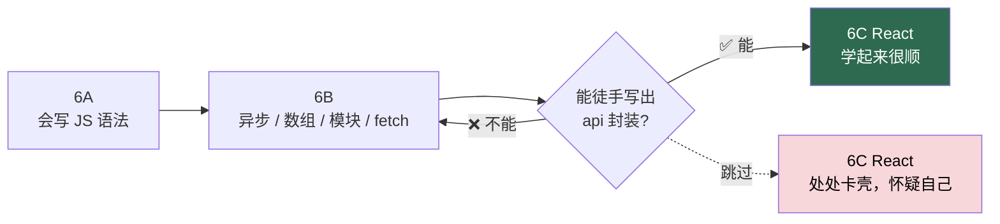

# 阶段 6B · JavaScript 进阶

## 📌 一句话定位

> **把「会写 JS 语法」升级成「会写真实项目里的 JS」—— 异步、数组处理、模块化、调接口。**

| 项目 | 内容 |
|---|---|
| **总工时** | **35 h**（资源 25 h + 练习 10 h） |
| **前置** | [6A · HTML/CSS/JS](06A-HTML-CSS-JavaScript.md)：会用 `querySelector`、会绑事件 |
| **后置** | [阶段 6C · React](06C-React.md)；交付物是 `api()` 封装 + 一个调通后端接口的页面 |

---

## 🚨 先看这段，再看别的

> # ⚠️ 这一步不过关，React 会学得非常痛苦
>
> 这是**全流程最容易被跳过、后果最严重的一环**。
>
> 很多人从 6A 直接跳到 6C，结果：
>
> | 症状 | 真实原因 |
> |---|---|
> | `useEffect` 看不懂 | 不懂 Promise / `async-await` |
> | 渲染列表报错 | 不会 `map`、不会解构 |
> | `{user?.name}` 一脸问号 | 不知道可选链 `?.` |
> | 后端 401 不会处理 | 不会 `try/catch` + `fetch` |
> | `import` 报错 | 不懂模块化 |
>
> **这些全都不是 React 的知识，全是 JavaScript 的知识。** React 官方文档默认你已经会这些。跳过这一步，后面 60 小时里至少有 20 小时是在补这一课的债，而且还是带着「React 好难」的错误结论去补。



---

## 🎯 学完能做什么

| 能力 | 具体表现 |
|---|---|
| 写现代语法 | 全程 `const`，熟练用解构、展开、可选链，代码短一半 |
| 处理列表数据 | 后端给一个数组，能用 `map/filter/find/reduce` 随意加工 |
| 处理异步 | 知道代码为什么「顺序不对」，能用 `async/await` 理顺 |
| 调接口 | 能封装统一的 `api()`：自动带 Token、处理 401、统一报错 |
| 拆模块 | 把代码拆成多个 `.js` 文件，用 `import/export` 串起来，Token 存 `localStorage` |

**一句话验收：** 后端给你一个 `/api/books` 接口，你能在 30 行以内写出「请求 → 处理错误 → 渲染到页面」的完整流程。

---

## ⏱️ 工时拆解

| # | 模块 | 内容 | 工时 | 类型 |
|:---:|---|---|:---:|:---:|
| 1 | 现代 JS 教程 | 第一部分全部（含 Promise / async） | 20 h | 资源 |
| 2 | ES6 入门 | 挑着看：解构、展开、模块、Promise | 5 h | 资源 |
| | | **资源小计** | **25 h** | |
| 3 | 练习 | 封装 `api()` + 调后端接口 | 10 h | 动手 |
| | | **练习小计 / 合计** | **10 h / 35 h** | |
---

## 📚 资源清单

| 资源 | 类型 | 语言 | 工时 | 优先级 | 链接 |
|---|---|:---:|:---:|:---:|---|
| 现代 JavaScript 教程（第一部分） | 图文 | 中 | 20 h | 🔴必学 | <https://zh.javascript.info/> |
| ES6 入门教程 · 阮一峰 | 电子书 | 中 | 5 h | 🟡推荐 | <https://es6.ruanyifeng.com/> |
| 动手：待办清单 + fetch 调 API | 动手 | — | 10 h | 🔴必学 | — |

**现代 JavaScript 教程的推荐顺序：** ① 数据类型 / 函数 / 对象（快速过）→ ② 数组与数组方法（核心）→ ③ 解构 / 展开 / 可选链 → ④ **Promise 与 async/await（读两遍）** → ⑤ 模块 import/export → ⑥ 错误处理 try/catch。

> ⚠️ **不要通读阮一峰的 ES6 书。** 它适合当字典查，不适合当教材。只在某个语法不确定时翻对应章节。

---

## 🧠 必须掌握的知识点

### 一、现代语法（React 的日常用语）

- [ ] `let` / `const` 与块级作用域；`const` 对对象是「引用不变」不是「内容不变」
- [ ] 箭头函数 `(a, b) => a + b`；**箭头函数没有自己的 `this`**，取外层作用域的
- [ ] 普通函数的 `this`（谁调用指向谁）、`call` / `apply` / `bind`；模板字符串
- [ ] 解构：`const { title } = book`、`const [first, ...rest] = arr`；参数解构 + 默认值 `{ method = "GET" } = {}`
- [ ] 展开运算符：`[...list, item]`、`{ ...user, name: "新名字" }`
- [ ] **展开是浅拷贝** —— 嵌套对象仍会共享引用（React 里的大坑）
- [ ] 可选链 `user?.profile?.avatar`；空值合并 `??` 与 `||` 的区别（`0` 和 `""` 会被 `||` 吃掉）

### 二、数组方法（列表渲染的基础）

- [ ] `map` 一对一转换，返回新数组 —— **React 列表渲染的核心**
- [ ] `filter` 筛选、`find` 找第一个匹配项、`findIndex` 返回下标（找不到是 `-1`）
- [ ] `reduce` 归约成一个值；`some` / `every` / `includes`
- [ ] `sort` **会原地修改数组**，要用 `[...arr].sort()`
- [ ] `forEach` 与 `map` 的区别；链式调用 `books.filter(...).map(...)`
- [ ] 为什么不能直接改对象后丢给 React（要返回新对象）

### 三、异步（最容易懵的一块）

- [ ] 为什么 JS 单线程还能「同时」发请求（事件循环 / 任务队列）；回调地狱长什么样
- [ ] `Promise` 三种状态：`pending` / `fulfilled` / `rejected`；`.then()` / `.catch()` / `.finally()`
- [ ] **`async` 函数永远返回 Promise**；`await` 就是「暂停在这一行等结果」，用 `try/catch` 捕获错误
- [ ] `Promise.all()` 并发请求（互不依赖的请求别一个 `await` 一个）；`allSettled` 的区别
- [ ] **忘记 `await` 的后果**：拿到的是 Promise 对象而不是数据

### 四、模块化

- [ ] `import` / `export` 基本语法；具名导出 vs 默认导出 `export default`
- [ ] 对应导入：`import { api } from "./api.js"` / `import api from "./api.js"`
- [ ] **用 `type="module"` 就必须走 http 服务**，不能双击 `file://` 打开（会报 CORS）；起服务用 `npx serve .`

### 五、网络与存储

- [ ] `fetch(url, options)` 返回 Promise，且**只有网络错误才 reject**
- [ ] `fetch` **不会因为 404 / 500 而 reject**，必须自己看 `res.ok` / `res.status`
- [ ] `res.json()` / `res.text()` 也是异步的，要 `await`
- [ ] 请求头 `Content-Type: application/json` 与 `Authorization: Bearer <token>`
- [ ] `POST` 的 `body` 必须 `JSON.stringify()`；`AbortController` 取消请求（6C 会用）
- [ ] `localStorage` **只能存字符串**，对象要 `JSON.stringify` / `JSON.parse`

### 六、必须能说清的 3 个问题

- [ ] `fetch` 什么时候会 reject，什么时候不会？
- [ ] `await` 写在 `for` 循环里和写在 `Promise.all` 里，性能差多少？`{ ...user, name: "x" }` 为什么不污染 `user`？

---

## 🛠️ 动手练习

### 练习：封装 `api()` 并调通后端接口（10 h）

**目标：** 写出一个到处都能用的请求函数，自动完成 4 件事：拼 `BASE_URL`、带 `Authorization`、遇 401 清 Token 跳登录页、把 FastAPI 的各种错误体统一成一句人话。**先自己想 30 分钟**，下面是参考实现。

```javascript
// api.js —— 全项目唯一的请求入口
const BASE_URL = "http://127.0.0.1:8000";

/** 统一错误类型，方便区分「网络错误」和「业务错误」 */
export class ApiError extends Error {
  constructor(message, status = 0, data = null) { super(message); Object.assign(this, { name: "ApiError", status, data }); }
}

/** auth=false 表示不带 Token（登录接口用）；signal 用来取消请求 */
export async function api(path, { method = "GET", body, headers = {}, auth = true, signal } = {}) {
  const token = localStorage.getItem("token");
  const finalHeaders = { ...headers };
  if (body !== undefined) finalHeaders["Content-Type"] = "application/json";
  if (auth && token) finalHeaders.Authorization = `Bearer ${token}`;

  let res;
  try {
    res = await fetch(`${BASE_URL}${path}`, {
      method, headers: finalHeaders, signal,
      body: body === undefined ? undefined : JSON.stringify(body),
    });
  } catch (err) {
    if (err.name === "AbortError") throw err;      // 主动取消不算错误
    throw new ApiError("网络异常，检查后端是否启动", 0, null);
  }

  if (res.status === 401) {                        // Token 没了或过期了
    localStorage.removeItem("token");
    if (!location.pathname.endsWith("login.html")) location.href = "login.html";
    throw new ApiError("登录已过期，请重新登录", 401, null);
  }

  const text = await res.text();
  let data = null;
  if (text) { try { data = JSON.parse(text); } catch { data = text; } }

  if (!res.ok) throw new ApiError(extractMessage(data, res.status), res.status, data);
  return data;
}

/** FastAPI 的错误体有两种形态，统一压成一句话 */
function extractMessage(data, status) {
  const detail = data && data.detail;
  if (typeof detail === "string") return detail;              // 业务错误
  if (Array.isArray(detail)) {                                // Pydantic 校验错误
    return detail.map((d) => `${(d.loc || []).slice(1).join(".")}: ${d.msg}`).join("；");
  }
  return `请求失败（HTTP ${status}）`;
}
```
**业务接口拆成独立模块：**

```javascript
// auth.js
import { api } from "./api.js";

export async function login(username, password) {
  const data = await api("/api/auth/login", {
    method: "POST", body: { username, password }, auth: false,   // 登录时还没 Token
  });
  localStorage.setItem("token", data.access_token);
  return data;
}
export const isLoggedIn = () => Boolean(localStorage.getItem("token"));
```

```javascript
// books.js
import { api } from "./api.js";

export function listBooks({ keyword = "", page = 1, size = 10, signal } = {}) {
  const params = new URLSearchParams({ page, size });
  if (keyword) params.set("keyword", keyword);
  return api(`/api/books?${params}`, { signal });
}

export const borrowBook = (bookId) => api("/api/borrows/borrow", { method: "POST", body: { bookId } });
```

**串起来用：**

```html
<!DOCTYPE html>
<html lang="zh-CN">
<body>
  <form id="login-form">
    <input name="username" placeholder="用户名" required />
    <input name="password" type="password" placeholder="密码" required />
    <button type="submit">登录</button>
  </form>
  <script type="module">
    import { login } from "./auth.js";   // type="module" 才能用 import/export

    document.getElementById("login-form").addEventListener("submit", async (event) => {
      event.preventDefault();
      const form = new FormData(event.target);
      try {
        await login(form.get("username"), form.get("password"));
        location.href = "books.html";
      } catch (err) {
        alert(err.message);     // api() 已经翻译成人话了，这里直接提示
      }
    });
  </script>
</body>
</html>
```

> ⚠️ **必须用本地服务打开，不能双击文件。** 在项目目录跑 `npx serve .`，访问 `http://localhost:3000/login.html`。否则 `type="module"` 会因为 `file://` 协议报 CORS 错误。

**顺手升级 6A 的待办清单**（让它刷新后不丢）：

```javascript
// storage.js —— 让 6A 的待办清单刷新后不丢
const KEY = "todos";

export function loadTodos() {
  try { return JSON.parse(localStorage.getItem(KEY)) ?? []; }
  catch { return []; }              // 存进去的不是合法 JSON 时兜底
}

export function saveTodos(todos) {
  localStorage.setItem(KEY, JSON.stringify(todos));
}
```

在 6A 的 `todo.html` 里，每次 `render()` 之前调一次 `saveTodos(todos)` 即可。

---

## ✅ 验收标准

- [ ] 能不看资料写出 `map` / `filter` / `find` / `reduce` 各一个例子
- [ ] 能说清展开运算符是浅拷贝，以及这会带来什么问题
- [ ] 能解释为什么 `async` 函数里忘了 `await` 会拿到 Promise 对象
- [ ] 能说清 `fetch` 在什么情况下不会 reject；能自己拆文件用 `import/export` 串起来
- [ ] `api()` 能自动带 Token（Network 面板能看到 `Authorization` 请求头）
- [ ] 删掉 `localStorage` 里的 token 后请求接口，能自动跳回登录页
- [ ] 后端返回 422 校验错误时，`err.message` 是一句人话，不是 `[object Object]`
- [ ] 后端没启动时提示「网络异常」而不是崩溃；`Promise.all` 并发总耗时接近较慢的那个
- [ ] 待办清单刷新后数据仍在（`localStorage` 存的是合法 JSON）
**自测题：**

| # | 问题 | 参考答案要点 |
|:---:|---|---|
| 1 | `res.json()` 前面为什么要 `await`？ | 它是异步方法，返回 Promise |
| 2 | `a?.b?.c` 和 `a.b.c` 的区别？ | 链条中任一环是 `null/undefined` 就短路，不抛错 |
| 3 | `Promise.all` 里有一个失败会怎样？ | 整体立刻 reject，其他结果拿不到（要全拿到用 `allSettled`） |

---

## ⚠️ 常见坑

| # | 坑 | 症状 | 怎么躲 |
|:---:|---|---|---|
| 1 | 跳过本阶段直接学 React | `useEffect` 完全看不懂 | 老老实实写完这 35 h |
| 2 | 忘写 `await` | 打印出来是 `Promise {<pending>}` | 函数是 `async`，调用处就 `await` |
| 3 | `.then()` 混 `async/await` | 代码乱，错误抓不到 | 统一用 `async/await` + `try/catch` |
| 4 | 以为 `fetch` 遇 404 会报错 | `catch` 里什么都没捕到 | 手动判断 `res.ok` |
| 5 | `POST` 忘 `JSON.stringify` | 后端收到 `[object Object]` | 在 `api()` 里统一处理 |
| 6 | 直接改数组/对象不返回新值 | React 里界面不更新（6C 撞上） | 养成 `[...arr]` / `{...obj}` 的习惯 |
| 7 | `type="module"` 双击打开 HTML | 控制台报 CORS | 用 `npx serve .` 起本地服务 |
| 8 | `localStorage` 直接存对象 | 取出来是 `"[object Object]"` | `JSON.stringify` 进、`JSON.parse` 出 |
| 9 | `JSON.parse` 没兜底 | 数据坏了整页白屏 | 包 `try/catch` |
| 10 | `await` 写在循环里 | 10 个请求串行，慢 10 倍 | 互不依赖就用 `Promise.all` |
| 11 | 把 Token 拼在 URL 上 / `catch` 里什么都不做 | 泄露 Token 或静默失败 | 放 `Authorization` 头；至少 `console.error(e)` |

---

## 🧭 下一步

顺利写出 `api()`？[阶段 6C · React](06C-React.md) 里你会把它**原样搬进项目**，只加一个 TypeScript 泛型。

> 📌 **一句话收尾：** 这一阶段学的每个语法，在 React 里都会以每天几十次的频率出现。**这里的每一小时，都会在 6C 里连本带利还给你。**

---

[← 返回首页](../README.md) · [资源总表](../resources.md) · [里程碑](../milestones.md)
