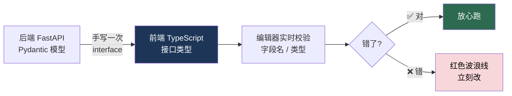

# 阶段 6D · TypeScript

## 📌 一句话定位

> **在代码跑起来之前就用类型挡掉低级错误 —— 顺便把前后端的接口契约写成不会过期的文档。**

| 项目 | 内容 |
|---|---|
| **总工时** | **22 h**（资源 18 h + 练习 4 h） |
| **前置 / 后置** | 前置 [6C · React](06C-React.md)（有能跑的项目才能补类型）；后置 [阶段 7 · 前后端联调](07-前后端联调.md)。交付物：所有 API 响应和数据模型都有类型，`npm run typecheck` 无报错（计入 [里程碑 ⑨](../milestones.md)） |

---

### 💡 为什么值得花这 22 小时

| 场景 | 纯 JS（6C 之前） | TypeScript |
|---|---|---|
| 后端把 `title` 改名成 `book_title` | 页面渲染一片空白，`undefined` 在控制台飘 | 编辑器立刻标红：**属性 `title` 不存在** |
| 借书接口要传 `bookId`，你写成 `book_id` | 后端返回 422，对着 Network 面板查半小时 | 调用处直接报错 |
| `available` 是数字，你当字符串比较 | `"3" === 3` 恒为 false，逻辑静默失效 | 类型不匹配，编译不过 |

> 💡 **收益点：** 你写错字段名的那一刻就知道错了，而不是等页面白屏。


**但也要说清楚：** 类型只在**编译期**存在，编译后全部被擦掉，运行时一点保护都没有。所以后端该做的校验一个都不能省。

---

## 🎯 学完能做什么

| 能力 | 具体表现 |
|---|---|
| 看懂报错 | 红色波浪线不是找麻烦，是提前帮你抓住了 bug |
| 描述数据 | 后端返回什么，你能用 `interface` 一比一写出来 |
| 收窄类型 | 会用联合类型 + 类型守卫处理「可能是 A 也可能是 B」 |
| 复用类型 | 会用 `Pick` / `Omit` / `Partial` 从已有类型派生新类型，全局零 `any` |

**一句话验收：** 把后端接口的字段名改错一个字母，**不改任何逻辑**，TypeScript 立刻在编辑器里报错并指出位置。

---

## ⏱️ 工时拆解

| # | 模块 | 内容 | 工时 | 类型 |
|:---:|---|---|:---:|:---:|
| 1 | TS 官方手册 | 基础类型到泛型入门（配 xcatliu 教程补漏） | 10 h | 资源 |
| 2 | xcatliu 入门教程 | 中文示例，挑薄弱章节看 | 5 h | 资源 |
| 3 | type-challenges | **只做简单题**，找找感觉 | 3 h | 资源 |
| | | **资源小计** | **18 h** | |
| 4 | 练习 | 给 React 项目补类型 + 跑 typecheck | 4 h | 动手 |
| | | **练习 / 合计** | **4 h / 22 h** | |

---

## 📚 资源清单

| 资源 | 类型 | 语言 | 工时 | 优先级 | 链接 |
|---|---|:---:|:---:|:---:|---|
| TypeScript 官方手册（中文） | 文档 | 中 | 10 h | 🔴必学 | <https://www.typescriptlang.org/zh/docs/handbook/2/basic-types.html> |
| TypeScript 入门教程（xcatliu） | 电子书 | 中 | 5 h | 🟡推荐 | <https://ts.xcatliu.com/> |
| type-challenges（只做简单题） | 练习 | 英 | 3 h | ⚪选学 | <https://github.com/type-challenges/type-challenges> |
| 动手：给 React 项目补类型 | 动手 | — | 4 h | 🔴必学 | — |

> 手册只读这几节：Basic Types / Everyday Types → Object Types → Narrowing → Generics（入门）→ Utility Types。⚠️ **先跳过：** 装饰器、`.d.ts`、`namespace`、条件类型进阶、`infer`、模板字面量类型。

---

## 🧠 必须掌握的知识点

### 一、基础

- [ ] 为什么需要类型：把运行时错误提前到编译期；`tsc --noEmit` 只查类型不产出 `.js`
- [ ] 类型注解 `const name: string = "张三"`，以及能推断出来就别手写
- [ ] 基础类型：`string` / `number` / `boolean` / `null` / `undefined` / `unknown` / `never` / `void`
- [ ] 数组与元组 `string[]` / `[number, string]`；对象类型 `{ id: string }`、可选 `?`、只读 `readonly`
- [ ] 函数类型（参数 + 返回值）；`unknown` 与 `any` 的区别（`unknown` 用前必须收窄）

### 二、interface 与 type

- [ ] `interface` 描述对象结构，`type` 定义类型别名，90% 场景可互换
- [ ] **本项目约定：描述对象结构用 `interface`**
- [ ] `interface` 能声明合并、能 `extends`；`type` 能用 `&` 交叉，且能表达联合类型
- [ ] 索引签名 `{ [key: string]: string }` 与 `Record<string, Book>`

| 场景 | 用哪个 | 例子 |
|---|---|---|
| 描述对象 / API 响应 | `interface` | `interface Book { id: string }` |
| 联合类型 / 字面量集合 / 函数签名 / 派生类型 | `type` | `type Status = "available" \| "out"`；`type BookDraft = Omit<Book, "id">` |

### 三、联合类型、字面量类型与收窄

- [ ] 联合类型 `string | number`；**字面量类型** `"available" | "out"` —— 本项目到处用
- [ ] `as const` 把数组变成字面量元组；类型收窄用 `typeof` / `in` / `instanceof`；可辨识联合用一个字段区分几种情况

```ts
type LoadState<T> = { status: "loading" } | { status: "success"; data: T } | { status: "error"; message: string };

function render(state: LoadState<Book[]>) {
  switch (state.status) {
    case "loading": return "加载中…";
    case "success": return `${state.data.length} 本书`;  // 这里能安全访问 data
    case "error":   return state.message;                // 这里能安全访问 message
  }
}
```

### 四、泛型基础（够用就行）

- [ ] 泛型函数 `function first<T>(arr: T[]): T | undefined`；泛型接口 `interface Page<T> { items: T[] }`
- [ ] 给 `api()` 加泛型：`api<Book[]>("/api/books")` —— **本阶段最有价值的一处**；泛型约束 `<T extends { id: string }>`

### 五、工具类型

- [ ] `Partial<T>` 全部变可选（编辑表单的草稿）
- [ ] `Pick<T, "a">` 挑字段、`Omit<T, "id">` 去字段（创建请求体）、`Record<K, V>`、`ReturnType<typeof fn>`；例：`type BookCreate = Omit<Book, "id" | "available">`

### 六、类型断言与 any

- [ ] `as` 断言：`document.getElementById("app") as HTMLInputElement`
- [ ] **断言的本质是「闭嘴，我知道我在干什么」** —— 断言错了不会有任何提示
- [ ] `any` 的危害：传染性 —— 一个 `any` 能让整条链路失去保护
- [ ] 外部数据用 `unknown`，用前先收窄；`tsconfig.json` 打开 `"strict": true`；绕不过去时用 `// @ts-expect-error` 加注释

### 七、前后端契约

- [ ] 后端 Pydantic 模型 ↔ 前端 `interface` 一一对应

| 后端（Python / Pydantic） | 前端（TypeScript） |
|---|---|
| `str` / `int` / `float` / `bool` | `string` / `number` / `number` / `boolean` |
| `datetime` | `string`（JSON 里是 ISO 字符串） |
| `Optional[str]` / `str \| None` | `string \| null` |
| `list[Book]` / `Literal["a", "b"]` | `Book[]` / `"a" \| "b"` |
| `Decimal` | `string`（**别用 number，会丢精度**） |

- [ ] 分页响应统一用泛型：`Page<Book>` / `Page<BorrowRecord>`
- [ ] 错误响应统一 `{ detail: string }` 或 FastAPI 的 `{ detail: { msg, loc }[] }`

### 八、必须能说清的 3 个问题

- [ ] `any` 和 `unknown` 有什么区别？为什么外部数据用 `unknown` 更安全？
- [ ] `interface` 和 `type` 什么时候必须用后者？
- [ ] `Partial<Book>` 和 `Book | undefined` 是一回事吗？（不是）

---

## 🛠️ 动手练习

### 练习：给 React 项目补类型（4 h）

**目标：** 让 [阶段 6C](06C-React.md) 的项目做到**全局零 `any`**，`npm run typecheck` 无报错。

```json
// package.json —— 加一个只查类型、不产出文件的脚本
{ "scripts": { "dev": "vite", "build": "tsc -b && vite build", "typecheck": "tsc --noEmit", "preview": "vite preview" } }
```

```ts
// src/types/index.ts —— 与后端 Pydantic 模型一一对应，字段名必须完全一致
export interface Book {
  id: string; isbn: string; title: string; author: string;
  publisher: string | null; stock: number; available: number;
  isDeleted: boolean; createdAt: string;   // ISO 字符串，不是 Date
}
/** 新增图书的请求体：id / available 由后端生成；编辑时所有字段可选 */
export type BookCreate = Omit<Book, "id" | "available" | "isDeleted" | "createdAt">;
export type BookUpdate = Partial<BookCreate>;
export type BookStatus = "available" | "out";   // 字面量联合类型，比 string 安全

export interface BorrowRecord {
  id: string; bookId: string; readerId: string;
  borrowDate: string; dueDate: string;
  returnDate: string | null;   // 未归还时是 null
}
/** 分页响应用泛型，图书和借阅记录都能复用；ApiErrorBody 是 FastAPI 的两种错误体 */
export interface Page<T> { items: T[]; total: number; page: number; size: number }
export interface ApiErrorBody { detail: string | { msg: string; loc: (string | number)[] }[] }
```

```ts
// src/api/client.ts —— 6B 的 api() 加泛型，泛型 T 就是「这个接口返回什么」
import type { ApiErrorBody } from "../types";

const BASE_URL = import.meta.env.VITE_API_BASE_URL ?? "http://127.0.0.1:8000";

export class ApiError extends Error {
  constructor(message: string, public status = 0, public data: unknown = null) {
    super(message);
    this.name = "ApiError";
  }
}

interface RequestOptions {
  method?: "GET" | "POST" | "PUT" | "PATCH" | "DELETE";
  body?: unknown; auth?: boolean; signal?: AbortSignal;
}

export async function api<T>(path: string, options: RequestOptions = {}): Promise<T> {
  const { method = "GET", body, auth = true, signal } = options;
  const token = localStorage.getItem("token");
  const headers: Record<string, string> = {};
  if (body !== undefined) headers["Content-Type"] = "application/json";
  if (auth && token) headers.Authorization = `Bearer ${token}`;

  let res: Response;
  try {
    res = await fetch(`${BASE_URL}${path}`, {
      method, headers, signal,
      body: body === undefined ? undefined : JSON.stringify(body),
    });
  } catch (err) {
    if (err instanceof DOMException && err.name === "AbortError") throw err;
    throw new ApiError("网络异常，检查后端是否启动");
  }

  if (res.status === 401) {
    localStorage.removeItem("token");
    if (!location.pathname.endsWith("login")) location.href = "/login";
    throw new ApiError("登录已过期，请重新登录", 401);
  }

  const text = await res.text();
  let data: unknown = null;
  if (text) { try { data = JSON.parse(text); } catch { data = text; } }
  // FastAPI 的错误体有两种形态，统一压成一句话
  if (!res.ok) {
    const d = (data as ApiErrorBody)?.detail;
    const msg = typeof d === "string" ? d
      : Array.isArray(d) ? d.map((i) => `${i.loc.slice(1).join(".")}: ${i.msg}`).join("；")
      : `请求失败（HTTP ${res.status}）`;
    throw new ApiError(msg, res.status, data);
  }
  return data as T;   // 唯一的一次断言：此后调用方拿到的都是强类型
}
```

```ts
// src/api/books.ts —— 返回值类型一次写清，调用方全程受益
import { api } from "./client";
import type { Book, BookCreate, BookUpdate, Page, BorrowRecord } from "../types";

export function listBooks(params: { keyword?: string; page?: number; size?: number } = {}) {
  const qs = new URLSearchParams({ page: String(params.page ?? 1), size: String(params.size ?? 10) });
  if (params.keyword) qs.set("keyword", params.keyword);
  return api<Page<Book>>(`/api/books?${qs}`);
}
export const createBook = (p: BookCreate) => api<Book>("/api/books", { method: "POST", body: p });
export const updateBook = (id: string, p: BookUpdate) => api<Book>(`/api/books/${id}`, { method: "PUT", body: p });
export const borrowBook = (bookId: string) => api<BorrowRecord>("/api/borrows/borrow", { method: "POST", body: { bookId } });
```
```tsx
// 组件里用起来：写错字段名、拼错字面量，编辑器立刻报错
const page = await listBooks({ keyword });   // 类型是 Page<Book>
setBooks(page.items);
const status: BookStatus = page.items[0].available > 0 ? "available" : "out";
setError(err instanceof ApiError ? err.message : "未知错误");   // err 是 unknown，先收窄
```

```bash
npm run typecheck   # 必须 0 报错
```

```powershell
Select-String -Path src\**\*.ts,src\**\*.tsx -Pattern ": any"   # 必须搜不到
```

---

## ✅ 验收标准

- [ ] 能说清 `interface` 和 `type` 各自适合什么场景
- [ ] 能写出一个可辨识联合并正确收窄；能说清 `any` 和 `unknown` 的区别；能用 `Omit` / `Pick` / `Partial` 派生新类型
- [ ] 知道运行时类型全被擦掉，所以后端校验不能省
- [ ] 知道 `datetime` 对应 `string`、`Decimal` 对应 `string`（不是 `number`）
- [ ] `npm run typecheck` **0 报错**；全局搜索 `: any` 和 `<any>` **零结果**
- [ ] 每个 API 响应都有对应的 `interface`；`api<T>()` 泛型用在了所有业务接口上；`tsconfig.json` 里 `"strict": true`
- [ ] 故意把 `book.title` 写成 `book.titel`，编辑器立刻标红（验证类型真的生效）
**自测题：**

| # | 问题 | 参考答案要点 |
|:---:|---|---|
| 1 | `Partial<Book>` 与 `Book \| undefined` 一样吗？ | 不一样，前者是「每个字段可选」，后者是「整个对象可能没有」 |
| 2 | 什么时候必须用 `type` 而不能用 `interface`？ | 定义联合类型、元组、映射类型时 |
| 3 | 为什么 `api<T>()` 里最后要 `as T`？ | 解析结果是 `unknown`，这是唯一的断言入口 |

---

## ⚠️ 常见坑

| # | 坑 | 症状 | 怎么躲 |
|:---:|---|---|---|
| 1 | 陷进类型体操 | 花 20 h 研究 `infer`，业务代码没写 | **够用就行**，看不懂的题直接跳过 |
| 2 | 到处 `any` 图快 | 类型系统形同虚设，白学 | 用 `unknown` + 收窄，或 `@ts-expect-error` 加注释 |
| 3 | `as` 乱断言 / `!` 非空断言 | 编译过了，运行时 `undefined` 直接炸 | 断言只用在确实知道类型的地方 |
| 4 | `interface` 字段名和后端不一致 | 编译不报错，数据是 `undefined` | 照着 Pydantic 模型一个字一个字对 |
| 5 | `datetime` 当成 `Date` / `Decimal` 当成 `number` | 调 `.getTime()` 报错；金额精度丢失 | 都声明成 `string` |
| 6 | 忘了 `import type` | 循环依赖、打包体积变大 | 只当类型用的导入写 `import type { Book }` |
| 7 | `tsconfig.json` 没开 `strict` | `null` 检查全部失效 | `"strict": true`，别关 |
| 8 | 用 `tsc` 直接编译 React 项目 | 不认识 `.tsx` 里的 JSX | 用 `tsc --noEmit` 只查类型，产物交给 Vite |
| 9 | 把类型当运行时校验 / `enum` 用太多 | 期待 TS 挡住脏数据；产物变大 | 校验交给后端；优先用字面量联合类型 |
---

## 🧭 下一步

项目零 `any` 了？前端部分到此结束，进入 [阶段 7 · 前后端联调](07-前后端联调.md)。类型和接口对不上时，回 [阶段 4 · FastAPI 与 SQLAlchemy](04-FastAPI与SQLAlchemy.md) 看后端模型定义。

> 📌 **一句话收尾：** TypeScript 的价值不在于「显得专业」，而在于**你改错字段名的第 0.1 秒就知道错了**。但记住：**够用就行，别陷进类型体操。**

---

[← 返回首页](../README.md) · [资源总表](../resources.md) · [里程碑](../milestones.md)
