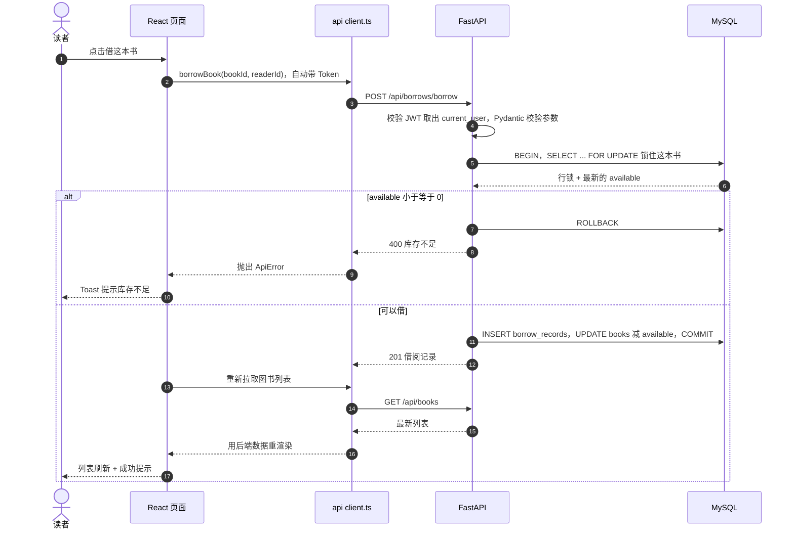

# 阶段 7 · 前后端联调（30 h）

> 一句话定位：**前端能跑、后端也能跑，一接起来就 CORS / 401 / 字段对不上** —— 这一阶段就是把两个半成品焊成一台能用的机器，顺便练出排错的手感。

---

## 🎯 学完能做什么

- [ ] 打开页面就能登录、看列表、借书还书，**全流程不报错**
- [ ] 说清「哪些逻辑归前端、哪些必须归后端」，写得出职责划分表
- [ ] 看到控制台报错，5 分钟内定位是**前端、网络、还是后端**的问题
- [ ] 独立排查 `blocked by CORS policy`、`401`、`422`、`Failed to fetch`
- [ ] 用 Hoppscotch **先验证接口、再写页面**，而不是边写页面边猜接口

---

## ⏱️ 工时拆解

| 模块 | 内容 | 工时 | 类型 |
|---|---|:---:|:---:|
| 资源学习 | Fetch 用法 + CORS + 接口调试工具 | 10 h | 输入 |
| 动手练习 | 前端接后端 + 排错（本文档核心） | 20 h | 输出 |
| | **合计** | **30 h** | |

---

## 📚 资源清单

| 资源 | 类型 | 语言 | 工时 | 优先级 | 链接 |
|---|---|:---:|:---:|:---:|---|
| Fetch 用法 | 文档 | 中 | 4 h | 🔴必学 | <https://zh.javascript.info/fetch> |
| Fetch 跨源请求（CORS） | 文档 | 中 | 3 h | 🔴必学 | <https://zh.javascript.info/fetch-crossorigin> |
| Hoppscotch / Postman 调试接口 | 工具 | 中 | 3 h | 🟡推荐 | <https://hoppscotch.io/> |
| 动手：前端接后端 + 排错 | 动手 | — | 20 h | 🔴必学 | — |

---

## 🧠 必须掌握的知识点

### 1. 前后端职责划分表

核心原则一句话：**前端不计算任何库存或状态，避免两套口径。**

| 判断项 | 谁说了算 | 前端干什么 | 后端干什么 |
|---|:---:|---|---|
| 库存 `available` | **后端** | 把后端返回的数字贴到页面上 | 事务内重算，返回权威值 |
| 借阅状态（在借/逾期/已还） | **后端** | 直接用后端返回的 `status` | 由 `return_date` / `due_date` 推导 |
| 能不能借这本书 | **后端** | 按钮禁用只是体验优化 | 真正的校验 + 行锁 |
| 角色权限 | **后端** | 藏菜单、跳路由，防误点 | `Depends` 强制校验，越权 403 |
| 表单格式 | 前端 + 后端 | 即时提示 | Pydantic 再校验（后端永远不信前端） |
| 分页 / 排序 / 搜索 | **后端** | 只传 `page` / `pageSize` / `q` | `LIMIT` / `ORDER BY` / `LIKE` |

❌ 错误：`setBooks(b => b.available - 1)` 前端自己减库存，两套口径刷新就露馅；✅ 正确：调完借书接口重新 `GET /books`，**以后端返回的数字为准**。

### 2. 唯一的网络出口：`src/api/client.ts`

**规矩：所有请求必须走封装，页面组件里禁止出现 `fetch`。** Token 注入、超时、错误提取、401 登出这四件事只写一遍，改也只改一处。

```ts
// src/api/client.ts —— 全项目唯一的网络出口
const BASE_URL = import.meta.env.VITE_API_BASE_URL ?? "/api";
const TIMEOUT_MS = 10_000;

export class ApiError extends Error {
  constructor(public status: number, message: string) { super(message); }
}

/** 把后端各种形态的错误统一抽成一句人话 */
async function extractError(res: Response): Promise<string> {
  const body = await res.json().catch(() => null);
  if (typeof body?.detail === "string") return body.detail;   // 400 业务错误
  if (Array.isArray(body?.detail)) {                          // 422 校验错误
    return body.detail.map((e: { loc: (string | number)[]; msg: string }) =>
      `${e.loc.at(-1)}: ${e.msg}`).join("; ");
  }
  return body ? JSON.stringify(body) : `HTTP ${res.status}`;
}

export async function request<T>(path: string, options: RequestInit = {}): Promise<T> {
  const controller = new AbortController();
  const timer = setTimeout(() => controller.abort(), TIMEOUT_MS);
  const token = localStorage.getItem("token");
  try {
    const res = await fetch(`${BASE_URL}${path}`, {
      ...options, signal: controller.signal,
      headers: {
        "Content-Type": "application/json",
        ...(token ? { Authorization: `Bearer ${token}` } : {}),
      },
    });
    if (res.status === 401) {                  // Token 失效 → 清干净并回登录页
      localStorage.removeItem("token");
      if (!location.pathname.startsWith("/login")) location.href = "/login";
      throw new ApiError(401, "登录已过期，请重新登录");
    }
    if (!res.ok) throw new ApiError(res.status, await extractError(res));
    return res.status === 204 ? (undefined as T) : ((await res.json()) as T);
  } catch (err) {
    if (err instanceof ApiError) throw err;
    if (err instanceof DOMException && err.name === "AbortError") throw new ApiError(0, "请求超时：后端没启动或卡死");
    throw new ApiError(0, "无法连接服务器（Failed to fetch）");
  } finally { clearTimeout(timer); }
}
```

| 要求 | 代码位置 | 说人话 |
|---|---|---|
| 统一注入 Token | `Authorization: Bearer ${token}` | 页面永远不用管 Token 从哪来 |
| 超时控制 | `AbortController` + `setTimeout` | 后端卡死时不会转到天荒地老 |
| 错误信息提取 | `extractError()` | 422 的数组、400 的字符串，全变成一句可显示的话 |
| 401 自动登出 | 清 `localStorage` + 跳 `/login` | Token 失效时用户不会停在白屏 |

### 3. 实体类型统一定义在 `src/data/*`

字段名**必须和后端 JSON 一模一样**，不要在前端做一次「翻译」。

```ts
// src/data/types.ts —— 字段名与后端 JSON 完全一致
export interface Book {
  bookId: string; title: string; author: string; isbn: string;
  stock: number; available: number; isDeleted: boolean;
}
export interface BorrowRecord {
  borrowId: number; bookId: string; readerId: string;
  borrowDate: string; dueDate: string; returnDate: string | null;
  status: "borrowing" | "overdue" | "returned"; // 后端算好的，前端只用不算
}
export interface Page<T> { items: T[]; total: number; page: number; pageSize: number; }
```

接口调用同样只放在 `src/data/books.ts`（比如 `listBooks()` / `borrowBook()`），组件里 `import` 进来用，**绝不自己写 `fetch`**。

| 做法 | 好不好 | 为什么 |
|---|:---:|---|
| 字段名与后端完全一致 | ✅ | 少一层心智负担，出问题好对照 |
| 前端把 `book_id` 转成 `bookId` | ❌ | 转换逻辑一多两边就对不上，坑就在这 |
| 每个组件自己写 `fetch` | ❌ | Token、错误处理会漏，改一处要改十处 |

### 4. CORS 原理与配置

浏览器有个**同源策略**：`http://localhost:5173` 的页面默认不许读 `http://localhost:8000` 的响应。**端口不同就算跨源**，浏览器会先发一个 `OPTIONS` 预检，后端必须在响应头里明确允许。

```python
# 方案 A：后端开 CORS
from fastapi import FastAPI
from fastapi.middleware.cors import CORSMiddleware

app = FastAPI()
app.add_middleware(
    CORSMiddleware,
    allow_origins=["http://localhost:5173", "http://127.0.0.1:5173"],
    allow_credentials=True, allow_methods=["*"], allow_headers=["*"],
)
```

```ts
// 方案 B：Vite 代理（开发环境首选）—— 让浏览器以为前后端同源
import { defineConfig } from "vite";
import react from "@vitejs/plugin-react";
import tailwindcss from "@tailwindcss/vite";

export default defineConfig({
  plugins: [react(), tailwindcss()],
  server: {
    port: 5173,
    proxy: { "/api": { target: "http://127.0.0.1:8000", changeOrigin: true } },
  },
});
```

| 方案 | 前端请求地址 | 优点 | 缺点 | 用在哪 |
|---|---|---|---|---|
| A · 后端 CORS | `http://127.0.0.1:8000/api/...` | 直观，写死也能用 | 每个环境都要配白名单 | 生产环境 |
| B · Vite 代理 | `/api/...`（相对路径） | 开发时**永远不会有 CORS 问题** | 只在 dev server 生效 | 本地开发首选 |

> ⚠️ `allow_origins=["*"]` 与 `allow_credentials=True` 不能同时用；`localhost` 和 `127.0.0.1` 是两个源，都要加。💡 两个方案一起上最稳。

### 5. 用 Hoppscotch 先验证接口，再写前端

**顺序不能反。** 页面报错时，你必须先知道接口本身是好的还是坏的。

| 步骤 | 操作 | 期望结果 |
|:---:|---|---|
| 1 | `POST /api/auth/login`，Body 填 `{"username":"admin","password":"123456"}` | `200` + 拿到 `accessToken` |
| 2 | 把 Token 贴进 Authorization → Bearer，再 `GET /api/books` | `200` + 图书数组 |
| 3 | 拿读者 Token 请求管理员接口 | `403` |
| 4 | `POST /api/books` 传 `{"stock":"abc"}` | `422`，`detail` 是数组 |
| 5 | 借一本 `available=0` 的书 | `400` + 中文错误信息 |

> ✅ 5 步全过 → 前端报错就一定是前端的问题，排查范围立刻缩一半。

### 6. DevTools 的 Network 面板

按 `F12` → **Network** → 勾 `Preserve log` → 操作页面 → 点开某条请求。

| 看哪 | 看什么 | 常见异常 |
|---|---|---|
| **Headers** | URL、Method、Status Code | 404 路径错；401 没带 Token |
| **Request Headers** | `Authorization` 有吗？`Content-Type` 对吗？ | 少 `Bearer ` 前缀 → 401 |
| **Payload** | 请求体到底发了什么 | 字段名拼错、`undefined` 被 JSON 丢掉 |
| **Response** | 后端原样返回的内容 | 422 的 `detail` 直接指出哪个字段错 |

**口诀：先看 Status Code，再看 Request Headers，最后看 Response。**

### 7. 完整借书流程时序图



> 🔑 注意最后几步：**前端不会自己改库存**，而是重新问后端要一份数据。

### 8. 常见报错对照表（本文档最有价值的部分）

| 现象 | 原因 | 怎么修 |
|---|---|---|
| `blocked by CORS policy: No 'Access-Control-Allow-Origin' header` | 后端没配 CORS，或白名单里没有前端的源 | ① 开发改用 Vite 代理，请求写相对路径 `/api/...`；② 后端 `allow_origins` 加上 `http://localhost:5173`（`localhost` 和 `127.0.0.1` 是两个不同的源，都要加） |
| 配了 `allow_origins=["*"]` 还是报 CORS | 同时开了 `allow_credentials=True`；或预检 `OPTIONS` 被拦（中间件顺序、Nginx 没放行） | 二选一：关掉 credentials，或把 `*` 换成具体域名；`CORSMiddleware` 要在路由之前注册 |
| 登录成功，**一跳转就变回未登录** | ① 存取用的 key 不一致；② 存进了组件 `useState`，刷新就丢；③ 401 分支无限跳转 | 检查读写是同一个 key；改用 `localStorage`；401 分支判断已在 `/login` 就不再跳 |
| 带了 Token 还是 `401` | ① 漏 `Bearer ` 前缀；② Token 过期；③ 改了 JWT 密钥旧 Token 全废；④ 头名不对 | Network → Request Headers 核对；用 <https://jwt.io> 看 `exp`；改密钥后重新登录 |
| `403 Forbidden` | 权限不够：读者 Token 访问管理员接口 | 这不是 bug 是设计。前端藏菜单只是体验，后端返回 403 才是真拦截 |
| `422 Unprocessable Entity` | Pydantic 校验失败：字段名错、类型错、必填项没传 | 看 Response 的 `detail` 数组，`loc` 指出哪个字段；常见是把 `number` 传成字符串、字段名大小写不对 |
| `422` 报 `field required` 但明明传了 | 请求体没被识别：漏 `Content-Type: application/json`，或后端参数不是 Body | 检查 `client.ts` 默认头；确认后端用 Pydantic 模型收 body 而非 query |
| **请求发出去了，后端收不到 body** | ① `Content-Type` 不对；② `body` 是 `undefined`（忘了 `JSON.stringify`）；③ 后端定义成 `GET`；④ 代理吃了 body | Network → Payload 看有没有内容；加 `method: "POST"` 和 `JSON.stringify`；后端改 `POST`/`PUT` |
| 前后端字段名对不上（camelCase vs snake_case） | 后端返回 `book_id`，前端读 `book.bookId` → `undefined` | 二选一别混：① 后端统一输出 camelCase（Pydantic `alias_generator`）；② 前端类型严格照抄后端 JSON |
| `Failed to fetch` / `net::ERR_CONNECTION_REFUSED` | **不是后端返回的错误**，是请求根本没发出去：后端没启动、端口写错、代理没生效、HTTPS 页面请求 HTTP 接口 | 浏览器直接打开 `http://127.0.0.1:8000/health` 试；确认 `uvicorn` 在跑；Network 里看这条是不是红色 `(failed)` |
| 请求一直 `pending` 最后超时 | 后端死循环、数据库锁等待、连接池耗尽 | 看后端日志；检查是否两个事务互相等锁；请求侧加超时 |
| `Unexpected token '<', "<!DOCTYPE"... is not valid JSON` | 请求打到了前端自己的 `index.html`（没走代理，返回了页面） | 检查 `BASE_URL` 是不是 `/api`、Vite 代理 key 是不是 `/api`、后端前缀是不是 `/api` |
| `Cannot read properties of undefined (reading 'map')` | 对分页对象直接 `map`，实际结构是 `{items,total}` | 打印响应确认结构，用 `res.items.map(...)` |
| 刷 `/books` 就 404 / 静态资源 404 | 服务器把前端路由当接口了，History 模式没有对应文件 | Nginx 加 `try_files $uri /index.html`；后端别抢前端路径 |

---

## 🛠️ 动手练习

**练习 1 · 抄一遍封装层（4 h）**
- [ ] 手敲 `src/api/client.ts`（**不要复制粘贴**）
- [ ] 建 `src/data/types.ts` 与 `src/data/books.ts`，调一次 `listBooks()` 打印结果
- [ ] 把 `BASE_URL` 改成错的端口，确认报「无法连接服务器」

**练习 2 · 打通登录闭环（4 h）**
- [ ] 登录调 `/api/auth/login`，成功后把 `accessToken` 存 `localStorage`
- [ ] 跳转 `/books`，`useEffect` 里拉列表
- [ ] 手动删掉本地 token 再刷新，确认自动跳回登录页
- [ ] 把后端 `exp` 改成 10 秒，登录后等 10 秒再操作，确认自动登出

**练习 3 · 打通借书闭环（6 h）**
- [ ] 列表每行加「借书」按钮，点击调 `borrowBook()`
- [ ] 成功后重新拉列表，确认 `available` **就是后端返回的值**
- [ ] 借 `available=0` 的书，确认弹出后端返回的中文错误
- [ ] 全项目搜 `available - 1`，确认前端没有任何库存计算

**练习 4 · 故意制造 6 种报错并修好（6 h）**（每修好一个，记一条「现象 / 原因 / 怎么修」）
- [ ] 注释掉 CORS 中间件 → `blocked by CORS policy`
- [ ] 把 `Authorization` 改成 `Token` → `401`
- [ ] 把 `{"stock": 10}` 改成 `{"stock": "十"}` → `422`
- [ ] `BASE_URL` 指向 `:9999` → `Failed to fetch`
- [ ] 前端类型里 `bookId` 改成 `book_id` → 字段对不上
- [ ] 去掉 `Content-Type` 头 → 后端收不到 body

---

## ✅ 验收标准

- [ ] 全项目搜 `fetch(`，**只有 `src/api/client.ts` 一处**（`node_modules` 除外）
- [ ] 页面组件里搜不到 `available - 1` 这类前端计算库存的代码
- [ ] 登录 → 列表 → 借书 → 归还 → 退出，全流程无控制台报错
- [ ] Hoppscotch 那 5 步接口验证**全部通过**
- [ ] 能在 5 分钟内定位「按钮点了没反应」，并说清是前端/网络/后端哪一层
- [ ] 讲得清 CORS 是什么、Vite 代理为什么能绕开它
- [ ] 讲得清为什么库存和状态**只能由后端算**
- [ ] 借书流程的时序图能背下来讲给别人听

---

## ⚠️ 常见坑

| 坑 | 说明 | 正确做法 |
|---|---|---|
| 前端自己算库存 | 两套口径必然对不上，刷新一下数字就变 | 只用后端返回值 |
| 页面里到处写 `fetch` | Token 漏注入、错误没人管、401 不登出 | 统一走 `client.ts` |
| 用 `*` 配 CORS 又想带 Cookie | 浏览器直接拒绝，报错还不明显 | 写具体域名，或用 Vite 代理 |
| 后端 snake_case，前端读 camelCase | 页面全是 `undefined` 还不报错 | 字段名严格统一，写进类型定义 |
| 借书按钮能连点 | 并发重复提交，可能借出两本 | `loading` 期间禁用，后端也要扛得住 |

---

## 🧭 文末导航

- 上一阶段：[`06D-TypeScript.md`](06D-TypeScript.md)
- 下一阶段（选修）：[`08-进阶与部署.md`](08-进阶与部署.md)
- 相关里程碑：[`⑦ 并发修复`](../milestones.md)

[← 返回首页](../README.md) · [资源总表](../resources.md) · [里程碑](../milestones.md)
