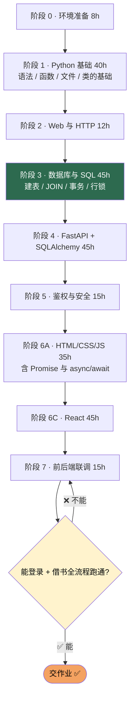

# 速通版 · 精简路线（260 h）

> 一句话定位：**只为交课程设计 / 作业的人准备的裁剪版** —— 砍掉一切「面试才用得上」的内容，只保留「能让系统跑起来」的最小集合。
>
> ⚠️ 先把丑话说前面：速通版做出来的项目**经不起深挖**。如果目标不只是交作业，请回[首页](../README.md)走标准版（470 h）。

---

## 🎯 学完能做什么

- [ ] 做出一个能登录、能增删改查图书、能借书还书的完整系统
- [ ] 前端页面能跑，后端接口能调，数据能存进 MySQL
- [ ] 能给别人演示一遍「登录 → 借书 → 归还」的完整流程
- [ ] 能讲清「为什么库存不能让前端算」这一个核心问题
- [ ] 手里有一个能写进课程设计报告、能录演示视频的项目
- [ ] 清楚知道自己**没学什么**，将来面试前知道往哪补

---

## ⏱️ 工时拆解

| 阶段 | 内容 | 工时 |
|:---:|---|:---:|
| 0 | 环境准备 | 8 h |
| 1 | Python 基础 | 40 h |
| 2 | Web 与 HTTP | 12 h |
| 3 | 数据库与 SQL | 45 h |
| 4 | FastAPI + SQLAlchemy | 45 h |
| 5 | 鉴权与安全 | 15 h |
| 6A | HTML / CSS / JavaScript（含 async/await） | 35 h |
| 6C | React | 45 h |
| 7 | 前后端联调 | 15 h |
| | **合计** | **260 h** |

**和标准版的差距：** 标准版 470 h，这里 260 h，省下 210 h。省在哪、凭什么能省，看下一节。

---

## ✂️ 砍掉了什么、为什么可以砍

| 砍掉的内容 | 省下 | 为什么可以砍 | 什么时候必须补 |
|---|:---:|---|---|
| Python 面向对象进阶（继承、魔术方法、元类） | ~20 h | 你只需要用类包一下 ORM 模型，继承和元类本项目用不到 | 想读懂第三方库源码时 |
| SQL 索引原理（B+ 树、执行计划） | ~35 h | 几百条数据不建索引也是毫秒级，答辩跑不出区别 | 面试问「为什么慢」时 |
| **整个 TypeScript** | ~22 h | 不用 TS 也能跑 React，代价只是没有类型提示 | 想找前端工作时 |
| React 进阶（useMemo、useReducer、自定义 Hook、性能优化） | ~15 h | 一个图书管理页面用 `useState` + `useEffect` 就够 | 页面开始卡、状态开始乱时 |
| 阶段 8（Docker、pytest、压测、CI） | ~45 h | 作业只要「老师电脑上能跑」，不需要一键部署 | 简历上有这个项目时，**这条最容易被追问** |
| 6B JavaScript 进阶独立课时 | ~35 h | 把 `Promise` / `async-await` / `map` / 解构 / 模块**并进 6A 的 35 h** | 不补的话 React 会学得很痛苦 |
| 索引优化、N+1 优化、日志监控 | ~10 h | 数据量小，肉眼看不到性能问题 | 有真实用户时 |

> 📌 一共砍掉约 210 h。**但注意：砍掉的是「深度」，不是「正确性」。**

---

## 🔒 哪些绝对不能砍

这三件事砍了，你的项目就是**错的**，不是「简化版」。

| 绝对不能砍 | 为什么 | 砍了会怎样 | 最少要学到什么程度 |
|---|---|---|---|
| **数据库事务与行锁** | 借书必须是一个原子的「检查 → 扣减 → 记录」 | 5 个人同时借 1 本书，会借出去 4 本 | 会写 `with_for_update()`，会把隔离级别设成 READ COMMITTED |
| **鉴权（JWT + 密码哈希）** | 这是唯一区分「谁能干什么」的东西 | 任何人都能删书、改别人的借阅记录 | 密码 bcrypt 入库，接口用 `Depends` 校验 Token 和角色 |
| **JS 的 `async/await`** | 所有网络请求都是异步的，不会它就是不会调接口 | 页面永远拿不到数据，或者拿到 `Promise` 对象 | 会用 `await fetch()`，会 try/catch，会处理 401 |

### 事务 + 行锁的最小写法（速通版也必须有）

```python
# 借书核心：锁住这一行，再判断库存
from sqlalchemy import select

def borrow(db, book_id: str, reader_id: str):
    book = db.execute(
        select(Book).where(Book.id == book_id).with_for_update()   # 行锁，必须
    ).scalar_one_or_none()
    if book is None or book.available <= 0:
        raise HTTPException(400, "库存不足")
    db.add(BorrowRecord(book_id=book_id, reader_id=reader_id))
    book.available -= 1
    db.commit()
```

> ⚠️ 只加行锁还不够。你必须同时把连接隔离级别设成 `READ COMMITTED`，否则 MySQL 默认的 REPEATABLE READ 会让锁内读到旧数据，**超借照旧**。见 [`03-数据库与SQL.md`](03-数据库与SQL.md)。

### 鉴权的最小写法

```python
import jwt
from fastapi import Depends, HTTPException
from fastapi.security import OAuth2PasswordBearer

oauth2 = OAuth2PasswordBearer(tokenUrl="/api/auth/login")

def current_user(token: str = Depends(oauth2)) -> User:
    try:
        payload = jwt.decode(token, SECRET, algorithms=["HS256"])
    except jwt.PyJWTError:
        raise HTTPException(401, "登录已过期")
    user = db.get(User, payload["sub"])
    if user is None:
        raise HTTPException(401, "用户不存在")
    return user
```

### async/await 的最小写法

```ts
async function loadBooks() {
  try {
    const res = await fetch("/api/books", { headers: authHeader() });
    if (res.status === 401) { location.href = "/login"; return; }
    if (!res.ok) throw new Error((await res.json()).detail);
    setBooks((await res.json()).items);   // 以后端返回为准
  } catch (e) {
    showToast(e instanceof Error ? e.message : "加载失败");
  }
}
```

---

## 🛣️ 最小可行路径



> 🔑 路径上**没有** TypeScript、没有阶段 8、没有 6B。但阶段 3 是深绿色 —— 它一点都不许省。

---

## 📚 资源清单

每个阶段只列**一条**主资源。同一阶段的完整资源表见标准版对应文档，这里只列必读的那一份。

| 阶段 | 主资源 | 语言 | 阶段工时 | 链接 |
|:---:|---|:---:|:---:|---|
| 0 | 环境安装实操 | 中 | 8 h | [00-环境准备.md](00-环境准备.md) |
| 1 | 廖雪峰 Python 教程（第 1–10 章） | 中 | 40 h | <https://liaoxuefeng.com/books/python/introduction/index.html> |
| 2 | MDN · HTTP 概述 | 中 | 12 h | <https://developer.mozilla.org/zh-CN/docs/Web/HTTP/Overview> |
| 3 | 廖雪峰 SQL + 小林coding 事务篇（**不许跳**） | 中 | 45 h | <https://liaoxuefeng.com/books/sql/index.html> |
| 4 | FastAPI 官方中文文档 · 用户指南 | 中 | 45 h | <https://fastapi.tiangolo.com/zh/tutorial/> |
| 5 | FastAPI 官方 · 安全性章节 | 中 | 15 h | <https://fastapi.tiangolo.com/zh/tutorial/security/> |
| 6A | MDN · 学习网页开发（HTML/CSS/JS） | 中 | 35 h | <https://developer.mozilla.org/zh-CN/docs/Learn> |
| 6C | React 官方中文文档 · Learn | 中 | 45 h | <https://zh-hans.react.dev/learn> |
| 7 | 现代 JavaScript 教程 · Fetch 与 CORS | 中 | 15 h | <https://zh.javascript.info/fetch> |

**不看的：** TypeScript 手册、SQLAlchemy 全量文档、Tailwind 文档（用最基础的 class 就行）、Docker 文档。

---

## 🧠 必须掌握的知识点

| 阶段 | 必须会（不会就过不了） | 会用就行（不用深究） |
|:---:|---|---|
| 0 | 装 Python / Node / MySQL、会用命令行、会 Git 基本命令 | Git 分支合并策略 |
| 1 | 变量、判断、循环、函数、列表字典、读写文件、`class` 会用 | 继承、多态、装饰器、生成器 |
| 2 | GET/POST/PUT/DELETE、200/400/401/403/404/422、JSON、CORS 是什么 | HTTP/2、缓存头、Cookie 细节 |
| 3 | `CREATE TABLE`、`SELECT/INSERT/UPDATE/DELETE`、`JOIN`、**事务**、**行锁** | 索引原理、执行计划、分库分表 |
| 4 | 路由、Pydantic 模型、依赖注入、`select()` 2.0 写法 | 中间件、生命周期钩子、异步 ORM |
| 5 | bcrypt 哈希、JWT 签发与校验、`Depends` 保护接口、区分角色 | OAuth2 第三方登录、刷新 Token |
| 6A | DOM 操作、事件、`fetch`、`async/await`、`localStorage` | 闭包深入、原型链、事件循环原理 |
| 6C | `useState`、`useEffect`、组件拆分、路由、Tailwind 基础 | `useMemo`、`Context` 性能优化、SSR |
| 7 | 封装 `client.ts`、统一错误处理、401 跳登录、字段名与后端一致 | 请求重试、缓存、并发控制 |

> 一张表就是速通版的全部范围。**表里没有的东西，一律不学。**

---

## 🛠️ 动手练习

**练习 1 · 后端闭环（阶段 1–5 期间，穿插做）**
- [ ] 写一个 100 行的 Python 脚本，读写文件并统计
- [ ] 建 `library` 库，手写 `books` / `users` / `borrow_records` 三张表
- [ ] 用 FastAPI 写出图书 CRUD 四个接口
- [ ] 写出借书 / 还书接口，`available` 由后端算
- [ ] 加登录接口，密码 bcrypt 入库，拿到 JWT

**练习 2 · 复现并修复超借（阶段 3 复习，约 5 h）**
- [ ] 用 5 个线程同时借一本 `stock=1` 的书，看到 ≥2 个成功
- [ ] 加 `with_for_update()`，发现**还是超借**
- [ ] 把隔离级别改成 `READ COMMITTED`，再测一次，只剩 1 个成功

**练习 3 · 前端页面（阶段 6A–6C）**
- [ ] 用 React + Vite 建项目，做登录页和图书列表页
- [ ] 封装 `src/api/client.ts`，页面里不出现 `fetch`
- [ ] 借书按钮调接口，成功后重新拉列表
- [ ] Token 失效时自动跳回登录页

**练习 4 · 联调验收（阶段 7）**
- [ ] 在浏览器里完整走一遍登录 → 借书 → 归还
- [ ] 把 Network 面板截图，写进课程设计报告
- [ ] 录一段 3 分钟的演示视频，能讲清「库存为什么由后端算」

---

## ✅ 验收标准

- [ ] 后端能启动，`/docs` 能打开，`/api/books` 需要 Token 才能访问
- [ ] 数据库里能看到明文的表数据，但**看不到明文密码**
- [ ] 前端能登录、能看列表、能借书还书，刷新后登录态不丢
- [ ] 借完 `available=0` 的书会弹出错误提示，而不是静默失败
- [ ] **5 并发借 1 本书，只有 1 个成功**（这是速通版唯一必须做的压力测试）
- [ ] 库存校验 SQL 恒等于 0：

```sql
SELECT (SELECT IFNULL(SUM(stock - available), 0) FROM books WHERE is_deleted = 0)
     - (SELECT COUNT(*) FROM borrow_records WHERE return_date IS NULL)
     - (SELECT COUNT(*) FROM reservations  WHERE status = 'ready') AS diff;   -- 必须为 0
```

- [ ] 能给非技术的人演示一遍完整流程
- [ ] 能说出自己**没学** TypeScript、Docker、索引原理

---

## ⚠️ 常见坑

| 坑 | 说明 | 正确做法 |
|---|---|---|
| 省掉行锁「反正并发低」 | 答辩演示时老师就让你并发点两下 | 行锁 + READ COMMITTED 是底线 |
| 只加行锁不改隔离级别 | 还是超借，而且你会以为锁没用 | 两件事一起做 |
| 前端自己算库存 | 演示时数字对不上，一眼假 | 库存只由后端算 |
| 密码存明文 | 被老师看一眼数据库就完了 | bcrypt 哈希 |
| 跳过 6B 直接学 React | 不会 `async/await`，React 寸步难行 | 6A 的 35 h 里必须吃透 async/await |
| 直接抄标准版全部内容 | 时间不够，最后什么都学一半 | 严格按这张表，超纲的一律不看 |
| 只学不写 | 速通版时间紧，更容易变成「看视频」 | 每个阶段结束必须能跑出东西 |
| 不录演示视频 | 答辩现场一紧张就说不清 | 提前录好，当保底 |
| 用假数据演示 | 老师一刷新就露馅 | 演示前用真实数据库操作一遍 |
| 简历上写「精通全栈」 | 一追问就崩 | 老实写「熟悉 FastAPI + React 全栈开发」 |

---

## 📅 13 周时间表（每周 20 h）

> ⚠️ 算术说明：260 h ÷ 20 h/周 = **13 周**。所以下表排到 W13 收尾，不要靠最后一周翻倍去硬压成 12 周。
> **再赶也不要跳过 W05（事务与行锁）**——那一周是整个项目唯一「能讲」的技术点。

| 周次 | 阶段 | 本周任务 | 工时 | 周末产出 |
|:---:|---|---|:---:|---|
| W01 | 0 + 1 开头 | 装环境、Python 语法基础 | 20 h | 能跑通 5 个小脚本 |
| W02 | 1 | 函数、列表字典、文件读写、类的基础 | 20 h | 100 行以上的 Python 脚本 |
| W03 | 2 | HTTP / REST / JSON / 状态码 + 第一个 FastAPI 接口 | 20 h | `/health` + 内存版 CRUD |
| W04 | 3 上半 | 建库建表、增删改查、JOIN | 20 h | 能用 SQL 查出借阅记录 |
| W05 | 3 下半 | **事务、隔离级别、行锁** ⭐不可跳过 | 20 h | 复现超借并修好 |
| W06 | 4 上半 | FastAPI 路由 + Pydantic + SQLAlchemy 模型 | 20 h | 真数据库版 CRUD |
| W07 | 4 下半 | 借书 / 还书业务逻辑、库存统一重算 | 20 h | 借还闭环 |
| W08 | 5 | bcrypt、JWT、`Depends` 鉴权、角色区分 | 20 h | 无 Token 访问返回 401 |
| W09 | 6A | HTML / CSS / DOM / fetch / async-await | 20 h | 纯 JS 版能登录能借书 |
| W10 | 6C 上半 | React 组件、useState、useEffect | 20 h | 图书列表页 |
| W11 | 6C 下半 + 7 | 路由、Token 存储、封装 client.ts | 20 h | React 版主流程跑通 |
| W12 | 7 | 联调排错、CORS、错误处理 | 20 h | 完整借书流程从页面跑通 |
| W13 | 收尾 | 写报告、录演示视频、补并发测试 | 20 h | **可交付 ✅** |

---

## ⚠️ 最后一句警告

速通版能让你**交上作业**，但交不出一个「能聊」的项目。面试或答辩时，下面这些问题你**全都答不上来**：

| 老师/面试官可能问 | 速通版学了吗 |
|---|:---:|
| 你这个查询走了索引吗？为什么？ | ❌ |
| 为什么前端传 `book_id`，你类型里写 `bookId`？ | ❌ 没有类型系统 |
| 你的接口 QPS 多少？瓶颈在哪？ | ❌ |
| 并发再高一点会怎样？ | 🟡 只做过 5 并发 |
| 怎么部署到服务器让别人访问？ | ❌ |
| 你的代码有测试吗？ | ❌ |

**所以：**

- 如果只是**交课程设计 / 作业**：用这份，够用，别再扩。
- 如果想**写进简历 / 找工作**：老老实实走[标准版 470 h](../README.md)，再补[阶段 8](08-进阶与部署.md)。
- 如果时间紧又想兼顾：至少把**阶段 8 的 pytest 和 Docker** 补上，那是回报率最高的两块。

---

## 🧭 文末导航

- 标准版路线图：[`../README.md`](../README.md)
- 被砍掉的进阶内容：[`08-进阶与部署.md`](08-进阶与部署.md)
- 核心难点（不许跳）：[`03-数据库与SQL.md`](03-数据库与SQL.md) · [`05-鉴权与安全.md`](05-鉴权与安全.md)

[← 返回首页](../README.md) · [资源总表](../resources.md) · [里程碑](../milestones.md)
