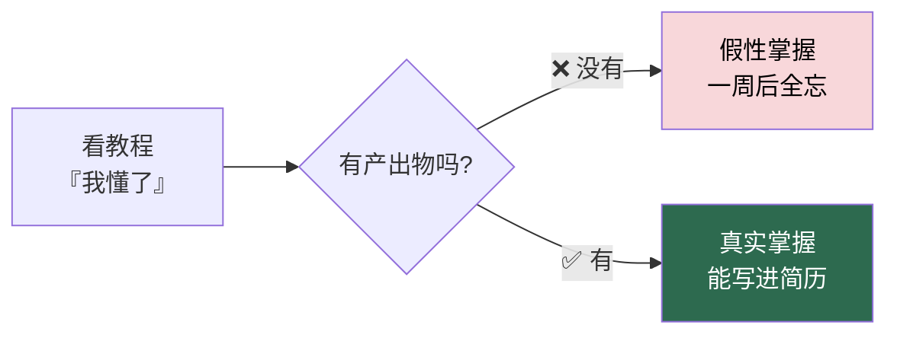
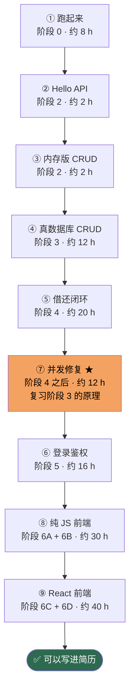

# 里程碑与验收标准

> 9 个里程碑，每个都是**能给别人演示的东西**。
> 不是「我学完了」这种自我感觉，而是「打开浏览器 / 打开终端，看得见摸得着」。

---

## 为什么要有里程碑



**只学不产出 = 白学。** 每个里程碑都要求你交付一个可以运行的东西。

---

## 里程碑总览



> ⚠️ **里程碑 ⑦ 为什么排在 ⑤ 之后：** 复现超借需要一个**能跑的借书接口**，那是阶段 4 的产出物。
> 但**原理**（事务、隔离级别、行锁）在阶段 3 就学完了，所以 ⑦ 是「用阶段 3 的知识，验收阶段 4 的代码」。

---

## ① 跑起来　`阶段 0`　约 8 h

**目标：** 先看到成品长什么样，知道终点在哪。

### 任务
- [ ] 装好 Python 3.12、Node.js LTS、MySQL 8.4、VS Code、Git
- [ ] 克隆任意一个开源的图书管理系统 / 管理系统 Demo
- [ ] 按它的 README 把前后端都启动起来
- [ ] 用演示账号登录，点一遍所有菜单

### 验收标准
- [ ] 浏览器能打开页面并成功登录
- [ ] 能打开接口文档页（如 `/docs`），并成功调用一个 GET 接口
- [ ] 能用 `git clone` / `git pull` 不出错

> 💡 这一步的价值：**你见过终点，后面迷路时知道往哪走。**

---

## ② Hello API　`阶段 2`　约 2 h

**目标：** 写出人生第一个后端接口。

### 任务
- [ ] 建项目目录，创建虚拟环境 `python -m venv .venv`
- [ ] `pip install fastapi "uvicorn[standard]"`
- [ ] 写 `main.py`，启动服务

```python
from fastapi import FastAPI

app = FastAPI()

@app.get("/health")
def health():
    return {"ok": True, "service": "library-api"}
```

- [ ] 用 `uvicorn main:app --reload` 启动
- [ ] 浏览器访问 `/health` 和 `/docs`

### 验收标准
- [ ] `/health` 返回 `{"ok": true, "service": "library-api"}`
- [ ] `/docs` 能看到自动生成的 Swagger 文档，并能点击调用
- [ ] 改代码后服务自动重载（`--reload` 生效）
- [ ] 能说清：为什么访问 `/docs` 不需要自己写前端

---

## ③ 内存版 CRUD　`阶段 2`　约 2 h

**目标：** 不碰数据库，先用 Python 列表把接口跑通。

### 任务
- [ ] 定义 `books` 列表，预置 3 本书
- [ ] 实现 4 个接口：列表、新增、修改、删除
- [ ] 用 Pydantic 定义 `BookCreate` 做请求体校验
- [ ] 用 `/docs` 逐个测试

### 验收标准
- [ ] `GET /books` 返回图书数组
- [ ] `POST /books` 能新增，返回 `201`
- [ ] `PUT /books/{id}` 能修改
- [ ] `DELETE /books/{id}` 能删除
- [ ] 传入非法数据（如 `stock: "abc"`）时返回 **422** 而不是 500

> ⚠️ 此时的数据**重启就丢**，这是故意的 —— 下一步你就知道数据库解决什么问题。

---

## ④ 真数据库 CRUD　`阶段 3`　约 12 h

**目标：** 换成 MySQL，数据持久化。

### 任务
- [ ] 启动 MySQL，建库 `library`
- [ ] 手写 `CREATE TABLE books (...)`
- [ ] 装 `sqlalchemy pymysql`
- [ ] 写 `models.py` 定义 ORM 模型
- [ ] 把内存列表换成数据库查询

### 验收标准
- [ ] 重启后端，之前新增的书**还在**
- [ ] 能说清 ORM 与原生 SQL 的关系
- [ ] 能用 MySQL 命令行 `SELECT * FROM books;` 看到数据
- [ ] 表里有 `created_at`、`is_deleted` 这类字段

### 自测题（答不出就回去补）
1. 主键和外键分别解决什么问题？
2. 为什么删除图书不用 `DELETE`，而用 `is_deleted = 1`？
3. `SELECT * FROM borrow_records WHERE user_id = 1` 需要给哪列建索引？

---

## ⑤ 借还闭环　`阶段 4`　约 20 h

**目标：** 做出真正的业务逻辑 —— 借书、还书、库存自动变化。

### 任务
- [ ] 建 `users`（读者）和 `borrow_records`（借阅记录）表
- [ ] 写「借出」接口：创建借阅记录 + 减少可借数
- [ ] 写「归还」接口：填 `return_date` + 增加可借数
- [ ] 写 `sync_book()`：**统一重算** `available`，而不是到处 `+1/-1`

### 核心公式（本项目的灵魂）

```
available = stock - 未归还借阅数 - 已到书待取的预约占位数
```

### 验收标准
- [ ] 借出一本，`available` 减 1
- [ ] 归还一本，`available` 加 1
- [ ] 同一读者不能对同一本书有两条未归还记录（返回 400）
- [ ] `available` 为 0 时借书被拒（返回 400）
- [ ] **`stock - available` 恒等于「在借 + 预约占位」** —— 用 SQL 验证

```sql
-- 任何时刻跑这句，结果都应该是 0
SELECT (SELECT SUM(stock - available) FROM books WHERE is_deleted = 0)
     - (SELECT COUNT(*) FROM borrow_records WHERE return_date IS NULL);
```

- [ ] 借阅状态**不存数据库**，由日期推导：

| 条件 | 状态 |
|---|---|
| `return_date` 有值 | `returned` |
| `return_date` 为空 且 `due_date < 今天` | `overdue` |
| 其余 | `borrowing` |

---

## ⑥ 登录鉴权　`阶段 5`　约 16 h

**目标：** 没有 Token 谁都进不来。

### 任务
- [ ] `users` 表加 `password_hash`（**绝不存明文**）
- [ ] 注册接口：bcrypt 哈希后入库
- [ ] 登录接口：校验密码，签发 JWT
- [ ] 写 `get_current_user` 依赖，保护业务接口
- [ ] 区分角色：管理员 / 读者

### 验收标准
- [ ] 数据库里 `password_hash` 是 `$2b$12$...` 这种形式，**看不到明文**
- [ ] 登录返回的 Token 能在 <https://jwt.io> 解析出 `sub`、`exp`
- [ ] 不带 Token 请求 `/api/books` → **401**
- [ ] 用读者 Token 请求管理员接口 → **403**
- [ ] 手动改一位 Token 字符 → **401**（签名校验生效）
- [ ] 前端只做路由跳转，**权限判断在后端**（前端能绕过，后端不能）

---

## ⑦ 并发修复 ★★ 最重要的里程碑　`阶段 4 之后`　约 12 h

**目标：** 亲眼看到 bug，亲手修好它。

> 这是**全流程含金量最高的一步**。能讲清楚这个 bug，面试时就能讲 10 分钟。

### 第 1 步：复现 bug

准备一本 `stock = 1, available = 1` 的书，然后用脚本并发借 5 次：

```python
import concurrent.futures, requests

token = "你的管理员Token"
book_id = "B001"

def borrow(i):
    r = requests.post(
        "http://127.0.0.1:8000/api/borrows/borrow",
        json={"bookId": book_id, "readerId": f"R{i:03d}"},
        headers={"Authorization": f"Bearer {token}"},
    )
    return r.status_code

with concurrent.futures.ThreadPoolExecutor(max_workers=5) as ex:
    results = list(ex.map(borrow, range(1, 6)))

print(results)
# 🐛 错误结果：多个 201 —— 1 本书被借走了 4 次
```

### 第 2 步：修好它

需要**两件事同时做**，只做一件没用：

| 措施 | 代码 | 作用 |
|---|---|---|
| ① 行锁 | `SELECT ... FOR UPDATE` | 让并发请求排队 |
| ② 改隔离级别 | `SET SESSION TRANSACTION ISOLATION LEVEL READ COMMITTED` | 让锁内读到**最新**数据 |

```python
from sqlalchemy import create_engine, event

engine = create_engine(DATABASE_URL)

@event.listens_for(engine, "connect")
def _use_read_committed(dbapi_connection, _record):
    cursor = dbapi_connection.cursor()
    cursor.execute("SET SESSION TRANSACTION ISOLATION LEVEL READ COMMITTED")
    cursor.close()
```

```python
book = db.execute(
    select(Book).where(Book.id == payload.bookId).with_for_update()
).scalar_one_or_none()
```

### 第 3 步：解释为什么

### 验收标准
- [ ] **能复现**：修复前，5 并发出现 ≥2 个 `201`
- [ ] **能修复**：修复后，5 并发**只有 1 个** `201`，其余 4 个 `400`
- [ ] **能解释**：口述清楚为什么 MySQL 默认的 REPEATABLE READ 会让行锁失效
- [ ] 并发测试后 `stock - available` 的校验 SQL 仍然返回 0

### 必须能回答的问题
1. 为什么只加 `FOR UPDATE` 不加 `READ COMMITTED`，5 并发还是能过 4 个？
2. MVCC 快照是在事务的哪个时刻建立的？
3. READ COMMITTED 下，每条语句读的是什么数据？
4. 这样改有什么代价？（提示：可重复读能力下降）

> 📖 原理看 [小林coding · 图解 MySQL](https://xiaolincoding.com/mysql/) 的**事务篇**和**锁篇**。

---

## ⑧ 纯 JS 前端　`阶段 6A + 6B`　约 30 h

**目标：不用任何框架**，做出能登录、能借书的页面。

> 这一步是理解 React 价值的**必经之路**。跳过它，你永远不知道为什么需要 React。

### 任务
- [ ] 单个 HTML 文件，内嵌 CSS 和 JS
- [ ] 登录表单 → `fetch` 调后端 → 存 Token 到 `localStorage`
- [ ] 图书列表页：`fetch` 渲染表格
- [ ] 搜索框：输入时实时过滤
- [ ] 借书按钮 → 调接口 → 刷新列表
- [ ] 用 `showToast()` 做成功/失败提示

### 核心代码（必须自己写出来）

```javascript
async function api(path, options = {}) {
  const token = localStorage.getItem("token");
  const res = await fetch(`http://127.0.0.1:8000${path}`, {
    ...options,
    headers: {
      "Content-Type": "application/json",
      ...(token ? { Authorization: `Bearer ${token}` } : {}),
      ...options.headers,
    },
  });
  if (res.status === 401) { location.href = "/login.html"; return; }
  if (!res.ok) throw new Error((await res.json()).detail);
  return res.json();
}
```

### 验收标准
- [ ] 登录后跳转到列表页，刷新页面**仍保持登录**
- [ ] 列表能显示后端真实数据（**不是写死的**）
- [ ] 搜索框输入能实时过滤
- [ ] 借书成功后列表自动更新
- [ ] 退出登录后 Token 被清掉，跳回登录页
- [ ] 后端返回 401 时自动跳登录页

### 反思题（写下来，这决定了你学 React 的效率）
1. 每改一个数据，你手动调了几次 `render()`？
2. 状态散落在几个变量里？同步它们累不累？
3. 如果页面有 20 个地方要更新，你还写得动吗？

**答完这三题，你就知道 React 要解决什么了。**

---

## ⑨ React 前端　`阶段 6C + 6D`　约 40 h

**目标：** 用 React 重写第 ⑧ 步，并补上 TypeScript 类型。

### 任务
- [ ] `npm create vite@latest my-app -- --template react-ts`
- [ ] 拆组件：`LoginPage` `BooksPage` `Layout` `ProtectedRoute`
- [ ] 用 `useState` 管状态，`useEffect` 拉数据
- [ ] 用 `react-router-dom` 做路由
- [ ] 把 Token 放进 `Context`，写 `ProtectedRoute` 拦截
- [ ] 用 Tailwind 写样式
- [ ] 给所有 API 响应定义 `interface`

### 验收标准
- [ ] 组件拆分合理，没有超过 300 行的文件
- [ ] 数据变了页面**自动更新**，不用手动操作 DOM
- [ ] 未登录访问 `/books` 自动跳 `/login`
- [ ] 全局没有 `any`（跑 `npm run typecheck` 无错）
- [ ] 刷新页面登录态不丢
- [ ] 与第 ⑧ 步功能完全对等

### 对比总结（写进你的学习笔记）

| 维度 | 纯 JS 版 | React 版 |
|---|---|---|
| 更新界面 | 手动操作 DOM | 改 state 自动渲染 |
| 状态管理 | 全局变量满天飞 | `useState` / `Context` |
| 代码复用 | 复制粘贴 | 组件 |
| 类型安全 | 无 | TypeScript |

---

## 🏁 全部完成后

到这里你应该能：

- [ ] 从零搭起 FastAPI + MySQL + React 的前后端分离项目
- [ ] 讲清楚**事务、隔离级别、行锁**，并解释你踩过的超借 bug
- [ ] 独立排查 CORS、401、N+1 查询这类常见问题
- [ ] 说清为什么库存和状态**只能由后端算**

**下一步：** 进入 [`docs/08-进阶与部署.md`](docs/08-进阶与部署.md)，加上 Docker、测试和压测，然后把这套东西**写进简历**。

---

[← 资源总表](resources.md) · [返回首页](README.md) · [进度打卡 →](progress.md)
