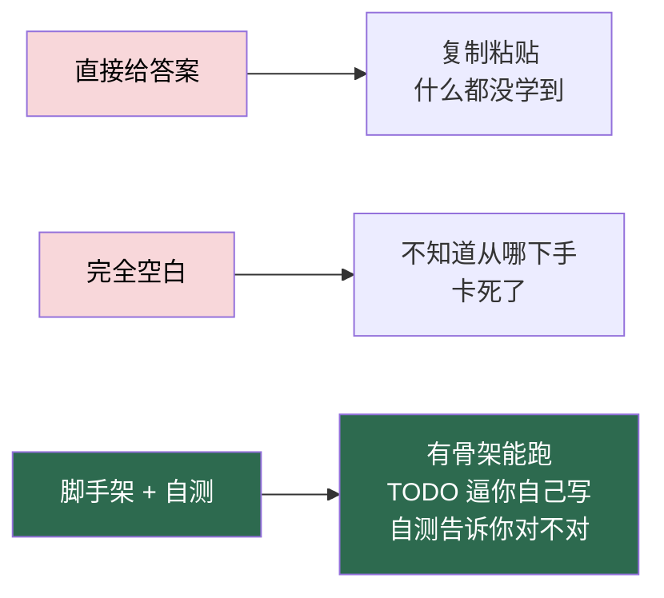

# 练习脚手架

> **这里不是答案，是「自带自测的填空题」。**
> 每个文件都能直接运行，关键的学习点留成 `TODO`，跑一下就知道自己哪里还没做完。

---

## 为什么这么设计



**每个练习文件的结构：**

```python
"""
练习：命令行通讯录
验收标准：能增删改查联系人
对应文档：docs/01-Python基础.md
"""
# ... 骨架代码 ...
# TODO: 实现添加联系人的逻辑
#   提示：用 dict 存，key 用姓名
#   预期：add("张三", "138...") 后，find("张三") 返回该联系人

# ... 文件末尾的自测 ...
if __name__ == "__main__":
    run_self_check()   # 打印哪些 TODO 还没做
```

运行后你会看到：

```
[ ] 01 添加联系人        —— 未完成（第 42 行 TODO）
[x] 02 查找联系人        —— 通过
[ ] 03 删除联系人        —— 未完成（第 58 行 TODO）
```

**TODO 全部消掉、自测全绿 = 这个练习过关。**

---

## 目录结构

| 目录 | 对应阶段 | 内容 | 需要什么 |
|---|---|---|---|
| [`01-python/`](01-python/) | 阶段 1 | 5 个 Python 小练习（通讯录/词频/银行账户/CSV 报告/文件整理） | 只要 Python |
| [`02-memory-api/`](02-memory-api/) | 阶段 2 | 不连数据库的内存版 CRUD | FastAPI |
| [`03-sql/`](03-sql/) | 阶段 3 | 建表脚本 + 20 道 SQL 题 + **并发超借测试** | MySQL |
| [`04-library-api/`](04-library-api/) | 阶段 4+5 | 完整后端骨架（模型/校验/库存重算/鉴权） | MySQL + FastAPI |
| [`05-frontend-js/`](05-frontend-js/) | 阶段 6A+6B | 纯 JS 前端（**零依赖，双击就能开**） | 浏览器 |
| [`06-frontend-react/`](06-frontend-react/) | 阶段 6C+6D | React 骨架文件 + 初始化步骤 | Node.js |

---

## 快速开始

### 1. 装依赖

```powershell
cd <仓库目录>
python -m venv .venv
.venv\Scripts\Activate.ps1
pip install -r practice/requirements.txt
```

### 2. 按顺序做

**阶段 1（不需要装任何东西）：**

```powershell
cd practice/01-python
python 01_contacts.py      # 看输出，按提示消 TODO
```

**阶段 2：**

```powershell
uvicorn main:app --reload --app-dir practice/02-memory-api
# 打开 http://127.0.0.1:8000/docs
```

**阶段 3：**

```powershell
mysql -u root -p < practice/03-sql/schema.sql
mysql -u root -p library < practice/03-sql/queries.sql
python practice/03-sql/concurrency_test.py --concurrency 5
```

**阶段 4+5：**

```powershell
cd practice/04-library-api
copy .env.example .env      # 然后改里面的数据库密码
uvicorn main:app --reload
```

**阶段 6A+6B（零依赖）：**

直接双击 `practice/05-frontend-js/index.html`，或：

```powershell
python -m http.server 8080 --directory practice/05-frontend-js
```

---

## 使用规则

| 规则 | 说明 |
|---|---|
| ✅ **先自己写，卡住先查文档** | 超过 30 分钟再看参考实现 |
| ✅ **自测全绿才算过关** | 别靠「看起来对了」 |
| ✅ **写不下去就降级** | 先让最小的例子跑起来，再加功能 |
| ❌ **不要搜现成答案直接复制** | 你骗得过自测，骗不过面试 |
| ❌ **不要跳过 03-sql 的并发测试** | 那是整个项目最值钱的一段经历 |

---

## 遇到问题

| 现象 | 去哪看 |
|---|---|
| 不知道这个 TODO 要写什么 | 每个 TODO 上方的「提示」+ 对应 `docs/` 文档 |
| 接口报错不知道怎么调 | [`docs/07-前后端联调.md`](../docs/07-前后端联调.md) 的报错对照表 |
| 不知道这个阶段学完没有 | [`milestones.md`](../milestones.md) 的验收标准 |
| 忘了自己学到哪了 | [`PLAN-26周.md`](../PLAN-26周.md) + [`progress.md`](../progress.md) |

---

## 参考实现

**本目录不含答案。** 完整可运行的参考实现在：

- 后端：`docs/03-数据库与SQL.md`、`docs/04-FastAPI与SQLAlchemy.md`、`docs/05-鉴权与安全.md` 里的代码块
- 前端：`docs/06B-JavaScript进阶.md`、`docs/06C-React.md` 里的代码块

**建议顺序：** 先自己写 → 卡住 30 分钟 → 看文档对应章节 → 关掉文档自己再写一遍。

---

[← 返回首页](../README.md) · [26 周日历](../PLAN-26周.md) · [里程碑](../milestones.md)
